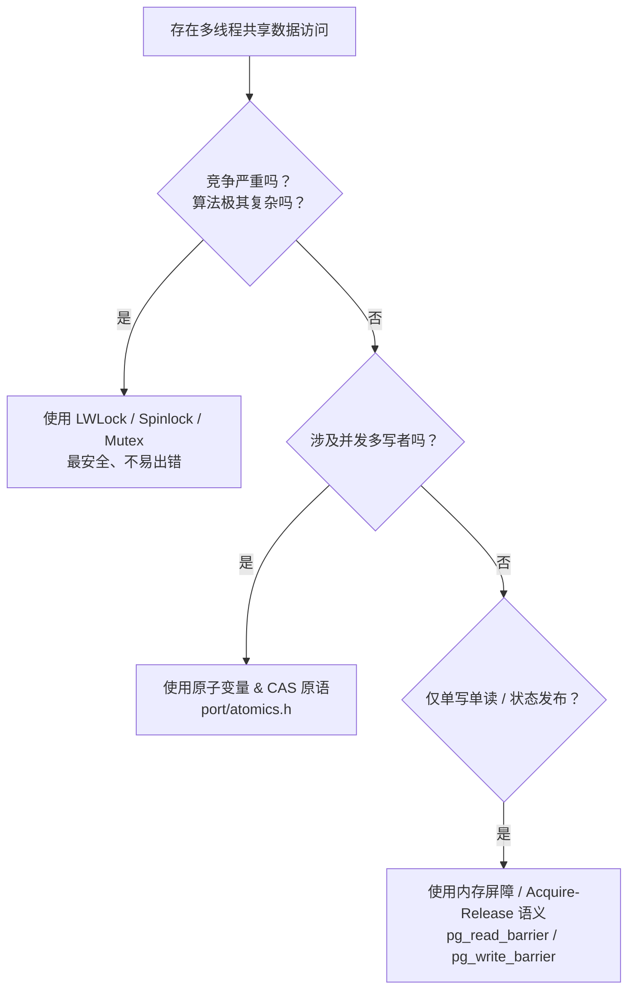

在编写高并发、低延迟的底层系统软件（如数据库引擎 PostgreSQL、操作系统内核 Linux）时，开发者往往需要超越常规的互斥锁（Mutex/LWLock），使用无锁（Lock-free）数据结构以追求极限性能。而无锁编程的核心与最大难点，便在于**内存屏障（Memory Barrier）**与**内存重排序（Memory Reordering）**。

本文将从 PostgreSQL 源码中的技术文档 `src/backend/storage/lmgr/README.barrier` 出发，结合 Paul E. McKenney 的经典论文及 Linux 内核文档，系统性地梳理内存屏障的**底层硬件原理、重排序形态、软件原语抽象及工程实战指南**。

---

## 目录
1. [背景：为什么会出现内存乱序？](#1-背景为什么会出现内存乱序)
2. [PostgreSQL 中的内存屏障实践 (README.barrier 解读)](#2-postgresql-中的内存屏障实践-readmebarrier-解读)
   - [经典无锁队列 Bug 案例](#经典无锁队列-bug-案例)
   - [PG 提供的内存屏障 API](#pg-提供的内存屏障-api)
   - [内存屏障的 4 大局限性](#内存屏障的-4-大局限性)
3. [内存重排序的四种基础形态](#3-内存重排序的四种基础形态)
   - [L-L / S-S / S-L / L-S 详细拆解](#l-l--s-s--s-l--l-s-详细拆解)
   - [强内存模型 (x86 TSO) vs 弱内存模型 (ARM)](#强内存模型-x86-tso-vs-弱内存模型-arm)
4. [硬件视角：为什么必须存在内存屏障？](#4-硬件视角为什么必须存在内存屏障)
   - [MESI 协议与 Write Stall](#mesi-协议与-write-stall)
   - [Store Buffer（存储缓冲区）与写屏障](#store-buffer存储缓冲区与写屏障)
   - [Invalidate Queue（失效队列）与读屏障](#invalidate-queue失效队列与读屏障)
5. [Linux 内核抽象与工程实战](#5-linux-内核抽象与工程实战)
   - [Acquire & Release 语义](#acquire--release-语义)
   - [铁律：内存屏障成对出现原则](#铁律内存屏障成对出现原则)
   - [编译器屏障 READ_ONCE / WRITE_ONCE](#编译器屏障-read_once--write_once)
6. [总结与选型建议](#6-总结与选型建议)

---

## 1. 背景：为什么会出现内存乱序？

现代计算机体系结构为了最大化 CPU 吞吐量和指令流水线效率，会在两个层面引入**指令重排序（Reordering）**：

1. **编译器优化重排序**：GCC/Clang 等编译器在编译期为了优化寄存器分配和指令流水线，会改变指令的机器码顺序。
2. **CPU 乱序执行（Out-of-Order Execution）**：CPU 在运行期根据硬件资源空闲情况与指令依赖关系，动态调整指令的执行顺序。

> **核心法则**：对于单线程/单进程而言，重排序遵循 “As-If” 规则（即保证单线程执行结果与按程序顺序执行一致）。但当**多个 CPU 核心访问同一块共享内存（Shared Memory）**时，这种乱序会导致非常反直觉的并发 Bug。

---

## 2. PostgreSQL 中的内存屏障实践 (README.barrier 解读)

PostgreSQL 的源码文档 `src/backend/storage/lmgr/README.barrier` 提供了一个非常经典的并发场景来说明乱序危害。

### 经典无锁队列 Bug 案例

考虑一个简单的单生产者-单消费者共享队列：

```c
// 生产者 (Writer)
q->items[q->num_items] = new_item;  // 步骤 A：写入数组元素
++q->num_items;                     // 步骤 B：递增计数器

// 消费者 (Reader)
num_items = q->num_items;           // 步骤 1：读取计数器
for (i = 0; i < num_items; ++i)
    process(q->items[i]);           // 步骤 2：读取数组元素
```

在没有内存屏障的情况下，这段代码存在双重危险：
1. **写端乱序**：写进程可能先执行了 `++q->num_items`（步骤 B），再填充数组（步骤 A）。读进程看到计数器增加了，读到的却是未初始化的垃圾数据。
2. **读端预取乱序**：即使写进程严格按 A $\rightarrow$ B 执行，读进程的 CPU 也会在读取计数器（步骤 1）之前，提前将 `q->items` 的内存预取到 Cache 中（步骤 2）。导致读进程拿到旧数据。

### PG 提供的内存屏障 API

为了解决上述问题，PostgreSQL 提供了三组轻量级宏：

| API 宏 | 适用场景 | 说明 |
| :--- | :--- | :--- |
| `pg_memory_barrier()` | **通用全屏障** (Full Barrier) | 阻止前后所有类型的读写指令越过屏障重排。 |
| `pg_write_barrier()` | **写屏障** (Write Barrier) | 专门用于分隔**两次写操作**（Store-Store）。 |
| `pg_read_barrier()` | **读屏障** (Read Barrier) | 专门用于分隔**两次读操作**（Load-Load）。 |

修正后的无锁队列代码：

```c
// 生产者 (Writer)
q->items[q->num_items] = new_item;
pg_write_barrier();   // 保证数据写入先于计数器递增
++q->num_items;

// 消费者 (Reader)
num_items = q->num_items;
pg_read_barrier();    // 保证计数器读取先于数组元素读取
for (i = 0; i < num_items; ++i)
    process(q->items[i]);
```

### 内存屏障的 4 大局限性

PostgreSQL 文档特别提醒开发者，内存屏障**不是万能的**：

1. **无法解决多写者互斥**：屏障只保证顺序，不保证互斥。如果有多个写者同时操作队列，依然需要 Spinlock 或 LWLock。
2. **8 字节读写在 32 位平台非原子**：在 32 位架构上，8 字节赋值会被拆分为两条 4 字节汇编指令，无法保证单次指令级原子性。必须使用原子变量 (`port/atomics.h`)。
3. **不提供时间上的同步保证**：屏障只保证当前进程内指令的相对顺序，无法决定“进程 A 和进程 B 谁先谁后执行”。
4. **屏障滥用引发性能衰退**：如果算法需要插入多个屏障，代码复杂度和硬件开销会急剧上升，此时直接使用 LWLock 反而性能更好。

---

## 3. 内存重排序的四种基础形态

在体系结构文献中，内存操作指令的重排序被划分为 4 种基本组合（Load 代表读，Store 代表写）：

### L-L / S-S / S-L / L-S 详细拆解

#### 1. Load-After-Load (L-L)：读之后再读
- **代码顺序**：先读 A，后读 B。
- **重排序效果**：CPU 实际先完成了读 B，后完成了读 A。
- **典型后果**：读端先读 `ready` 标志，再读 `data`。若发生 L-L 乱序，CPU 提前预取了 `data` 旧值，导致读到脏数据。
- **保护原语**：`pg_read_barrier()` / `smp_rmb()`。

#### 2. Store-After-Store (S-S)：写之后再写
- **代码顺序**：先写 A，后写 B。
- **重排序效果**：CPU 实际先将写 B 刷入缓存对外可见，后将写 A 刷入缓存。
- **典型后果**：写端先写 `data = 100`，再写 `ready = 1`。若发生 S-S 乱序，其他 CPU 看到 `ready == 1` 时，`data` 仍为旧值。
- **保护原语**：`pg_write_barrier()` / `smp_wmb()`。

#### 3. Store-After-Load (S-L / Store-Load)：写之后再读
- **代码顺序**：先写 A，后读 B。
- **重排序效果**：读 B 的操作先执行，而写 A 的操作卡在 CPU Store Buffer 中尚未对外部可见。
- **典型后果**：Dekker/Peterson 算法中，两个线程各自执行 `flag = 1; read(other_flag);`。由于 S-L 乱序，两个线程都读到了对方旧的 `flag == 0`，导致同时进入临界区。
- **保护原语**：全屏障 `pg_memory_barrier()` / `smp_mb()` / x86 `mfence`。

#### 4. Load-After-Store (L-S / Load-Store)：读之后再写
- **代码顺序**：先读 A，后写 B。
- **重排序效果**：写 B 的操作先于读 A 执行并对外生效。
- **保护原语**：`pg_memory_barrier()` 或 Acquire 语义。

### 强内存模型 (x86 TSO) vs 弱内存模型 (ARM)

不同的 CPU 架构对这 4 种乱序的支持截然不同：

| 重排序组合 | 代码顺序 $\rightarrow$ 实际效果 | x86 (TSO 强内存模型) | ARM / PowerPC (弱内存模型) |
| :--- | :--- | :---: | :---: |
| **Load-Load** | 先读 A 后读 B $\rightarrow$ 先读 B 后读 A | **禁止** | **允许** |
| **Store-Store** | 先写 A 后写 B $\rightarrow$ 先写 B 后写 A | **禁止** | **允许** |
| **Load-Store** | 先读 A 后写 B $\rightarrow$ 先写 B 后读 A | **禁止** | **允许** |
| **Store-Load** | 先写 A 后读 B $\rightarrow$ 先读 B 后写 A | **允许** *(Store Buffer 导致)* | **允许** |

> **关键结论**：x86 架构非常“规矩”，**只允许 Store-Load 乱序**。因此在 x86 上，`pg_read_barrier()` 和 `pg_write_barrier()` 不需要产生任何硬件指令（仅抑制编译器重排）；但在 ARM/ARM64 上，4 种乱序皆可能发生，必须产生真正的硬件屏障指令（如 `dmb`）。

---

## 4. 硬件视角：为什么必须存在内存屏障？

Paul E. McKenney 在其经典论文 *《Memory Barriers: a Hardware View for Software Hackers》* 中，揭示了内存屏障的硬件起源。

```
+-------------------------------------------------------+
|                       CPU Core                        |
+-------------------------------------------------------+
                           |
                           v
              +-------------------------+
              |      Store Buffer       |  <-- 引发写乱序 (S-S / S-L)
              +-------------------------+
                           |
                           v
              +-------------------------+
              |       CPU Cache         | (MESI 协议)
              +-------------------------+
                           |
                           v
              +-------------------------+
              |    Invalidate Queue     |  <-- 引发读乱序 (L-L)
              +-------------------------+
```

### MESI 协议与 Write Stall
在多核 CPU 中，为了保证缓存一致性，通常使用 MESI 协议（Modified, Exclusive, Shared, Invalid）。当 CPU 0 试图修改一个不属于自己独占的缓存行时，必须广播 `Invalidate` 消息并**等待所有其他 CPU 回复 ACK**。这种等待被称为 **Write Stall**，极大拉低了 CPU 性能。

### Store Buffer（存储缓冲区）与写屏障
* **硬件优化**：硬件工程师在 CPU Core 和 Cache 之间引入了 **Store Buffer**。CPU 写数据时直接写入 Store Buffer，立刻继续执行后续指令，由 Store Buffer 在后台异步等待 ACK。
* **副作用**：写入 Store Buffer 的数据对其他 CPU **暂时不可见**，导致了写乱序（Store-Store / Store-Load）。
* **写屏障的硬件本质**：强制 CPU 将 Store Buffer 中当前的条目打上标记，**后续的写操作必须等待带标记的写操作全部刷入 Cache 后才能执行**。

### Invalidate Queue（失效队列）与读屏障
* **硬件优化**：为了加快回复 ACK 的速度，硬件工程师又引入了 **Invalidate Queue**。CPU 收到 `Invalidate` 消息后立刻存入该队列并回复 ACK，待 CPU 空闲时再真正失效缓存行。
* **副作用**：回复了 ACK 并不代表 Cache 已经失效！CPU 可能会读取到 Invalidate Queue 中尚未处理的**过期旧缓存**，导致了读乱序（Load-Load）。
* **读屏障的硬件本质**：强制 CPU 在执行后续任何 Load 指令前，**必须先清空 Invalidate Queue 中的所有失效请求**。

---

## 5. Linux 内核抽象与工程实战

Linux 内核文档 `Documentation/memory-barriers.txt` 将底层硬件细节抽象为通用的软件设计模式。

### Acquire & Release 语义

现代并发编程强烈推荐使用带有单向屏障特性的 Acquire / Release 语义：

* **Acquire 语义 (`smp_load_acquire`)**：常用于读端或加锁。**保证屏障之后的读写操作，绝不允许重排到屏障之前**。
* **Release 语义 (`smp_store_release`)**：常用于写端发布或解锁。**保证屏障之前的读写操作，绝不允许重排到屏障之后**。

```c
// 生产者 (Release 语义)
data = 42;
smp_store_release(&ready, 1); // 保证 data=42 先于 ready=1 对外可见

// 消费者 (Acquire 语义)
if (smp_load_acquire(&ready) == 1) { // 保证 ready==1 读取先于 data 读取
    do_something(data);
}
```

### 铁律：内存屏障成对出现原则

> **内存屏障必须跨线程/CPU 成对出现（Barrier Pairing）！**

单侧加屏障是完全无效的。写端（Producer）使用 `smp_wmb()` 或 `smp_store_release()` 发布数据，读端（Consumer）**必须**配合使用 `smp_rmb()` 或 `smp_load_acquire()`。一端缺失屏障就会导致数据竞争。

### 编译器屏障 READ_ONCE / WRITE_ONCE

硬件屏障解决 CPU 乱序，而编译器屏障解决编译器优化问题：

* `barrier()`：阻止编译器跨越屏障重排代码 (`asm volatile("" ::: "memory")`)。
* `READ_ONCE(x)` / `WRITE_ONCE(x)`：强制编译器对变量执行逐次内存访问，防止变量被优化进寄存器、防止编译器指令合并，以及防止 Store Tearing（写拆分）。

---

## 6. 总结与选型建议

编写高性能并发代码时，请遵循以下决策顺序：



1. **优先选锁**：锁（LWLock/Spinlock）本身包含了完整的内存屏障语义，且易于维护。
2. **严禁凭空想象**：使用无锁原语时，必须清楚目标 CPU 架构（x86 vs ARM）的内存模型差异。
3. **时刻成对**：保证读写两侧的屏障（Acquire/Release 或 Write/Read Barrier）严格匹配。
4. **配合 READ_ONCE/WRITE_ONCE**：避免编译器层面的优化陷阱。

---
*参考资料*：
1. PostgreSQL Source Code: `src/backend/storage/lmgr/README.barrier`
2. Paul E. McKenney, *Memory Barriers: a Hardware View for Software Hackers*
3. Paul E. McKenney, *Memory Ordering in Modern Microprocessors*
4. Linux Kernel Documentation, `Documentation/memory-barriers.txt`
