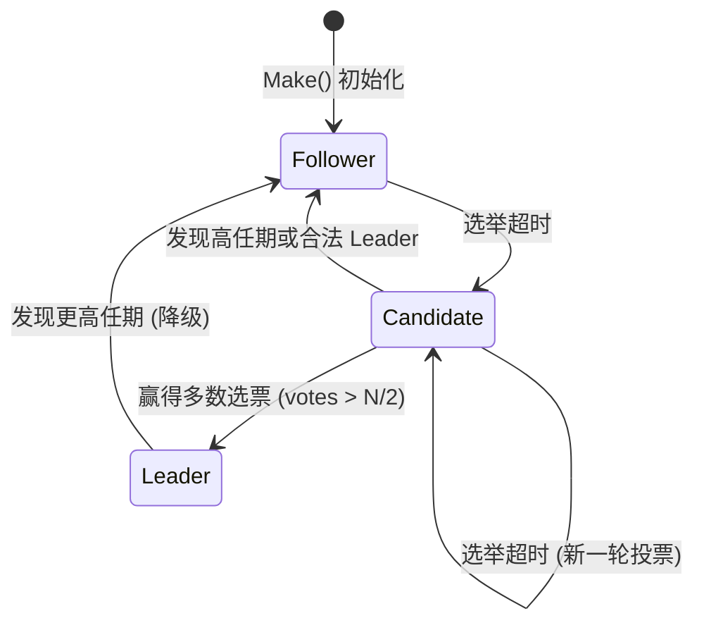
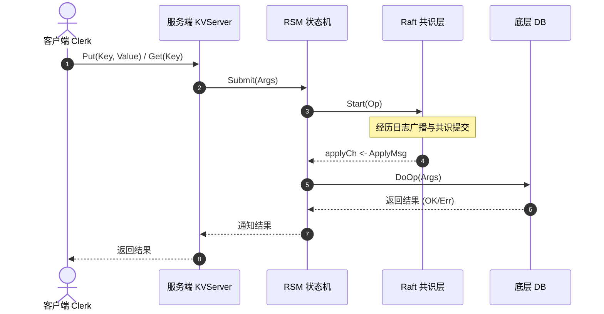

在分布式系统领域，如何构建一个既具强一致性又具高容错性的服务，是学术界与工业界经久不衰的命题。MIT 6.5840 (原 6.824) 作为分布式系统课程的巅峰之作，其核心实验便是带领学生从零实现一个完整的 Raft 共识协议，并在其上构建一个高可用的分布式键值服务（KV-Raft）。

本文将系统性梳理并总结 **Raft (Lab 3A/3B/3C/3D)** 以及 **KV-Raft (Lab 4)** 的架构设计、核心时序流程、以及开发调试中的踩坑指南。

---

## 一、 Raft 共识协议实现精要 (Lab 3)

Raft 协议的核心思想是将复杂的分布式共识问题分解为三个子问题：**领导者选举（Leader Election）**、**日志复制（Log Replication）** 和 **安全性（Safety）**。

### 1. Lab 3A：领导者选举与心跳检测
在 Raft 实现中，节点被赋予了三种角色状态：`Follower`、`Candidate` 和 `Leader`。

#### 节点状态转移流程
状态的转移遵循严格的超时与投票机制：

#### 关键技术点：
* **随机选举超时（Randomized Election Timeout）**：为了避免瓜分选票（Split Votes），选举超时时间被设定在 `300ms ~ 450ms` 之间随机分布。
* **心跳广播**：当选 Leader 后，立即以 `100ms` 的固定间隔向所有 Follower 发送心跳包（空 `AppendEntriesArgs`），以压制其它节点的选举定时器。

---

### 2. Lab 3B：日志复制与一致性匹配
日志复制是 Raft 保证状态机安全性与强一致性的关键通道。

#### 日志追加与冲突解决流程
1. **客户端请求**：Leader 接收到客户端指令后，通过 `Start()` 方法将指令追加到本地日志，并向所有 Follower 发送 `AppendEntries` RPC。
2. **一致性检查**：Follower 在接收到请求后，会校验 `PrevLogIndex` 处的日志任期是否与 `PrevLogTerm` 一致：
   - **若一致**：追加日志，并返回成功。
   - **若不匹配**：回退并寻找冲突位置，返回给 Leader。
3. **快速冲突回退优化（Fast Backoff）**：
   如果一条一条回退 `nextIndex`，在网络不良或节点断线重连时，日志对齐的延迟极大。我们在 `AppendEntriesReply` 中引入了 `ConflictIndex` 与 `ConflictTerm` 字段：
   - 如果 Follower 日志长度不够，直接将 `ConflictIndex` 设为 Follower 的日志长度。
   - 如果 Follower 对应位置任期不匹配，将 `ConflictTerm` 设为冲突位置的任期，并让 `ConflictIndex` 指向该任期的第一条日志。
   - Leader 收到回复后，可根据冲突信息一步回退数个任期的日志，极大加速了系统收敛。

---

### 3. Lab 3C：状态持久化与崩溃恢复
为了防范节点突然宕机断电，Raft 必须持久化关键 of 非易失性状态。

* **非易失性状态**：
  - `currentTerm`（当前任期）
  - `votedFor`（本任期内选票投给谁）
  - `log`（日志条目）
  - `lastIncludedIndex` 与 `lastIncludedTerm`（快照元数据）
* **持久化时机**：只要上述状态发生改变（如选举、收到有效投票请求、追加日志），必须在释放锁或向 RPC 响应前调用 `persist()` 保存状态。

---

### 4. Lab 3D：日志压缩与快照管理
随着运行时间的增长，Raft 的日志会无限膨胀，严重耗费内存并拉长重启恢复时间。

#### 索引转换层设计
引入快照（Snapshot）后，Raft 的真实物理 `log` 数组仅保存快照点以后的增量部分。为此，我们需要设计一套**绝对索引**到**相对索引**的映射关系：
$$\text{相对索引 (Slice Index)} = \text{绝对索引 (Absolute Index)} - \text{rf.lastIncludedIndex}$$

#### 快照同步逻辑：
- 当 Leader 发现要同步给某个 Follower 的日志已经被截断（即 `nextIndex[peer] <= rf.lastIncludedIndex`）时，无法再通过 `AppendEntries` 同步，此时必须改发 `InstallSnapshot` RPC。
- Follower 收到快照后，校验任期，重置本地日志并截断，然后通过 `applyCh` 将快照元数据及二进制数据交付给上层应用状态机。

---

## 二、 基于 Raft 的分布式 KV 服务 (Lab 4)

在分布式键值服务中，`KVServer` 作为上层应用，其读写状态并不直接修改本地数据库，而是通过共识层（Raft）同步，从而在多节点间实现完全一致的“复制状态机（RSM）”。

### 1. 客户端请求与重试处理
`Clerk（客户端）` 负责缓存上一次成功的 Leader 索引。当发生网络超时、RPC 丢失或收到 `ErrWrongLeader` 报错时，客户端会自动轮询集群节点重试，直到请求被新的 Leader 接受。

* **Put 幂等性与版本校验**：为了应对 RPC 响应丢失导致的客户端重试，系统引入了版本校验。
  - 只有当请求中的 `Version` 匹配服务器端 Key 的当前版本时，才执行修改。
  - 如果在重试期间收到了 `ErrVersion`，代表可能是之前丢失的 RPC 已经在服务端共识成功，此时需要返回 `ErrMaybe` 给应用层进行更高级别的处理。

### 2. 读写请求生命周期
以下是 KV 读写请求通过共识层达成强一致性的完整时序图：

### 3. 主动快照与状态恢复
- **容量感知**：`RSM` 异步应用协程会不断监控 Raft 的持久化大小（`rf.PersistBytes()`）。
- **打快照**：一旦超过 `maxraftstate` 限制，RSM 便会调用 `sm.Snapshot()` 序列化当前内存中的 KV 数据库，并调用 `rf.Snapshot` 对 Raft 的日志进行截断。
- **状态恢复**：节点重启时，RSM 读取持久化快照并通过 `sm.Restore` 恢复内存 DB 的数据。

---

## 三、 调试心得与踩坑指南 (坑点总结)

在实现分布式共识系统的过程中，细节决定成败。以下是开发中最为关键的踩坑点总结：

### 1. 锁与死锁（Deadlock）的预防
> [!CAUTION]
> **绝对不要在持锁期间向外部 Channel 发送数据，或进行同步 RPC 调用！**
> 
> 在 Raft 的 `applier` 或 RSM 的处理流程中，向 `applyCh` 推送数据是长耗时阻塞操作。如果在持锁 `rf.mu.Lock()` 的状态下向 channel 发送数据，而上层读取端正试图获取 `rf.mu` 锁，就会导致典型的**双向死锁**。
> 
> **解法**：在推送 `applyCh` 前必须释放锁，在操作完毕（例如向外部 Channel 发送数据）后再重新上锁。

### 2. 数据竞态（Data Race）与状态过期
在并发 Go 协程中，从锁被释放到重新获取锁期间，节点的状态（如 `Term`、`state`）可能已经被更新。
- 在处理任何异步 RPC 回包时（例如 `startElection` 内的异步拉票协程），重新拿锁后**必须首先校验**任期与状态是否一致。如果已经发生任期过时，则直接废弃该次响应。

---

## 四、 总结

MIT 6.5840 是一项极具挑战性的训练，它让我们深刻理解了在不可靠网络、断电崩溃等复杂现实环境下，如何构建绝对可靠的强一致性系统。
- **Raft 协议**的精妙之处在于将共识拆分为清晰可控的子任务，并在复杂的冲突校验中保持数学上的严密性。
- **KV-Raft** 则是典型的复制状态机实践，要求我们在上下层服务交互中完美处理重复包、状态截断与快照恢复。

本仓库通过精心设计的日志回退与锁分离逻辑，顺利通过了测试套件的严苛校验，为后续构建更大规模 of 分布式分片服务打下了坚实的基础。
