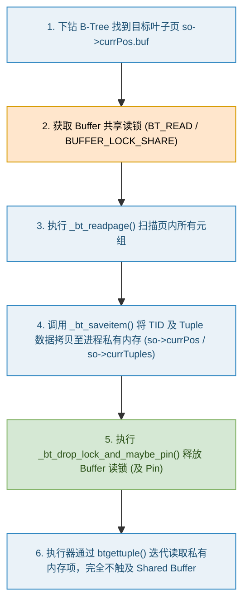
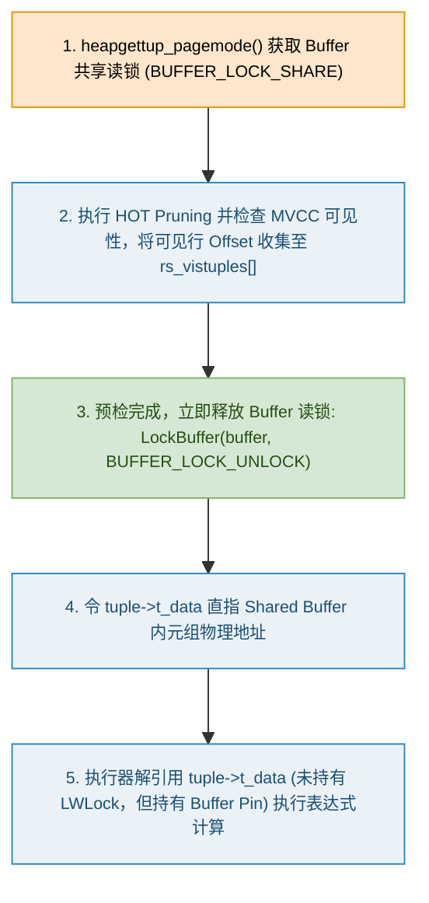

在关系型数据库的高并发读写架构中，共享缓冲区管理器（Buffer Pool Manager）与物理存储引擎（Access Methods）之间的锁协议设计，直接决定了系统的并发吞吐量上限。

在探索 PostgreSQL 的底层实现时，一个经典且具有迷惑性的问题经常被提及：

> **在 B-Tree 索引扫描或堆表（Heap Table）扫描过程中，释放了 Buffer 内容锁（LWLock）之后，是否存在通过裸指针直接访问 Shared Buffer 共享内存数据的操作？**

答案是：**对于 B-Tree 索引扫描，绝对不存在；而对于 Heap 堆表扫描，确实存在释放 LWLock 后通过指针访问 Shared Buffer 的操作，但它受到 Buffer Pin 与 MVCC 不可变性的严格保护。**

本文将结合 PostgreSQL 最新源码（`src/backend/access/nbtree/` 与 `src/backend/access/heap/`），对这一机制进行全方位的深度剖析。

---

## 一、 B-Tree 索引扫描：批处理与私有内存深拷贝

在 B-Tree 索引扫描中，PostgreSQL 采用了 **Page-at-a-time Batch Processing（按页批量暂存机制）**。

### 1. 扫描流程与锁的控制

B-Tree 索引检索元组的总体流程如下：



### 2. 源码实现分析

当 `_bt_readpage()` 遍历叶子页上的 Index Tuple 时，每当发现符合 ScanKey 条件的元组，就会调用 `_bt_saveitem()`：

```c
// src/backend/access/nbtree/nbtreadpage.c
static void
_bt_saveitem(BTScanOpaque so, int itemIndex, OffsetNumber offnum, IndexTuple itup)
{
    BTScanPosItem *currItem = &so->currPos.items[itemIndex];

    // 1. 复制物理堆表 TID (ItemPointerData，包含 BlockNumber 与 OffsetNumber)
    currItem->heapTid = itup->t_tid;
    currItem->indexOffset = offnum;

    // 2. 如果是 Index-Only Scan，深拷贝整个 IndexTuple 到进程私有内存 so->currTuples 中
    if (so->currTuples)
    {
        Size itupsz = IndexTupleSize(itup);
        currItem->tupleOffset = so->currPos.nextTupleOffset;
        memcpy(so->currTuples + so->currPos.nextTupleOffset, itup, itupsz);
        so->currPos.nextTupleOffset += MAXALIGN(itupsz);
    }

    // 注：在 PG 13+ 引入的 Deduplication 机制下，若为 Posting List 展开元组，
    // _bt_saveitem 会将其解包成多个独立 TID 并存入 items 数组中。
}
```

整页匹配元组暂存完毕后，系统立即调用 `_bt_drop_lock_and_maybe_pin()` 释放锁：

```c
// src/backend/access/nbtree/nbtsearch.c
static inline void
_bt_drop_lock_and_maybe_pin(Relation rel, BTScanOpaque so)
{
    if (!so->dropPin)
    {
        /* 仅释放 Leaf Page Buffer 读锁 */
        _bt_unlockbuf(rel, so->currPos.buf);
        return;
    }

    /* 在 MVCC 扫描中，甚至连 Buffer Pin 一并释放（PostgreSQL 12+ 引入，避免阻塞 VACUUM） */
    so->currPos.lsn = BufferGetLSNAtomic(so->currPos.buf);
    _bt_relbuf(rel, so->currPos.buf);
    so->currPos.buf = InvalidBuffer;
}
```

> **历史演进提示（PG 12+ 优化）**：
> 在 PostgreSQL 12 之前，B-Tree 扫描在迭代 tuple 期间会持续 hold 住 Leaf Page 的 Pin，这会导致慢查询在索引扫描时长期 Pin 住页面，进而阻断 `VACUUM` 获取 Cleanup Lock。PG 12 引入了记录 `lsn` 并主动释放 Pin 的机制（`_bt_drop_lock_and_maybe_pin`），彻底解决了 B-Tree 索引扫描阻塞 `VACUUM` 的历史痛点。

### 3. 结论

**B-Tree 索引扫描绝不使用野指针**。锁释放后，执行器拿到的 `scan->xs_heaptid` 是从进程私有数组 `items` 中取出的结构体副本，而 Index-Only Scan 取出的 `scan->xs_itup` 指向进程私有 `palloc` 的内存空间 `so->currTuples`。

---

## 二、 Heap 堆表扫描：解除 LWLock 后的“Pin 保护裸指针”

与 B-Tree 索引扫描不同，Heap 堆表扫描在 **Page Mode（页级批量模式 `SO_ALLOW_PAGEMODE`）** 下，展示了极为大胆且高效的设计：**在释放 Buffer 内容锁（LWLock）之后，直接使用指针访问 Shared Buffer 内部的数据！**

### 1. Page Mode 扫描流程



### 2. 源码逻辑拆解

在 `heapam.c` 的 `heapgettup_pagemode()` 跨页/新页处理阶段：

```c
// src/backend/access/heap/heapam.c (内联于 heapgettup_pagemode 中)
static void
heapgettup_pagemode(HeapScanDesc scan, ScanDirection dir, int nkeys, ScanKey key)
{
    ...
    // 1. 尝试对全页做 HOT 裁剪与碎页整理
    heap_page_prune_opt(scan->rs_base.rs_rd, buffer, &scan->rs_vmbuffer, ...);

    // 2. 加共享读锁评估可见性
    LockBuffer(buffer, BUFFER_LOCK_SHARE);
    page = BufferGetPage(buffer);

    // 3. 筛选可见元组索引存入 scan->rs_vistuples
    scan->rs_ntuples = page_collect_tuples(scan, snapshot, page, buffer, ...);

    // 4. 关键：可见性评估完成，立即解锁 LWLock！
    LockBuffer(buffer, BUFFER_LOCK_UNLOCK);
    ...

    // 5. 后续迭代吐出 tuple 时：
    lineoff = scan->rs_vistuples[lineindex];
    lpp = PageGetItemId(page, lineoff);

    // tuple->t_data 是一个物理 C 语言指针，直接指向 Shared Buffer 内的物理内存页！
    tuple->t_data = (HeapTupleHeader) PageGetItem(page, lpp);
    tuple->t_len = ItemIdGetLength(lpp);
    ...
}
```

当执行器调用 `slot_deform_heap_tuple` 解构字段或评估过滤条件（`ExecEvalExpr`）时，系统解引用 `tuple->t_data` 裸指针，而此时 **共享内存锁 LWLock 早已被释放**。

### 3. 为什么“无锁访问指针”绝对安全？

在 Shared Buffer 中，解锁后指针为何不会发生野指针溢出或并发脏读？答案在于 PostgreSQL 建立的**四重防护网**：


1. **保障一：Buffer Pin 机制（内存地址锁定）**
   * LWLock 控制并发读写，而 **Buffer Pin（引用计数）** 控制 Buffer 物理页的生命周期。
   * 在 `BufferHeapTupleTableSlot` 槽位中，后端进程**全程持有着该 Buffer 的 Pin（`IncrBufferRefCount`）**。只要 Pin 存在，Buffer Pool Manager 就**绝不会换出或重分配**该页面的虚拟内存地址。
2. **保障二：阻断 VACUUM 的物理重排（Cleanup Lock 阻断）**
   * `VACUUM` 物理擦除元组或重排 Line Pointer（`ItemIdData`）的前提是必须取得缓冲区的 **Cleanup Lock（超独占锁）**。
   * Cleanup Lock 规定缓冲区的 `RefCount` 必须等于 1（即仅 VACUUM 自己持有）。**只要有查询进程持 Pin，VACUUM 就绝对无法获取 Cleanup Lock**，必须挂起等待。因此物理 Offset 绝不会被移除或篡改。
3. **保障三：MVCC 属性只读不可变性（Payload Immutability）**
   * PostgreSQL 的更新采用异地更新（Out-of-place Update），生成新行。
   * 已经对当前 MVCC 快照可见的元组，其列属性 Payload（`t_hoff` 之后的数据）在物理上是**绝对只读且不可变**的。并发事务的 `UPDATE`/`DELETE` 最多原子修改元组头部的 `xmax` 状态，绝不触碰或覆写列数据。
4. **保障四：Pre-Pruning（持锁预裁剪）**
   * 页面裁剪（HOT Pruning）已经在持锁期间完成，解锁后消费阶段无需再进行任何结构性修改。

### 4. 裸指针生命周期的物化闭环（Slot Materialization）

裸指针访问仅在 Buffer Pin 的生命周期内生效。当执行器需要跨越当前 Pin 生命周期传递元组时（例如上层算子为 `Sort`、`HashJoin`、`Materialize`，或槽位准备清空/换页），执行器会调用 `ExecMaterializeSlot()` / `heap_copytuple()`：

* 系统在进程私有内存（`palloc`）中分配新的空间，将 Shared Buffer 中的元组完整**深拷贝**过去。
* 将 Slot 的底层指针指向私有深拷贝副本，并主动调用 `UnpinBuffer()` 释放 Buffer Pin。

这一机制形成了“**优先物理裸指针零拷贝，跨生命周期自动深拷贝**”的完整闭环。

### 5. 特殊防御：非 MVCC 快照的强行加锁

如果扫描使用的是非 MVCC 快照（如 `SnapshotAny`、`SnapshotDirty` 或系统目录探查）：

```c
// src/backend/access/heap/heapam.c -> heap_beginscan
if (!(snapshot && IsMVCCSnapshot(snapshot)))
    scan->rs_base.rs_flags &= ~SO_ALLOW_PAGEMODE;
```

由于非 MVCC 快照下元组随时可能被并发事务删除或物理改动，PostgreSQL **会强行禁用 Page Mode**。在非 Page Mode（`heapgettup`）下，每次读取评估元组时，**必须全程重新持有 `BUFFER_LOCK_SHARE` 锁**。

---

## 三、 B-Tree 与 Heap 的设计哲学深度对比

为什么 B-Tree 不能像 Heap 一样利用 Pin 保护裸指针，而必须做深拷贝？

| 对比维度 | B-Tree 索引扫描 (Index Scan) | Heap 堆表扫描 (Page Mode) | Heap 堆表扫描 (非 Page Mode) |
| :--- | :--- | :--- | :--- |
| **Buffer LWLock 持锁时间** | 仅在扫描单个 Leaf Page 匹配项时持有，**搜集完立即解锁** | 仅在评估页可见性时持有，**搜集完立即解锁** | **处理每个 Tuple 时全程持锁** |
| **Buffer Pin 持留时间** | 仅在 `!so->dropPin` 时持留；`dropPin=true` 时**立即释放 Pin** | **全程持 Pin**（直到 Slot 清空或跨页） | **全程持 Pin**（直到 Slot 清空或跨页） |
| **数据内存位置** | 进程私有内存 (`so->currPos` / `so->currTuples`) | **Shared Buffer 物理页面** (`tuple->t_data`) | **Shared Buffer 物理页面** (`tuple->t_data`) |
| **数据提取方式** | 私有内存结构体副本 / 深拷贝内存指针 | **Pin 保护下的 Shared Buffer 物理指针** | **LWLock 保护下的 Shared Buffer 物理指针** |
| **深拷贝 (Materialize) 条件** | 默认即深拷贝（Index-Only Scan 拷贝整行） | 仅在跨 Pin 生命周期（如 Sort / HashJoin / Slot 清空）时深拷贝 | 仅在跨 Pin 生命周期时深拷贝 |
| **VACUUM 友好度** | **极高**（立刻释放 Pin，绝不阻塞 VACUUM） | 较高（持 Pin 期间阶段性挂起 VACUUM Cleanup Lock） | 较高（持 Pin 期间阶段性挂起 VACUUM Cleanup Lock） |

### 架构考量背后的本质原因：

1. **B-Tree 页面动态变动剧烈**：
   * B-Tree 叶子页存在频繁的并发分裂（Page Split）、并发删除与 Deduplication（去重）。页内的 Line Pointer 和元组 Offset 偏移量极易发生剧烈变动。
   * B-Tree 扫描无法像 Heap 堆表那样依靠单纯的 Pin 阻止物理变更。为了彻底规避复杂的死锁和并发同步开销，B-Tree 选择在持锁瞬间**一次性深拷贝全页匹配项**，随即可大方地释放 LWLock 甚至 Pin。
2. **Heap 堆表追求零拷贝极致性能**：
   * 堆表物理结构相对稳定（按块追加，异地更新）。
   * 借助 MVCC 保证的数据不可变性与 Pin 阻断 VACUUM 的特性，堆表扫描成功实现了**无锁状态下直读 Shared Buffer 物理内存**，彻底消除了每次读表都要将 tuple 复制一份的巨大 CPU/内存开销。

---

## 四、 总结

PostgreSQL 存储引擎的设计展现了极其精妙的权衡艺术：

- **B-Tree 索引** 通过 **“批处理 + 私有内存深拷贝”**，换取了极短的 Buffer LWLock 持有时间与对并发 `VACUUM` 的极佳友好度。
- **Heap 堆表** 巧妙利用 **“Buffer Pin 锁地址 + MVCC 保证数据只读”** 构筑的四重防护网，实现了**解锁 LWLock 后直接通过指针零拷贝读取 Shared Buffer**，将单表顺序扫描与过滤的性能推向极致。

理解这两套机制的运作原理，不仅有助于深入掌握数据库并发控制与缓冲区管理的本质，也为我们在分布式系统与高性能存储开发中权衡锁粒度与内存拷贝提供了绝佳的架构范本。
