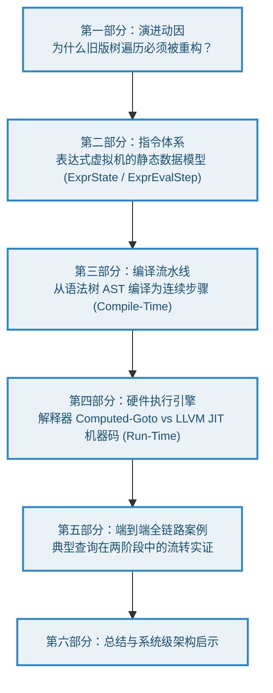
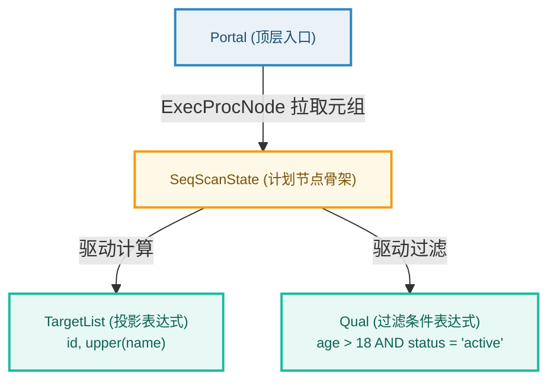
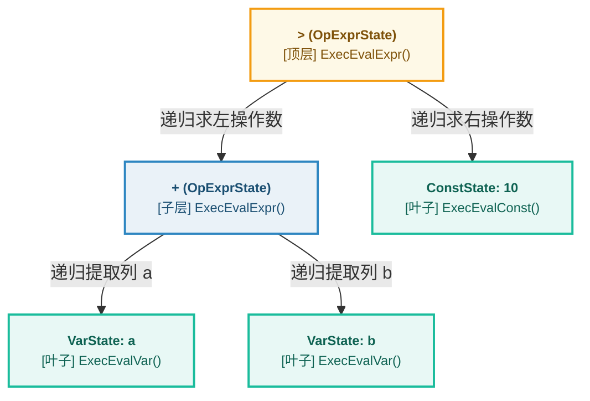
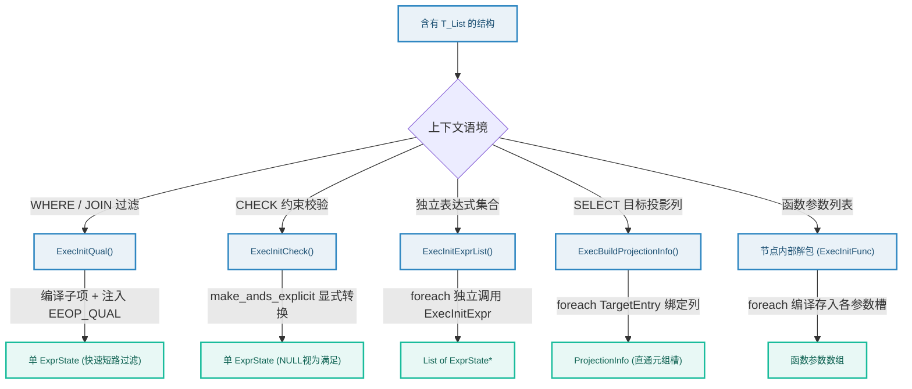
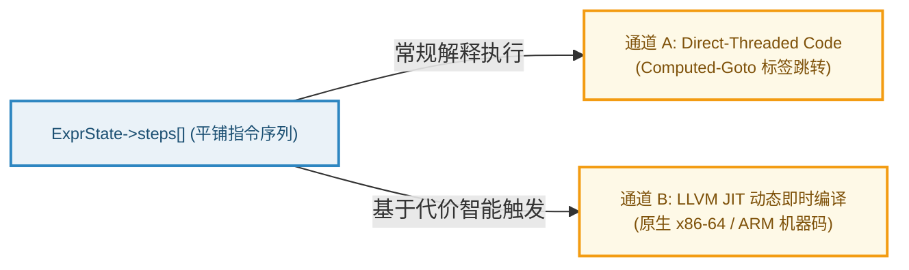
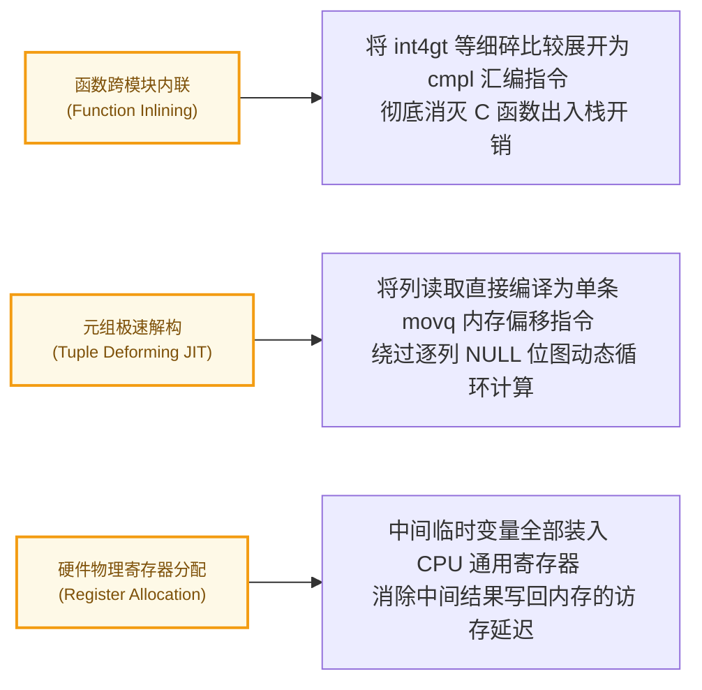

在关系型数据库内核中，如果说**执行计划树（Plan Tree）**构成了按火山模型（Volcano Model）拉取元组的数据管道骨架，那么**表达式求值（Expression Evaluation）**就是流淌在管道中处理每一行数据的血肉。无论是 `SELECT` 投影列的运算、`WHERE` 过滤条件的判定、`JOIN` 关联条件的匹配，还是聚合与窗口函数参数的准备，最终都由表达式引擎以纳秒级的频率对海量数据逐行计算。

从 PostgreSQL 10 开始，内核引入了由 Andres Freund 主导的表达式引擎革命性重构（Commit: `b8d7f053c5c`），并在 PostgreSQL 11 中正式集成 LLVM JIT 动态即时编译。这一跨越使 PostgreSQL 从沿用了 20 年的“递归树遍历解释器”迈入了“现代平铺字节码与原生机器码”时代。

本文将以**一条 SQL 表达式的完整生命周期（Lifecycle）**为主线，深度拆解这一现代执行器核心基础设施的底层演进与实现机理：



---

## 一、 演进动因：为什么表达式必须“拍扁”？

### 1.1 架构定位：计划骨架与行级血肉

在数据库执行器中，必须清晰界定**计划节点（PlanNode）**与**表达式（Expression）**的职责边界：



- **计划节点（PlanNode）**：执行器的骨架（如 `SeqScan`、`HashJoin`、`Agg`）。节点间通过拉取式管道火山模型（`ExecProcNode`）以元组（`TupleTableSlot`）为粒度传递数据。
- **表达式（Expression）**：依附在计划节点上的运算单元。它在单行元组（或内外表拼接元组）的上下文中，进行具体的标量计算、条件短路判定或列属性投影提取。

### 1.2 旧架构之殇：PG 9.6 以前的树遍历解释器

在 PostgreSQL 9.6 及更早版本中，表达式求值采用的是经典的**递归树遍历模型（Tree-walk Evaluation）**（以 `(a + b) > 10` 为例）：



面对简单的条件 `(a + b) > 10`，在扫描千万行数据时，旧模型暴露出四个致命的硬件级性能缺陷：

1. **深度函数调用栈开销（Call Stack Overhead）**：
   求值逻辑通过深度优先递归遍历抽象语法树，每一个算术运算符、甚至简单常量提取都要经历一次完整的 C 语言函数调用（`ExecEvalExpr` 入栈/出栈），保存和恢复寄存器带来不可忽视的 CPU 开销。
2. **指针追逐与 Cache 颠簸（Pointer Chasing & Cache Misses）**：
   树形结构中的每个 `ExprState` 节点都是在堆上独立 `palloc` 分配的，物理内存分布极其离散。CPU 在求值时不得不沿着指针在内存空间中漫游跳跃，导致 CPU L1/L2 数据缓存命中率极为低下。
3. **硬件分支预测器冲刷（BTB Thrashing）**：
   所有节点在递归时都在执行间接函数指针调用（`node->evalfunc(...)`），导致现代 CPU 的硬件分支目标缓冲器（Branch Target Buffer, BTB）被反复冲刷和污染，分支预测准确率骤降，流水线频繁停顿（Pipeline Stall）。
4. **与 JIT 编译天然绝缘**：
   分散在堆中的树形递归结构语义过于离散，外部编译器（如 LLVM）根本无法对其进行统一的过程内控制流构建、数据流分析与跨函数内联（Inlining）。

**核心结论**：为了迎合现代高并发多核 CPU 的体系结构特性，PostgreSQL 必须将递归的树形 AST 扁平化（Flattening）为**内存连续、硬件缓存友好的指令数组**。

---

## 二、 指令体系：现代表达式虚拟机的静态数据模型

重构后的现代求值引擎，在本质上是一个专门运行在内核中的**轻量级专用虚拟机（Domain-Specific VM）**。它定义了一套高度契合 CPU 底层特性的执行状态容器与微操作码体系。

### 2.1 虚拟机运行时容器：`ExprState`

整个求值上下文由结构体 `ExprState` 统一承载：

```c
/* src/include/nodes/execnodes.h */
typedef struct ExprState
{
    Node        tag;
    uint8       flags;          /* 状态与模式标志: 如 EEO_FLAG_IS_QUAL, EEO_FLAG_DIRECT_THREADED */

    /* 表达式计算结果默认暂存区 (解耦存储与运算) */
    bool        resnull;        /* 标量结果是否为 NULL */
    Datum       resvalue;       /* 标量结果的值 */

    TupleTableSlot *resultslot; /* 投影操作的目标元组槽 (非投影时为 NULL) */

    struct ExprEvalStep *steps; /* 核心：扁平化指令数组 (物理内存连续) */
    int         steps_len;      /* 指令实际数量 */

    ExprStateEvalFunc evalfunc; /* 实际执行求值的入口函数指针 (指向解释器或 JIT 编译函数) */
    Expr       *expr;           /* 指向原始表达式语法树 (供 EXPLAIN 及调试溯源) */
    ...
} ExprState;
```

`ExprState` 彻底剥离了以往树节点的父子指针，其核心就是一段连续的字节码数组 `steps` 以及执行入口 `evalfunc`。这里有两个体现极致性能工程的细节：
- **无循环边界检查（Loopless Dispatch）**：在源码注释中，`steps_len` 被明确标记为“仅在编译准备阶段有用”。运行期解释执行时，CPU 完全无需维护 `for (i = 0; i < steps_len; i++)` 形式的计数器与边界检查分支，而是纯粹依靠指令指针 `op++` 推进，直到命中末尾的 `EEOP_DONE` 触发 `goto out;` 退出。
- **快车道特化（Fast-Path: `ExecJust*`）**：对于极其高频的简单表达式（如长度为 2 的纯常量 `[EEOP_CONST, EEOP_DONE]`，或长度为 3 的单列读取 `[EEOP_SCAN_FETCHSOME, EEOP_SCAN_VAR, EEOP_DONE]`），`ExecReadyInterpretedExpr()` 会直接将 `evalfunc` 特化替换为硬编码的专属 C 函数（如 `ExecJustConst`、`ExecJustScanVar`、`ExecJustAssignScanVar`），连 Computed-Goto 解释循环都直接绕过！

### 2.2 硬件友好的最小微指令：`ExprEvalStep`

每一步具体运算被抽象为一个微指令步骤结构体 [`ExprEvalStep`](https://github.com/postgres/postgres/blob/master/src/include/executor/execExpr.h)：

```c
/* src/include/executor/execExpr.h */
typedef struct ExprEvalStep
{
    intptr_t    opcode;         /* 操作码 (编译完成时可直接替换为 Computed-Goto 绝对标签地址) */
    Datum      *resvalue;       /* 当前步骤计算结果存入的目标内存指针 */
    bool       *resnull;        /* 当前步骤 NULL 标志存入的目标内存指针 */

    /* 
     * 内联操作数联合体: 严格限制 <= 40 字节！
     * 保证整个结构体大小恰好等于 64 字节 (对齐主流 CPU 单个 L1 缓存行)
     */
    union
    {
        struct { int last_var; bool fixed; ... } fetch;     /* 元组属性批量解构预取 */
        struct { int attnum; Oid vartype; } var;            /* 读取列属性值 */
        struct { FunctionCallInfo fcinfo_data; ... } func;  /* 函数调用预置上下文 */
        struct { int jumpdone; } qualexpr;                  /* 过滤短路跳转目标 (关键设计！) */
        ...
    } d;
} ExprEvalStep;
```

#### 为什么必须严格对齐 64 字节？
1. **硬件缓存行零浪费（Cacheline Conscious）**：主流 x86-64 / ARM 架构的 L1 数据缓存行大小均为 64 字节。每个 `ExprEvalStep` 恰好独占一个缓存行，不存在跨 Cacheline 访问带来的额外内存总线事务。
2. **极速预取（Hardware Prefetcher）**：由于 `steps` 数组在内存中连续排布，CPU 预取器在加载 Step 0 时，Step 1、Step 2 便被自动拉入缓存，彻底消除了历史上的指针追逐（Pointer Chasing）。
3. **解耦中间结果存储**：每个 Step 包含 `resvalue` 和 `resnull` 的目标指针。编译器可以通过调整指针指向，让上一步的输出直接对准下一步的输入槽位（甚至直接指向 `ExprState->resvalue` 或元组槽），省去中间缓冲区的内存拷贝。
4. **设计伏笔（`d.qualexpr.jumpdone`）**：联合体中的 `qualexpr` 字段专门保存短路跳出时的目标下标，这是编译器在处理过滤条件时实现极速短路的核心武器。

---

## 三、 编译流水线：从语法树到指令流的生成（Compile-Time）

在理解了虚拟机的静态指令格式后，下一个核心问题是：**PostgreSQL 是如何在执行准备阶段，将用户输入的嵌套 AST 递归平铺为 `ExprEvalStep[]` 数组的？**

### 3.1 标量节点递归编译：`ExecInitExprRec`

编译流水线的主入口是 [`ExecInitExprRec`](https://github.com/postgres/postgres/blob/master/src/backend/executor/execExpr.c)。该函数采用深度优先遍历（DFS），并借助一个典型的编译器状态机逐步构建指令流：

```c
/* 编译器在栈上初始化临时步骤模板 */
ExprEvalStep scratch = {0};

/* 递归编译子节点... */
ExecInitExprRec(child_node, state, target_resv, target_resnull);

/* 组装当前节点对应的指令 */
scratch.opcode = EEOP_FUNCEXPR;
scratch.resvalue = resv;
scratch.resnull = resnull;
scratch.d.func.fcinfo_data = ...;

/* 将步骤压入动态数组 */
ExprEvalPushStep(state, &scratch);
```

在 `ExecInitExprRec` 内部，通过庞大的 `switch-case` 覆盖了 35 种以上的核心 `NodeTag`：

| 类别 | 代表节点类型 | 关键编译行为与生成 Opcode |
| :--- | :--- | :--- |
| **数据源叶子** | `T_Var`, `T_Const`, `T_Param` | 生成 `EEOP_SCAN_VAR`、`EEOP_CONST`，直接映射 `TupleTableSlot` 列偏移或字面常数。 |
| **标量运算与函数** | `T_FuncExpr`, `T_OpExpr` | 由 `ExecInitFunc` 统一处理，严格函数（Strict Function）生成 `EEOP_FUNCEXPR_STRICT`，并预先缓存 `FmgrInfo`。 |
| **控制流短路** | `T_BoolExpr`, `T_CaseExpr`, `T_CoalesceExpr` | 拆解为带相对偏移的 `EEOP_BOOL_AND_STEP`，遇短路直接跳转。 |
| **复合容器** | `T_RowExpr`, `T_ArrayExpr` | 递归编译子元素后，末尾追加 `EEOP_ROW` / `EEOP_ARRAY` 操作码组装成复合 Datum。 |
| **子计划交互** | `T_SubPlan`, `T_AlternativeSubPlan` | 生成 `EEOP_SUBPLAN`，求值时通过 `ExecSubPlan` 唤醒下层火山模型子树。 |

### 3.2 深度解密：为什么 `ExecInitExprRec` 没有 `case T_List`？

细看 `ExecInitExprRec` 的源码，会发现一个关键设计：**通用链表节点 `T_List` 在 `switch` 中是缺席的！** 这并非疏漏，而是 PostgreSQL 内核极其精巧的架构解耦决策：

1. **接口契约不匹配（Scalar vs Container）**：
   - `ExecInitExprRec` 的严格契约是：**将输入节点编译为能够计算出“单一标量值”（写入唯一的 `resvalue` / `resnull` 目标）的指令序列**。
   - `List` 本质上是一个异构指针容器，它本身不是表达式，不存在“将一个 List 求值为单一标量 Datum”的数学定义。
2. **上下文语义歧义（Contextual Ambiguity）**：
   同一个表达式列表，在 SQL 的不同子句中代表着截然相反的执行语义：
   - 在 `WHERE / JOIN ON` 中：表示**隐式 AND 过滤条件**（遇 NULL/False 立即丢弃行）；
   - 在 `SELECT` 中：表示**投影列集合**（各自计算并并列存入 `TupleTableSlot` 的不同物理列）；
   - 在函数调用中：表示**参数列表**（依次计算并写入 `FunctionCallInfo->args[]` 的各个参数槽）。
   如果把 `case T_List:` 塞进 `ExecInitExprRec`，编译器在没有外部语境的情况下根本无法决定该生成何种指令。
3. **终结历史上的类型双关（Type-punning）**：
   在 PG 9.6 以前，旧代码曾强行在 `ExecInitExpr` 中支持 `case T_List:`，内部把 `List *` 强制转换为 `(ExprState *)` 假装成表达式返回，埋下了严重的类型安全隐患。PG 10 重构确立了一条根本原则：**“谁拥有列表，谁在外部按上下文语义解包（Unpack）”**。



### 3.3 上下文语义特化：常规计划树 vs 独立表达式

由 `T_List` 解包原则自然衍生出执行器的一大分支：**根据运行上下文选择特化的编译入口**。特别是在计划树外部（如分区剪枝、CHECK 约束检查、PL/pgSQL 变量计算），系统提供了专门的独立准备函数：

#### 1. 编译入口总览

```c
/* 1. 计划树外的标量求值 */
ExprState *ExecPrepareExpr(Expr *node, EState *estate);

/* 2. 计划树外的条件过滤 */
ExprState *ExecPrepareQual(List *qual, EState *estate);

/* 3. 计划树外的 CHECK 约束 */
ExprState *ExecPrepareCheck(List *qual, EState *estate);
```

#### 2. 深度对比：`ExecPrepareExpr` vs `ExecPrepareQual`

| 对比维度 | `ExecPrepareExpr` | `ExecPrepareQual` |
| :--- | :--- | :--- |
| **输入形式** | 单一标量节点：`Expr *node` | 表达式链表：`List *qual`（隐式 AND） |
| **核心底层编译** | `ExecInitExpr(node, NULL)` | `ExecInitQual(qual, NULL)` |
| **标志位与生成指令** | 无特殊标记，常规求值指令流 | 标记 `EEO_FLAG_IS_QUAL`，**强制插入 `EEOP_QUAL` 步骤** |
| **空值 (NULL) 语义** | **严格三值逻辑**：计算出 NULL 则 `*resnull = true` | **WHERE 过滤语义**：遇到 NULL 或 False **直接判定不通过** |
| **短路与指令印证** | 无自动外层短路 | 编译时记录待回填位置，统一将 `d.qualexpr.jumpdone` 指向末尾 |
| **运行期调用接口** | 配合 `ExecEvalExpr(state, ...)` 运行 | 专门配合 `ExecQual(state, ...)` 运行 |
| **返回值类型** | 任意类型的 `Datum`（数值、文本、记录等） | 纯布尔判别值 `bool`（是否保留该行） |
| **空输入行为** | 传入 NULL 返回 NULL（交给 Eval 会引发段错误） | 传入 NIL 返回 NULL（**`ExecQual` 零开销直通返回 true**） |

#### 3. 为什么不能盲目替换？

如果在标量计算中错误调用了 `ExecPrepareQual`，将引发灾难性后果：

1. **非布尔类型内存破坏与段错误（Crash）**：
   `ExecPrepareQual` 编译生成的 `EEOP_QUAL` 指令底层会执行 `DatumGetBool(*op->resvalue)`，若该值非真，会将其强制改写为 `BoolGetDatum(false)`。若用于计算数值或文本，会将指针当作布尔判断，甚至暴力覆盖原始数据指针导致野指针崩溃！
2. **CHECK 约束语义被篡改（违反 SQL 标准）**：
   SQL 标准规定 CHECK 约束对待 NULL 的规则是 **"NULL is satisfied（视为通过）"**（如 `CHECK (age >= 18)` 允许插入 `age = NULL`）。
   `ExecCheck` 内置了防御性断言：`Assert(!(state->flags & EEO_FLAG_IS_QUAL))`。若使用 `ExecPrepareQual`，不仅断言直接崩溃；即使在 release 模式下，`EEOP_QUAL` 也会把 NULL 误判为不合格，导致合法数据被错误拦截。
3. **布尔变量三值状态丢失**：
   在 PL/pgSQL 中赋值 `my_var := (a > b);`，若 `a` 为 NULL，三值逻辑下变量应被赋予 NULL。而 `ExecPrepareQual` 会强行抹平为 `false`。

---

## 四、 硬件执行引擎：指令流的高速消耗机制（Run-Time）

当编译器将表达式编译为物理连续的 `ExprEvalStep[]` 数组后，表达式进入生命周期的后半程——**运行期消耗**。PostgreSQL 提供了两条相互配合的极致执行通道：



### 4.1 通道 A：直接线程化分发（Direct-Threaded Code）

传统的虚拟机解释器通常基于中央循环构建：
```c
while (true) {
    switch (op->opcode) {
        case EEOP_SCAN_VAR: ...; break;
        case EEOP_FUNCEXPR: ...; break;
    }
}
```
这会导致两个性能杀手：每次循环都需要一次中心化的间接跳转；且所有指令共用同一个跳转指令位置，导致 CPU BTB 分支预测器完全无法区分不同指令序列的走向。

PostgreSQL 在 GCC/Clang 编译器下启用了基于 `labels-as-values`（`&&CASE_label`）的**直接线程化代码（Direct-Threaded Code）**：

```c
/* src/backend/executor/execExprInterp.c */
#define EEO_DISPATCH()       goto *((void *) op->opcode)
#define EEO_NEXT()     do {         op++;         EEO_DISPATCH();     } while (0)
```

1. **编译期地址动态回填**：在初始化末尾阶段，`ExecReadyInterpretedExpr` 遍历 `steps[]` 数组，将每个 step 的 `opcode` 枚举值，直接替换为对应 C 函数内部汇编标签的**内存绝对地址**。
2. **去中心化跳转流**：每条指令在执行完毕后，直接通过 `op++` 并触发 `goto *(op->opcode)` 跃迁到下一条指令，完全消除了 `while` 和 `switch` 的中央调度开销。
3. **独立分支预测槽位**：每条指令末尾都拥有独立的间接跳转指令，现代 CPU 的硬件 BTB 可以针对具体的指令上下文分别记录预测历史，分支预测命中率提升 30% 以上。

### 4.2 通道 B：LLVM JIT 动态即时编译引擎

线性平铺字节码的诞生，为 PostgreSQL 接入 **LLVM JIT 即时编译** 扫清了最后一道工程障碍。

#### 1. 为什么平铺是 JIT 的天然基石？
JIT 编译器的本质是将高级指令映射为低级 LLVM 中间表示（IR）。在源码 [`src/backend/jit/llvm/llvmjit_expr.c`](https://github.com/postgres/postgres/blob/master/src/backend/jit/llvm/llvmjit_expr.c) 中：
- 平铺后的 `ExprEvalStep[]` 数组在结构上完全等价于**线性基本块（Basic Blocks）序列**；
- 编译器为数组中的每一个 step 逐一建立对应的 LLVM 基本块：
  ```c
  opblocks = palloc(sizeof(LLVMBasicBlockRef) * state->steps_len);
  for (i = 0; i < state->steps_len; i++)
      opblocks[i] = l_bb_append_v(eval_fn, "b.op.%d.start", i);
  ```
- 步骤之间的跳转（如 `EEOP_QUAL` 判定不通过时跳转至 `jumpdone`）被 1:1 直截了当地转译为 LLVM 条件分支指令（`LLVMBuildCondBr`）。

#### 2. JIT 的三大颠覆性硬件优化



1. **跨模块函数内联（Cross-Module Inlining）**：
   在解释执行下，即便比较两个简单整数（`>` 操作），每行数据也必须通过函数指针调用一次 C 语言的 `int4gt` 函数。LLVM JIT 利用内核预生成的 bitcode 库，直接把 `int4gt` 内联展开为一条原生的 CPU 汇编指令 `cmpl %eax, %edx`，函数调用开销归零。
2. **元组解构 JIT（Tuple Deforming JIT）**：
   传统解释器为了读取某一列，必须在运行时遍历元组头、解析 NULL 位图并动态计算列属性偏移。JIT 在查询编译期获悉表结构后，直接将列读取硬编码为单条内存加载指令：`movq 24(%rdi), %rax`（直接从第 24 字节加载目标数据），使元组解构性能飙升数倍。
3. **物理寄存器重分配**：
   解释执行下各步骤的结果必须存入 `resvalue/resnull` 内存指针；而在 JIT 生成的原生机器码中，LLVM 寄存器分配器将临时变量全程保存在 CPU 通用物理寄存器（如 `%rax`, `%rcx`）中高速流转，消除了对内存/缓存的频繁往返读写。

#### 3. 代价模型与性能权衡：三级递进代价阶梯（Three-tier Cost Ladder）

JIT 编译本身需要消耗明显的 CPU 算力与耗时（通常在 5ms ~ 50ms）：
- **高并发 OLTP 场景（点查点改）**：若查询本身的执行仅耗时 0.1ms，盲目触发 JIT 将导致总耗时劣化数十倍；
- **复杂分析型 OLAP 场景（大表过滤与聚合）**：当查询需要处理数千万行数据时，花费 20ms 进行 JIT 编译，能使运行时执行耗时从 10 秒缩减至 2 秒，收益极为显著。

为此，PostgreSQL 并没有采用“一刀切”的触发机制，而是设计了一套精密的**三级递进代价阶梯（Cost Thresholds）**：

1. **`jit = on`**：JIT 总体功能开关；
2. **`jit_above_cost = 100000`（一阶门槛：生成 IR）**：
   优化器预估的计划总代价值（Total Cost）超过该阈值时，正式启动 JIT，生成表达式求值（`llvmjit_expr.c`）与元组解构（`llvmjit_deform.c`）的原生 LLVM IR；
3. **`jit_inline_above_cost = 500000`（二阶门槛：跨模块内联）**：
   当计划代价进一步超过该阈值时，才触发跨模块函数内联（`llvmjit_inline.cpp`）。**前文所述将 `int4gt` 展开为汇编 `cmpl` 指令的极致优化，必须跨过此阶梯才会真正发生**（若代价介于 10 万到 50 万之间，JIT 仍通过普通函数指针调用）；
4. **`jit_optimize_above_cost = 500000`（三阶门槛：LLVM 激进优化）**：
   当计划代价足够大时，才启用耗时的 LLVM 优化 Pass（如 Instruction Combining、GVN、内存到寄存器提升与循环优化）。

> **实战排查启示**：在生产环境执行 `EXPLAIN ANALYZE` 时，常常看到 `JIT: ... Functions Inlined: 0`，很多人误以为 JIT 未生效。实际上是查询代价刚好落在了 10 万至 50 万区间，触发了 JIT 编译但尚未越过内联阈值。

---

## 五、 端到端案例全链路贯通（End-to-End Walkthrough）

为了将上述编译期与运行期的所有机制融会贯通，我们以一条典型的 SQL 查询为例走完完整旅程：

```sql
SELECT id, upper(name) FROM users WHERE age > 18 AND status = 'active';
```

### 5.1 过滤链路编译：`ExecInitQual` 与短路生成

优化器将 `WHERE` 条件解析为包含两个比较子项的 `qual` 列表。`ExecInitQual` 为其编译生成的连续 `ExprEvalStep[]` 步骤序列如下：

```
[Step 0: EEOP_SCAN_FETCHSOME]   --> 元组解构预取: 一次性解析 users 元组至少到 status 列
[Step 1: EEOP_SCAN_VAR]         --> 读取 age 字段值，写入 fcinfo0 参数槽
[Step 2: EEOP_FUNCEXPR_STRICT]  --> 执行严格函数 int4gt(age, 18)
[Step 3: EEOP_QUAL]             --> 核心短路: 若为 false 或 NULL, 直接根据 jumpdone 飞跃至 Step 7 (丢弃整行!)
[Step 4: EEOP_SCAN_VAR]         --> 读取 status 字段值，写入 fcinfo1 参数槽
[Step 5: EEOP_FUNCEXPR_STRICT]  --> 执行严格函数 texteq(status, 'active')
[Step 6: EEOP_QUAL]             --> 核心短路: 若为 false 或 NULL, 直接飞跃至 Step 7 (丢弃整行!)
[Step 7: EEOP_DONE]             --> 判定通过: 保留该元组并放行至投影阶段
```

> **短路实证**：若某行的 `age` 为 15，在 Step 3 判定失败后，CPU 通过 `jumpdone` 立即直接跳跃到 Step 7 结束本行判定。后续涉及 `status` 字段的字符串内存提取（Step 4）与文本匹配函数（Step 5）被完全短路略过！

> **编译期常量内联玄机（Zero-step Const）**：细心的读者会发现，条件中的字面常量 `18` 和 `'active'` 并未生成独立的 `EEOP_CONST` 指令步骤。这是因为 `ExecInitFunc()` 在编译参数时做出了专门的优化：
> ```c
> if (IsA(arg, Const))
> {
>     Const *con = (Const *) arg;
>     fcinfo->args[argno].value = con->constvalue;
>     fcinfo->args[argno].isnull = con->constisnull;
> }
> ```
> 编译器在准备期就将字面常量直接填入了已预分配好的 `FunctionCallInfo` 参数槽，运行期对每一行数据无需重复下发常量加载指令，彻底消除了常量求值的指令步进开销！

### 5.2 投影链路编译：`ExecBuildProjectionInfo` 与融合直通

对于 `SELECT id, upper(name)`，投影管理器在编译时进行了**直通赋值融合优化（Fused Projection）**：

```
[Step 0: EEOP_ASSIGN_SCAN_VAR]       --> 直通复制: 将 ScanSlot 的 id 列指针零拷贝直接赋入 ResultSlot
[Step 1: EEOP_SCAN_VAR]              --> 提取 name 列数据，存入 fcinfo 参数槽
[Step 2: EEOP_FUNCEXPR_STRICT]       --> 执行 upper() 大写转换函数
[Step 3: EEOP_ASSIGN_TMP_MAKE_RO]    --> 将 upper() 运算结果强制标记为只读，并绑定至 ResultSlot 对应属性槽
[Step 4: EEOP_DONE]                  --> 投影构建完毕，产出最终 TupleTableSlot
```

对于不需要计算的物理列 `id`，编译器甚至省去了中间取值和赋值的步骤，通过 `EEOP_ASSIGN_SCAN_VAR` 一步直达目标元组槽。

> **变长类型只读保护（Read-Only Protection）**：
> 注意 Step 3 生成的是 `EEOP_ASSIGN_TMP_MAKE_RO` 而非普通的 `EEOP_ASSIGN_TMP`。因为 `upper()` 返回的是变长数据类型 `text`（`typlen == -1`），PostgreSQL 在投影阶段会强制将其置为只读（Read-Only），以防止该指针在向外层算子流水线传递时被其他节点原位修改（In-place mutation），保障了 Expanded Datum 的内存安全。

### 5.3 运行期消耗：双通道实测对比

当该步骤序列交给底层执行时：
1. **解释执行通道**：
   - `Step 0` 执行完毕后执行 `op++`，直接通过 `goto *((void *) op->opcode)` 跃迁至 `Step 1`；
   - 途中若 `age > 18` 为假，`Step 3` 的 `EEOP_QUAL` 直接执行 `op = &state->steps[7]; goto *((void *) op->opcode);` 实现纳秒级短路跳出。
2. **LLVM JIT 通道**：
   - 步骤序列被合并编译为单个原生函数指针；
   - `int4gt` 和 `texteq` 被展开为原生内联汇编；
   - 元组解构中的列偏移变为硬编码常量；
   - 整个过程不经历任何解释器循环与 C 语言函数调用栈，以机器原生速度疯狂吞吐数据。

---

## 六、 总结与系统级架构启示

PostgreSQL 表达式求值引擎从 PG 9.6 到 PG 10/11 的蜕变，堪称工业级数据库内核架构重塑的教科书范本。从中可以提炼出四项核心系统设计哲学：

1. **面向硬件特性的数据结构设计（Cacheline Consciousness）**：
   将执行单元严格约束为 64 字节并连续排布，配合硬件缓存行与内存预取器，彻底消灭内存离散跳跃。
2. **解耦控制流并消除间接开销（Direct-Threaded Code）**：
   用平铺指令与 Computed-Goto 替代传统的中心化循环分发，使 CPU 硬件分支目标预测器（BTB）能够真正发挥效能。
3. **接口正交化与语义特化（Specialized Interfaces）**：
   坚决剔除语法层面的类型双关（如消除 `case T_List:`），明确区分标量求值（`ExecPrepareExpr`）与条件过滤（`ExecPrepareQual`），在编译期为不同的业务语义注入专属指令（如 `EEOP_QUAL`）。
4. **线性字节码作为向现代编译器进化的坚实桥梁（IR as a Stepping Stone）**：
   将松散的 AST 平铺规约为线性字节码，不仅提升了解释执行的局部性，更天然构筑了一套直接映射到现代编译器（LLVM）的中间表示（IR），为 JIT 机器码生成奠定了不可动摇的技术基石。
