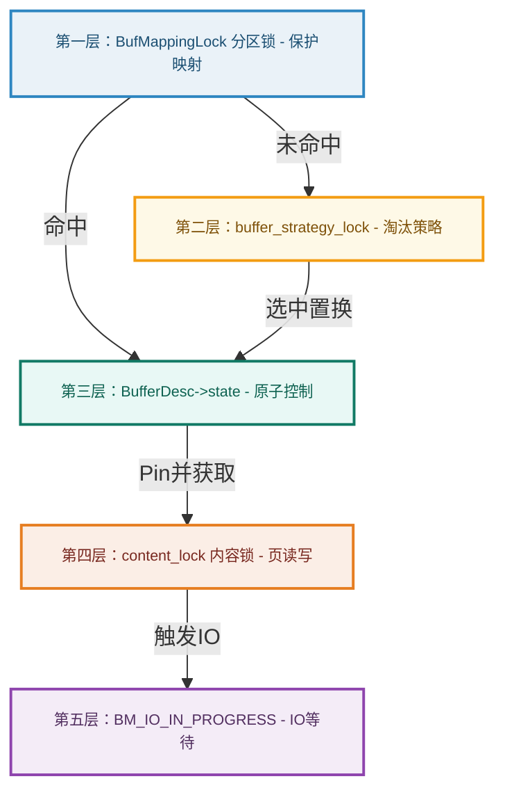

在关系型数据库中，共享缓冲区管理器（Buffer Manager）的并发控制是支撑高吞吐性能的底层关键。根据 PostgreSQL 官方设计文档 `src/backend/storage/buffer/README`，系统经历了一次划时代的内部锁定结构升级——从单一全局锁（BufMgrLock）蜕变为多层级、精细化的“锁解耦”与“原子 CAS 状态机”体系。

本文将针对这一内部锁定设计的演进与实现细节进行深度解析。

---

## 一、 历史背景：单系统锁（BufMgrLock）的瓶颈

在 PostgreSQL 8.1 之前，共享缓冲区的所有管理和查找操作都被保护在一个单一的全局轻量锁 **`BufMgrLock`** 之中。
*   **并发瓶颈**：任何进程在查找页面是否已缓存、Pin/Unpin 页面、或者执行置换算法淘汰老页面时，都必须以独占（Exclusive）或共享（Share）模式获取 `BufMgrLock`。这在多核 CPU 架构下造成了严重的全局锁争用，成为了吞吐量上不去的硬伤。
*   **演进方向**：将这一全局大锁分而治之，拆分为多层级、精细化的细粒度锁与原子状态操作，使常见路径（如缓存命中的快速读取）能以并发甚至无锁的形式完成。

---

## 二、 五层锁定与同步体系（Fine-Grained Locking Hierarchy）

目前，PostgreSQL 的缓冲区管理体系通过以下五层互补的锁与同步机制来实现高度并发与高可扩展性：



### 1. 第一层：哈希分区映射锁 `BufMappingLock` — 分离查找与调入
*   **物理对象**：在内核定义 `src/include/storage/buf_internals.h` 中，`BufMappingLock` 被拆分成了 **`NUM_BUFFER_PARTITIONS`** 个独立的轻量锁（LWLocks），默认值通常为 128。
*   **锁定规则**：
    *   通过 `BufTableHashCode(BufferTag)` 计算出数据页标签的 Hash 值，然后通过取模算法定位到对应的分区锁：`BufMappingPartitionLock(hashcode)`。
    *   **查找页面**：只需获取对应分区的 **共享锁（Share Lock）**。多个并发后端可以同时在哈希表的不同分区（甚至相同分区）快速检索 Buffer。
    *   **建立/修改映射**：当发生置换或首次从磁盘调入页面，需要修改哈希表项时，必须获取对应分区的 **排他锁（Exclusive Lock）**。
    *   **Pin 锁传递约束**：查找进程在哈希表中找到 Buffer 槽位后，**必须在释放 `BufMappingLock` 之前对其完成 Pin 操作**。否则，该缓冲区可能在锁释放的瞬间被并发置换进程剥夺并移作他用，从而导致读取数据发生严重错乱。
    *   **死锁预防**：在极少数需要同时锁定多个分区的操作中，进程必须按照**分区索引编号的升序**依次获取锁，以彻底杜绝死锁。

### 2. 第二层：置换算法全局锁 `buffer_strategy_lock` — 独占淘汰决策
*   **物理对象**：一个全局的自旋锁（Spinlock，类型为 `slock_t`），位于共享内存结构 `StrategyControl` 中。
*   **作用**：专门用来保护淘汰指针（Clock Hand）`nextVictimBuffer` 的向前推进，确保在置换缓冲区时，多个并发后端能安全且唯一地挑选出牺牲页（Victim Buffer）。
*   **性能保证**：因为是自旋锁，且其包含的时钟扫频置换算法执行路径极短（仅数条 CPU 指令），因此效率极高。
*   **严苛限制**：**在持有 `buffer_strategy_lock` 期间，严禁获取任何其他类型的锁（如轻量级锁 LWLock）**。否则，会导致其他处于自旋等待状态的 CPU 核心长时间空转，造成 CPU 暴涨与系统卡顿。

### 3. 第三层：缓冲描述符头部锁与原子状态 `BufferDesc->state` — 零自旋锁设计
在底层结构 `BufferDesc` 中，为了消除频繁读写控制属性（如引用计数、使用次数、状态位）时的锁争用，PostgreSQL 采用了一个 **32 位的原子变量 `state`**。

#### (A) 状态位复用结构
```
+--------------------------+---------------------+-------------------------------+
|  Flags 状态位 (10 bits)  |  Usage Count (4 bits) |  Reference Pin Count (18 bits)  |
+--------------------------+---------------------+-------------------------------+
31                       22 21                 18 17                            0
```
- **18 bits Pin 计数**：支持最大 262,143 个并发 Backend 同时 Pin 住同一个 Buffer 页。
- **4 bits 使用计数**：时钟置换算法使用次数（0~5 范围，对应 `BM_MAX_USAGE_COUNT = 5`）。
- **10 bits 控制标志**：包括 `BM_LOCKED`（头部锁）、`BM_DIRTY`（脏页）、`BM_VALID`（数据有效）、`BM_IO_IN_PROGRESS`（I/O在途）等。

#### (B) 无锁自增与原子比较交换（CAS Loop）
由于这三个字段被打包进同一个 32 位字中，PostgreSQL 可以利用现代 CPU 提供的原子汇编指令（如 CAS），在不持有任何硬件自旋锁或轻量锁的情况下，直接完成诸如“Pin 计数递增”、“使用次数更新”的操作。
*   例如，释放 Pin 计数并更新标志的代码片段 `UnlockBufHdrExt`：
    ```c
    for (;;)
    {
        uint32 buf_state = old_buf_state;
        buf_state |= set_bits;      // 修改状态位
        buf_state &= ~unset_bits;    // 消除状态位
        buf_state &= ~BM_LOCKED;    // 释放锁标志
        if (refcount_change != 0)
            buf_state += BUF_REFCOUNT_ONE * refcount_change; // 修改 Pin 数值
        
        // 原子比较并交换 (Compare-And-Swap)
        if (pg_atomic_compare_exchange_u32(&desc->state, &old_buf_state, buf_state))
            return old_buf_state; // 成功则退出循环，无锁完成状态更新
    }
    ```
*   **模拟自旋锁 (`BM_LOCKED`)**：当需要独占修改属性（如修改 `BufferTag` 绑定关系）时，系统会通过原子操作设置 `state` 中的 `BM_LOCKED` 标志，这个标志在逻辑上等同于该 Buffer Header 的独占自旋锁（`LockBufHdr`）。

### 4. 第四层：缓冲区内容锁 `content_lock` — 保护页内部数据一致性
*   **物理对象**：每个 `BufferDesc` 结构体中包含的 `LWLock content_lock`。
*   **作用**：控制对缓冲区内 8KB 数据页中元组（Tuple）读写的并发控制。
*   **区别**：前三层锁（Mapping锁、Strategy锁、Header自旋锁）全部是为了**保护管理器元数据（Metadata）**而设计；而内容锁是**唯一用来保护 8KB 页面数据实体**的锁。
*   **规则**：读页做可见性检查需获取共享（Shared）锁，写入、修改或冻结元组必须获取排他（Exclusive）锁。

### 5. 第五层：I/O 状态管理与条件变量 `BM_IO_IN_PROGRESS` — 异步 I/O 等待
*   **机制**：当进行物理磁盘读写时，执行进程会将对应缓冲区的 `state` 设置上 `BM_IO_IN_PROGRESS` 标志。
*   **等待非阻塞**：如果有其他并发进程也需要访问该页面，它们无需在内容轻量锁（`content_lock`）上自旋或阻塞，而是直接调用 `BufferDescriptorGetIOCV` 获取该缓冲区的**物理条件变量（Condition Variable）**并在其上休眠释放 CPU。
*   **唤醒**：发起 I/O 的进程在读写完成后清除该标志，并触发条件变量的广播信号（`ConditionVariableBroadcast`），唤醒所有在其上休眠 of 进程。这极大地提高了磁盘 I/O 期间整个系统的并发处理能力。

---

## 三、 对比总结：各锁类型与应用场景

为了更直观地理解这五层锁定关系，下表对其作用范围及底层实现进行了总结：

| 锁名称 | 底层物理类型 | 作用对象 | 典型应用场景 | 获取条件 |
| :--- | :--- | :--- | :--- | :--- |
| **分区映射锁**<br>`BufMappingLock` | `LWLock` (多分区) | 共享 Tag-Buffer 哈希表 | 查找页面是否被缓存在共享内存中 | 查找需 Share 锁，调入/页面置换需 Exclusive 锁 |
| **淘汰策略锁**<br>`buffer_strategy_lock` | `Spinlock` (单全局) | 时钟淘汰扫描指针及空闲链表 | 置换算法扫描 Victim Buffer 时 | 全局互斥，持有期间严禁获取其他锁 |
| **描述符状态/头部锁**<br>`BufferDesc->state` | `pg_atomic_uint32`<br>(CAS 结构) | 缓冲区状态属性控制块 | Pin / Unpin 计数增减，脏页/有效标志设置 | 读写属性均可通过无锁原子 CAS 指令循环完成 |
| **内容锁**<br>`content_lock` | `LWLock` (单 Buffer) | 8KB 数据页内容本体 | 执行元组扫描、插入、修改或物理删除 | 读 Tuple 需 Shared，改写 Tuple 需 Exclusive |
| **I/O 在途等待锁**<br>`BM_IO_IN_PROGRESS` | `state` 标志位 +<br>共享条件变量 `cv` | 磁盘 I/O 等待机制 | 当多个进程并发等待同一个脏页被写入或调入时 | 在对应的物理 `ConditionVariable` 上休眠等待唤醒 |
