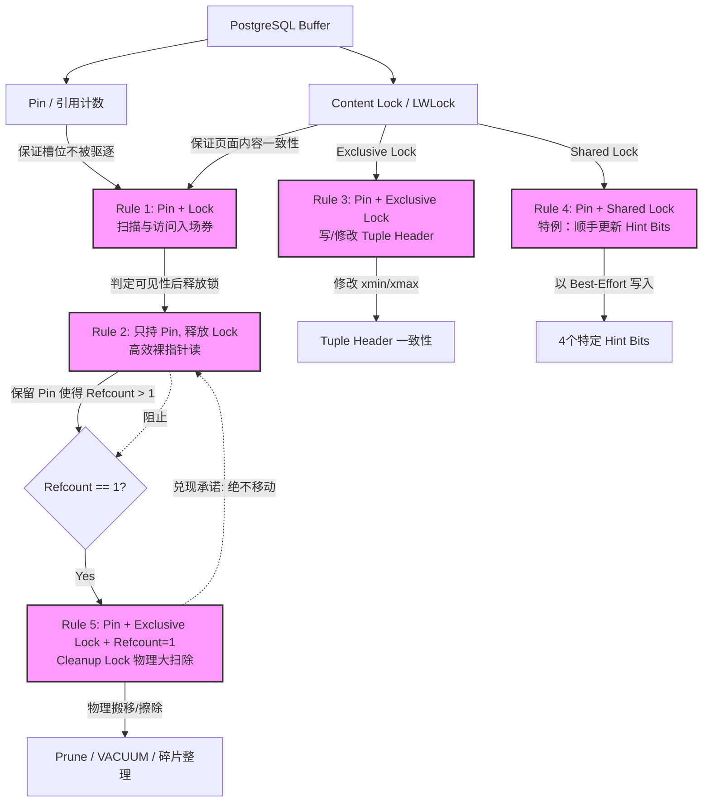

在关系型数据库中，如何在高并发读写的同时保证内存数据的正确性，是存储引擎设计的核心挑战之一。PostgreSQL 的 **Buffer 访问协议（通常称为 Pin 协议）**，就是为了解决这一问题而设计的底层并发控制基石。

根据 PostgreSQL 官方设计文档（`src/backend/storage/buffer/README`），整个协议由 5 条互相关联、设计精妙的规则（Rules）组成。本文将为您深度拆解这 5 条规则的来龙去脉、它们所解决的并发痛点，以及它们是如何协同工作的。

---

## 一、 核心同步原语：Pin 与 Content Lock

在 PostgreSQL 的 Buffer Manager 中，每个缓冲区（Buffer Slot）都配备了两个独立的同步原语，它们各司其职：

1. **Pin（引用计数）**：
   * **物理本质**：一个原子的引用计数（Refcount）。
   * **职责**：负责**“立足”**（保证槽位安全）。当一个 Buffer 被 Pin 住时，引用计数大于 0，缓存淘汰算法（如 Clock Sweep）就绝对不能将该槽位中的页面驱逐（Evict）或替换。
2. **Content Lock（内容轻量锁，LWLock）**：
   * **物理本质**：一个轻量级锁（LWLock），分为共享模式（Shared/Share）和排他模式（Exclusive）。
   * **职责**：负责**“防扰”**（保证字节一致性）。用于保护页面内部数据结构的并发读写，防止多个线程同时修改或读取时发生字节撕裂（Torn Page）。

| 同步原语 | 保护对象 | 解决的风险 | 锁开销 |
| :--- | :--- | :--- | :--- |
| **Pin** | Buffer 槽位与页面的映射关系 | 页面被并发替换（Eviction） | 极低（原子加减） |
| **Content Lock** | 页面内的字节内容与数据结构 | 并发读写导致的内存数据损坏、撕裂 | 较高（LWLock 争抢） |

这两种原语相互独立，但也必须紧密配合。Buffer 访问协议的 5 条规则，本质上就是**在不同场景下对这两个原语进行“加减法”的组合使用**。

---

## 二、 5 条 Buffer 访问规则深度剖析

---

### 1. Rule 1：基础页面扫描（Pin + Content Lock）

#### 核心定义
> **“要扫描页面以查找元组，必须同时持有该 Buffer 的 Pin 和内容锁（共享锁 Shared 或排他锁 Exclusive 皆可）。”**

#### 为什么两者缺一不可？
Rule 1 是整个访问协议的“入场券”。任何执行器、索引扫描或后台进程，在接触一个页面的最初那一刻，都必须同时把这两个独立的同步原语拉满。如果缺少任意一个，都会引发灾难性的后果：

* **如果只有 Content Lock，没有 Pin**：
  虽然锁住了页面内容，但由于没有 Pin，缓存淘汰算法会认为这个 Buffer 槽位是闲置的。在高并发压力下，另一个线程可能会直接将该槽位里的 Page 替换成物理磁盘上的另一个完全无关的 Page。此时，你持有的 Content Lock 锁住的已经是“别人的数据”，这会导致严重的内存数据错乱。
* **如果只有 Pin，没有 Content Lock**：
  虽然 Pin 保证了页面不会被换走（槽位安全），但由于没有加锁，无法保证并发安全性。如果有另一个写线程正在擦除、改写这个页面上的物理字节（例如触发了页面级重组），读线程在没有锁保护的情况下并发去读，就会读到被撕裂的、完全损坏的页面字节。

**总结**：**Pin 负责“立足”，Content Lock 负责“防扰”**。两者合璧，才是安全的初始访问状态。

---

### 2. Rule 2：高效裸指针读取（只持 Pin，释放 Content Lock）

#### 核心定义
> **“在通过内容锁判定某个元组可见后，可以释放内容锁，但只要保持 Pin 不放，就可以继续安全地使用裸指针访问该元组的数据。”**

#### 运行机制
在执行器扫描页面的过程中，如果每次读取 Tuple 成员都一直持有 Content Lock，会导致极高的锁竞争，严重压制并发只读性能。

Rule 2 允许了一种极其高效的脱钩状态——**“只持 Pin，不持 Content Lock”**：
1. Backend 在持有 Content Lock 的期间，对目标 Tuple 进行 MVCC 可见性检查。
2. 一旦判定该 Tuple 可见，Backend **立刻释放 Content Lock**，但**保持 Pin 不放**。
3. 此时，上层代码可以拿着指向该 Tuple 数据的裸指针（如 `HeapTuple` 的 `t_data`）跨函数、甚至跨执行节点传递并直接读取字节内容。

#### 它是如何保证安全的？
没有了 Content Lock，别的线程就可以进来修改该 Page。如果发生了页面内部的物理整理（如垃圾回收、碎片整理），Tuple 的物理偏移量变了，手里的裸指针不就变成野指针了吗？

Rule 2 本身不提供这个安全保证，它是靠 **Rule 5（Cleanup Lock 机制）** 来间接兑现的：
* 任何会改变 Tuple 物理位置的操作（如 `HOT prune` 局部清理、`VACUUM` 物理删除、页面碎片整理），都必须获取 **Cleanup Lock**。
* 获取 Cleanup Lock 的绝对前提是：**Page 的 Pin 引用计数必须等于 1**（即除了修改者自己，没有任何其他 Backend 引用）。
* 只要你手里还握着这个 Pin，Page 的 Refcount 就一定大于 1，任何人都拿不到 Cleanup Lock，也就**无法触发物理整理**。

因此，**Pin 间接保证了 Tuple 在页面内的物理位置（Line Pointer 和字节偏移）绝对稳定**。

#### 允许并发修改状态，但“无所谓”
README 中指出：*“Its state could change, but that is assumed not to matter...”* 
在你释放 Content Lock 只留 Pin 的期间，并发的事务可以拿 Exclusive Lock 去修改这个 Tuple 的 Header（例如标记它被删除了，或者并发提交了导致 `xmin/xmax/hint bits` 改变）。但这依然是安全的，原因在于：
1. **可见性决策已定**：Backend 是在持有 Content Lock 的期间做完 MVCC 可见性检查的。既然已经做出了“可见”的决策，后续即使并发修改了 Hint bits，Reader 也不会重新做检查。
2. **Tuple Payload 不可变（Immutable）**：PostgreSQL 采用非原地更新（MVCC 机制下 `UPDATE` = 删旧插新）。这意味着这个 Tuple 实际的数据内容（Payload）永远不会被并发改写，通过指针读到的数据永远是确定不变的。

#### 副作用：阻塞 VACUUM 物理清理
这种“长 Pin、不持锁”的模式极大地提升了只读查询的并发性能，但也带来了代价：
* 由于你的 Pin 没放，`VACUUM` 在这个 Page 上拿不到 Cleanup Lock。
* 普通的（Non-aggressive）`VACUUM` 碰到这种情况会直接**降级跳过**该页面的 Prune/Freeze 整理，这可能会导致死元组（Dead Tuples）无法及时回收，造成 Page 级的膨胀。
* 只有当需要推进 Freeze 视界的强力（Aggressive）`VACUUM` 进来时，才会死等这个 Cleanup Lock 放开。

---

### 3. Rule 3：权威状态写操作（Pin + Exclusive Content Lock）

#### 核心定义
> **“为了向页面添加新元组，或者修改已有元组的 `xmin` / `xmax` 等 Header 字段，必须同时持有 Buffer 的 Pin 和排他内容锁（Exclusive Content Lock）。”**

#### 解决的痛点：防止读到“半完成”的元组状态
在 PostgreSQL 中，MVCC 的可见性检查是一个需要读取 Tuple Header 多个字段（如 `t_xmin`、`t_xmax`、`t_infomask`、`t_ctid`）并进行组合判断的过程。由于 CPU 写入这些字段不是一个原子操作，如果没有强有力的互斥保护，Writer 在修改这些字段的过程中，Reader 就能通过共享锁进来，读到处于**中间撕裂状态的 Header**，从而做出错误的可见性判断。

#### 典型冲突场景：HOT Update（热更新）
假设事务 T1 正在对元组 X 进行 `HOT update`，需要串行修改 X 的多个 Header 字段：
1. **步骤 1**：将 `t_xmax` 设置为 T1 的事务 ID（标记 X 被 T1 删除了）。
2. **步骤 2**：修改 `t_infomask`，打上 `HEAP_HOT_UPDATED` 标记。
3. **步骤 3**：修改 `t_ctid`，指向新版本元组。

如果允许在不持排他锁的情况下修改这些字段，那么在**步骤 1 刚刚做完、步骤 2 还没开始**的瞬间，一个并发的读事务 T2 进来了。T2 会读到 `t_xmax` = T1，但没有 `HEAP_HOT_UPDATED` 标记。这会导致 T2 错误地认为“这是一个被普通删除的元组，且它后面没有 HOT 链了”，从而直接漏掉数据，无法正确跟随 HOT 链找到新版本。

**Rule 3 的解决方案**：强制要求 Writer 必须拿 **Exclusive Content Lock**，将所有并发的 Reader 堵在外面，确保上述步骤 1~3 作为一个整体一气呵成。

#### Rule 2 与 Rule 3 的完美分工
这两条规则保护的是正交（互不干扰）的两件事，体现了 PostgreSQL 在高并发设计上的精妙：

| 规则 | 保护对象 | 核心同步原语 | 解决的核心问题 |
| :--- | :--- | :--- | :--- |
| **Rule 2** | Tuple 的**物理位置** | **Pin**（阻止 Cleanup Lock） | 允许 Reader 在释放内容锁后，继续用裸指针安全地读取**不可变的数据 Payload**。 |
| **Rule 3** | Tuple Header 的**多字段一致性** | **Exclusive Content Lock** | 确保 Writer 在修改可见性状态时，Reader **绝对不会读到半完成的 Header 状态**。 |

---

### 4. Rule 4：特例放宽之 Hint Bits 顺手刷（Pin + Shared Content Lock）

#### 核心定义
> **“允许在仅持有 Pin 和共享内容锁（Shared Content Lock）的情况下，直接通过按位或（OR）操作来更新元组的 4 个特定 Hint Bits（提示位）。”**

#### 为什么可以破例放宽？
Rule 3 规定修改 Header 必须拿排他锁，但 Rule 4 针对这 4 个 Hint Bits（`HEAP_XMIN_COMMITTED`、`HEAP_XMIN_INVALID`、`HEAP_XMAX_COMMITTED`、`HEAP_XMAX_INVALID`）做出了放宽，因为它们具备以下硬核性质：

1. **单 Bit 写入，方向单一**：代码中执行的是 `tuple->t_infomask |= HEAP_XMIN_COMMITTED;`。这只是一个 16 位整数里的单 Bit 置位操作，不存在多字节撕裂问题，也无方向冲突。
2. **操作幂等（Idempotent）**：Hint Bits 的数据来源是确定的——即 CLOG（事务提交状态日志）。任何并发的 Backend 去查 CLOG，得到的答案都是完全相同的。因此，多个并发线程同时去 `OR` 同一个 Bit，最终结果完全一致。
3. **它是缓存，不是权威**：Hint Bits 仅仅是 CLOG 在元组上的一层“快取缓存”。如果 Hint Bit 没设，就去查权威的 CLOG，查完顺手把 Hint Bit 设上。哪怕因为并发冲突导致写入丢失，下一次访问的人再补上就行，绝对不会导致可见性判断出错。
4. **丢失更新也“丢得起”**：在极端高并发下，如果两个线程同时对 16-bit 整数进行非原子的 `OR` 操作，确实可能导致其中一个写入丢失。但社区在设计时大方承认：**“one bit-update would be lost”——丢了就丢了**。

#### 为什么 Rule 4 必须存在？（恐怖的性能动机）
假设没有 Rule 4，当一个大事务插入了 10 万条数据并提交后，这些物理页面上的 Hint Bits 都是未设置的。
此时，并发涌入 100 个 `SELECT` 只读查询：
1. 第一个 `SELECT` 发现 Hint Bits 没设，去查了 CLOG 确认已提交。
2. 它想把 `HEAP_XMIN_COMMITTED` 写回页面。
3. **没有 Rule 4 的惨剧**：这个只读的 `SELECT` 必须将锁升级为 **Exclusive Lock**。
4. **后果**：其余 99 个原本可以并发读取的 `SELECT` 全部被堵死、串行化。普通的 `SELECT` 瞬间变成了昂贵的“写操作”，高并发吞吐量会直接雪崩。

有了 Rule 4，这 100 个 `SELECT` 可以**同时持有 Shared Lock** 并行读取页面，谁查完了 CLOG 谁就顺手 `OR` 一下，完美实现了读写不互斥。

#### 严格的边界
Rule 4 权限放得极窄，`t_infomask` 中的其他标志位**绝对不能**走这条捷径：
* **权威的状态位**：诸如 `HEAP_HOT_UPDATED`（是否跟随 HOT 链）、`HEAP_XMAX_LOCK_ONLY`（xmax 是真删除还是加锁）等必须遵循 Rule 3 拿 Exclusive Lock。
* **元组冻结（Freeze）**：当需要把一个元组冻结时，属于关键物理状态变更，丢不起，**必须持 Exclusive Lock 并记录 WAL 日志**。

---

### 5. Rule 5：终极物理整理（Pin + Exclusive Content Lock + Refcount == 1）

#### 核心定义
> **“为了在页面上进行物理删除元组、或者压缩碎片空间，必须同时持有 Pin 和排他内容锁（Exclusive Content Lock），并且在持有排他锁的同时，观察到该 Buffer 的共享引用计数（Shared Refcount）恰好为 1（即除了你自己，没有任何其他 Backend 持有该 Pin）。”**

#### 什么是 Cleanup Lock（清理锁）？
在 PostgreSQL 中，并没有一个单独的物理锁对象叫 “Cleanup Lock”。它实际上是一种**复合状态**，由以下三个条件同时满足时达成：
1. **持有 Pin**：确保当前 Page 不会被淘汰换走。
2. **持有 Exclusive Content Lock**：阻挡了所有并发的、常规的读写操作。
3. **Refcount == 1**：确保此时此刻，**全数据库没有任何其他人正在以 Rule 2 的方式（只持 Pin、不持锁）引用这个页面上的元组**。

只有这三个条件同时成立，Backend 才能安全地搬动、擦除 Page 内的 Tuple 物理结构（如 `HOT prune` 局部热清理、`VACUUM` 物理删除、`PageRepairFragmentation` 碎片整理），而不必担心 Rule 2 的持有者手里出现野指针。

#### Cleanup Lock 的获取流程（精妙的无锁等待设计）
获取 Cleanup Lock 是通过底层函数 `LockBufferForCleanup()` 实现的。它的轮询和唤醒机制设计得非常温和。

> [!TIP]
> 本流程的 Draw.io 格式原图已保存至 [/static/images/cleanup-lock.drawio](file:///home/fengyao/code/hugo-blog/static/images/cleanup-lock.drawio)，您可以使用 Draw.io 工具直接打开并进行查看与编辑。

#### 架构限制与策略妥协：Single-Waiter（单等待者）约束
在 Buffer Header 的状态位（`BufferDesc.state`）中，**只预留了一个 Bit** 用于存储 `BM_PIN_COUNT_WAITER`（即等待 Pin 清零的进程号）。这意味着**同一个 Buffer，同一时间只能有一个进程在死等它的 Cleanup Lock**。

为了避免这个底层限制导致并发冲突，PostgreSQL 在上层做了极具智慧的策略妥协：
* **约束一：整表级 VACUUM 互斥**：
  PostgreSQL 在表级别通过 `ShareUpdateExclusiveLock` 锁，确保同一个表上绝对不可能有两个并发的 `VACUUM`。这直接规避了两个 `VACUUM` 进程在同一个 Buffer 上争抢等待 Cleanup Lock 的局面。
* **约束二：前台操作走 Conditional（条件）版本**：
  前台 `INSERT` 或 `UPDATE` 触发的 `HOT prune` 局部清理，调用的是 `ConditionalLockBufferForCleanup()`。如果发现 Refcount > 1，它们**根本不挂起等待**，而是直接返回 `false` 放弃清理。因为对于前台查询来说，机会主义的清理“能做就做，不能做拉倒”，绝不能因为死等而阻塞用户的 SQL 响应。

---

## 三、 5 条规则的联合协奏曲

我们可以将这 5 条 Rule 串联成一个完整的生命周期，看看它们是如何完美闭环的：

| 规则 | 操作对象/场景 | 核心同步原语组合 | 设计核心目的 |
| :--- | :--- | :--- | :--- |
| **Rule 1** | 基础页面扫描与元组查找 | **Pin + Content Lock (Shared/Exclusive)** | 访问元组的入场券（基线）。保证槽位安全与字节一致性。 |
| **Rule 2** | 高效只读查询与跨节点引用 | **Pin（释放 Content Lock）** | 允许 Reader 用裸指针高效、长久地引用不可变 Payload，极大地提升并发性能。 |
| **Rule 3** | 权威写操作（如修改 `xmin/xmax`） | **Pin + Exclusive Content Lock** | 确保 Writer 修改可见性状态时，Reader 不会读到半完成的 Header 状态。 |
| **Rule 4** | 特例：设置 4 个 Hint Bits | **Pin + Shared Content Lock** | 允许只读事务以 Best-effort 顺手刷缓存，避免只读查询因互斥而串行化。 |
| **Rule 5** | 物理空间擦除、整理或搬迁 | **Pin + Exclusive Lock + Refcount == 1** | 彻底排空所有 Reader 引用（Cleanup Lock），才能动刀搬动数据，从而兑现 Rule 2 的位置安全承诺。 |

---

## 四、 总结与实践启示

PostgreSQL 的 Buffer 访问协议通过**将“槽位安全（Pin）”与“字节一致性（Lock）”分离**，展现了极其优秀的架构设计美学。它在绝大多数场景下（只读查询）极力做减法以提升并发度（Rule 2 & Rule 4），而在涉及物理结构变更的极端场景下（物理清理）做加法以死守正确性底线（Rule 5）。

### 给 DBA 与开发者的启示：
日常运维中观察到的**“长事务或慢查询导致表膨胀（Bloat）”**，其底层物理根源之一正是该协议的体现：
* 当一个 `SELECT` 查询因为大表扫描、复杂计算或 Cursor 未关闭而长时间持有一个页面的 Pin 时（遵循 Rule 2）；
* 后台的 `VACUUM` 进程扫描到该页面，想要进行物理清理（遵循 Rule 5），但由于该页面的 Refcount > 1，`VACUUM` 无法获取 Cleanup Lock，只能无奈地跳过该页面；
* 最终，该页面中的死元组（Dead Tuples）无法被及时回收，随着新数据的插入，页面不断分裂和扩容，造成了严重的**物理膨胀**。

因此，**保持事务短小、及时关闭游标、避免长时间的交互式会话**，不仅是应用开发的最佳实践，更是对 PostgreSQL 底层 Buffer 访问协议最崇高的敬意。