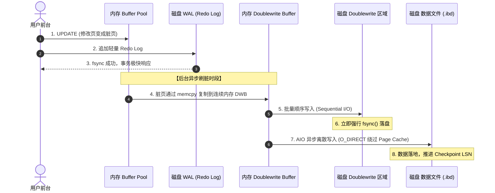
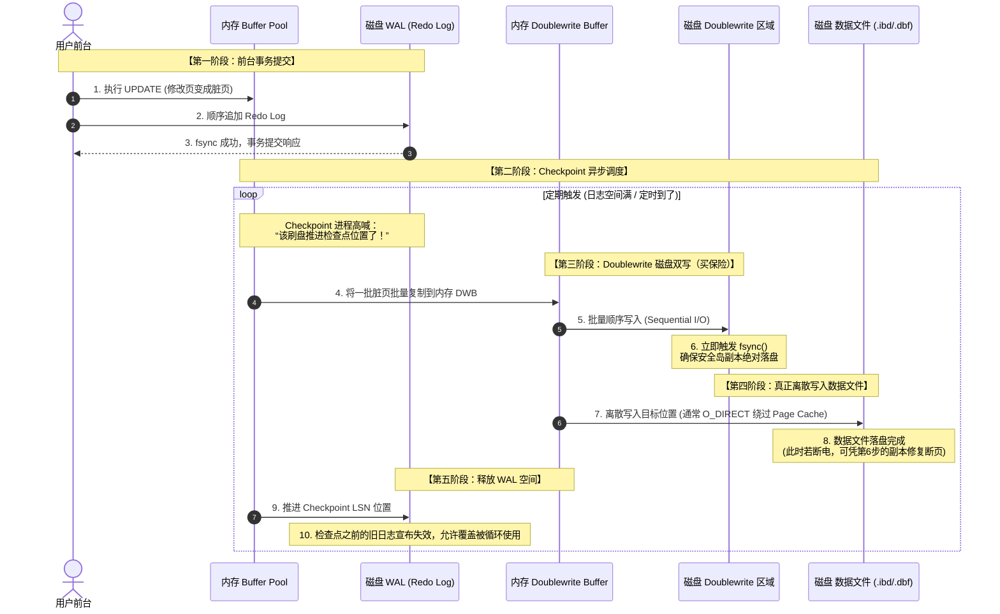

在数据库底层内核的演进史上，性能与安全的博弈从未停止。无论是关系型数据库的老牌劲旅 PostgreSQL，还是互联网时代的霸主 MySQL，在面对物理世界的一个随机灾难时，都不得不付出高昂的吞吐量代价。

这个灾难，就是 **Torn Page（断页 / 半写）**。

为了防范断页导致的数据毁灭，两大数据库走向了完全不同的分叉路口，这也决定了它们在面临高并发、大吞吐写负载时的性能表现。

---

## 一、 核心矛盾：什么是 Torn Page（断页）？

现代数据库（如 MySQL InnoDB 或 PostgreSQL）在内存中管理数据的单位通常较大（MySQL 是 16KB，PG 是 8KB）。然而，操作系统的文件系统块（Block）或底层 SSD 的最小原子写入单位通常只有 **4KB**。

当数据库的后台刷脏线程正准备把一个 16KB/8KB 的脏页写入磁盘时，如果写到一半服务器突然掉电，会发生什么？

磁盘上的这个数据页会处于“前半部分是新数据，后半部分是旧数据”的畸形状态。由于页面的物理结构被破坏（校验和对不上），这个页在物理上彻底损坏（Corrupted）了。

### 为什么有了 WAL（日志），数据库依然搞不定断页？

很多人会问：数据库不是有 WAL（预写日志）吗？挂了重启回放日志不就行了？

**不行。** 因为无论是 InnoDB 的 Redo Log 还是 PG 的 XLOG，它们在多数场景下记录的都是“物理逻辑日志”（Physical-to-a-Logical Page），例如：“在第 10 号表空间的第 3 号页、偏移量为 100 的地方，把数据从 A 改成 B”。

* **正常情况：** 磁盘上的页结构完好（哪怕全是旧数据 A），日志就能准确找到偏移量将其改写为 B。
* **断页情况：** 页面本身已经碎掉了，系统甚至连这个页是个什么东西都认不出来，物理逻辑日志根本找不到立足点，**无法回放**。

为了打破这个死循环，数据库必须在某个地方**保留一份完整的数据页副本**。如何保留这份副本，分化出了两大经典阵营。

---

## 二、 两大经典阵营的正面交锋

### 1. PostgreSQL 的选择：Full Page Write (FPW) —— 前台买保险

PostgreSQL 原生没有独立的双写文件，它选择把保险买在 **WAL 日志（前台路径）** 里面。

* **核心逻辑：** 在一轮 Checkpoint（检查点）结束后，任何一个数据页在内存中**第一次变脏并提交**时，PG 不仅记录增量修改，而是把这整整 **8KB 的完整数据页** 强行塞进 WAL 日志缓冲区，并伴随事务提交刷盘。
* **痛点：** 这种做法把防断页的开销完全压在了前台。在高并发写入场景下，频繁的 Checkpoint 会导致 WAL 日志量呈断崖式暴涨（严重写放大），直接拉高用户 SQL 的前台响应延迟（Latency）。

### 2. MySQL 的选择：Doublewrite Buffer (DWB) —— 后台装箱

MySQL 采取了“把流畅留给前台，把压力留给后台”的思路。它在内存和磁盘上各开辟了一块连续的特殊空间（通常 2MB 左右）。

当 Checkpoint 触发后台线程刷脏时，它不会直接写入 `.ibd` 数据文件，而是：

* **第 1 次物理写盘（同步）：** 将脏页通过 `memcpy` 复制到连续的**内存 DWB** 缓冲区中“打包装箱”。攒满一批后，**批量顺序写入**磁盘的 Doublewrite 区域，并立刻调用 `fsync()` 强行同步刷盘（买好保险）。
* **第 2 次物理写盘（异步）：** 确认双写文件安全落盘后，通过异步 I/O（AIO）结合 `O_DIRECT` 模式，**离散地**将脏页写入各自真正的表空间数据文件中（彻底绕过系统 Page Cache）。

---

## 三、 深度对决：FPW vs DWB

如果我们把这两套经典的防断页方案放在一起对比，它们在日常运行中表现出截然不同的技术特征：

| 维度 | PostgreSQL FPW 方案 | MySQL / openGauss DWB 方案 |
| --- | --- | --- |
| **额外写入发生在哪里？** | **前台路径（WAL 日志）** ❌ | **后台路径（刷脏线程）** |
| **对用户 SQL 的影响** | 增大前台写入量，用户直接感知到高延迟（Latency）和吞吐量下降。 | 后台异步做，前台用户基本感知不到，SQL 响应极快。 |
| **I/O 优化空间** | 有限。因为是前台写入，不能让用户事务等待太久。 | 巨大。后台可以攒满 1MB~2MB 的页再发起一次高效的顺序 I/O。 |
| **与 Checkpoint 的矛盾** | **严重冲突**。Checkpoint 越频繁，首次修改的页越多，FPW 导致的 WAL 暴涨越恐怖。 | **完美解耦**。DWB 不依赖 Checkpoint 防断页，你可以放心地频繁做 Checkpoint 来加速崩溃恢复。 |
| **崩溃恢复（Crash Recovery）** | 从 WAL 中拉出 Checkpoint 后的全页数据，覆盖掉磁盘损坏的断页。 | 从磁盘 DWB 区域拉出完好副本，覆盖掉数据文件损坏的断页，再回放 Redo Log。 |

---

## 四、 总结

天下没有免费的午餐，内核架构的设计永远是一场关于 trade-off（权衡）的艺术。

PostgreSQL 的 FPW 机制胜在工程上极其简单纯粹，无需维护额外的空间映射或双写文件，但它把沉重的性能枷锁拷在了前台事务上。

而 MySQL 风格的 DWB（双写）则是务实的改良派。它虽然让后台数据在物理上多写了一次盘，但它保证了空间的连续性，用后台的“二次顺序写”换取了前台的“小步快跑”。华为 openGauss 的成功引入、也证明了 **Doublewrite Buffer 是现阶段压榨传统关系型数据库高并发性能的最优解之一**。

## 附录：MySQL DWB 刷脏时序图

