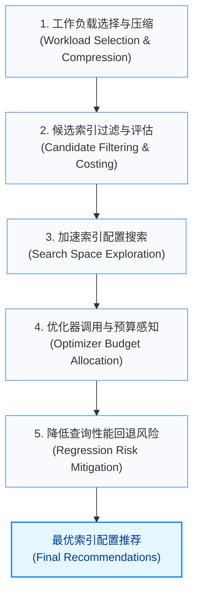
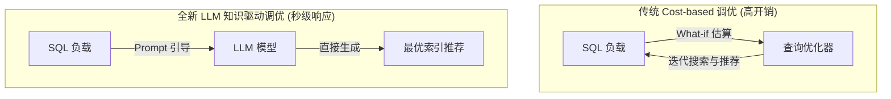

在面对日益增长的云服务与复杂多变的工作负载时，如何为数据库配置最优的索引以提升查询性能，成为了数据库管理员（DBA）和自动化系统面临的巨大挑战。传统的索引调优依赖专家经验，但随着数据规模与查询复杂度的爆炸式增长，自动化索引调优（Automated Index Tuning）已成为近年来数据库管理系统（DBMS）自调优研究的热点。

## 一、 自动化索引调优的五大核心任务

自动化索引调优的完整流程通常包含以下五个核心任务，形成了一条从工作负载处理到风险防范的系统化流水线：

### 1. 工作负载选择与压缩 (Workload Selection / Compression)
* **核心挑战**：真实生产环境中的 SQL 工作负载体量庞大且复杂，直接对其进行调优会消耗海量的计算资源与时间。
* **主要目标**：高效识别出具有代表性的核心查询子集，或通过查询重写消除无法从索引受益的部分，在**不降低索引推荐质量**的前提下，将调优开销降低几个数量级。

### 2. 候选索引过滤与评估 (Candidate Index Filtering and Costing)
* **核心挑战**：对于包含多列、多表的复杂查询，理论上的可用索引空间呈指数级爆炸。
* **主要目标**：利用轻量级的数据驱动技术，在调优早期快速过滤掉显然不合理或收益极低的索引组合，并提供快速的初步成本估算，降低后续精密搜索的负担。

### 3. 加速索引配置搜索 (Speeding up Index Configuration Search)
* **核心挑战**：在确定候选索引集合后，如何在有限的时间内，从海量索引组合中搜索出使整体工作负载执行成本（Cost）最低的最佳配置。
* **主要目标**：设计高效的启发式、强化学习或元启发式搜索算法，加速配置空间的收敛与求解。

### 4. 管理优化器 "What-if" 调用与预算感知调优 (Reducing Query Optimizer Calls / Budget-aware Tuning)
* **核心挑战**：传统调优器极度依赖优化器的 "What-if" API 来估算虚拟索引下的查询代价。然而，"What-if" 调用是整个调优流程中最昂贵的性能瓶颈。
* **主要目标**：引入**预算感知（Budget-aware）**机制，如动态预算重分配、提前终止（Early-stopping）等，在有限的 API 调用预算内最大化调优收益。

### 5. 降低查询性能回退风险 (Lowering Query Performance Regressions - QPR)
* **核心挑战**：查询优化器的成本估算往往存在误差（尤其是在多表关联和复杂谓词场景下）。这会导致推荐的索引在实际应用后，某些查询的执行计划反而恶化，引发灾难性的性能回退（Query Performance Regression, QPR）。
* **主要目标**：精准检测、理解并规避性能回退风险，建立起调优器与真实执行性能之间的“安全防线”。

---

## 二、 前沿文献与技术方案分类

针对上述五大任务，学术界与工业界近年来涌现出了一批代表性工作。以下是核心文献的方法分类与核心贡献：

| 核心任务 | 代表文献 | 核心技术 / 解决思路 |
| :--- | :--- | :--- |
| **工作负载压缩** | **《ISUM》** | 提出工作负载压缩技术，通过识别代表性查询子集提高调优扩展性。 |
| | **《Wred》** | 提出工作负载缩减（Workload Reduction）算法，通过重写 SQL 消除无效列/表表达式，加速单个 "What-if" 调用。 |
| **候选过滤与评估**| **《DISTILL》** | 利用轻量级数据驱动技术，在早期阶段快速过滤无效候选索引并估算成本。 |
| **预算感知与调用优化** | **《Esc》** | 针对调优后期“边际收益递减”，引入早停（Early-stopping）机制，提前终止无收益的搜索。 |
| | **《Wii》** | 在受限的 "What-if" 调用预算下，通过动态预算重分配（Dynamic Budget Reallocation）最大化资源利用率。 |
| | **《Budget-aware RL》**| 引入强化学习（Reinforcement Learning）来学习预算约束下的最优索引配置搜索策略。 |
| | **《AutoML Perspective》**| 从自动机器学习（AutoML）的宏观视角，为预算感知的查询调优提供理论框架。 |
| **降低性能回退风险**| **《Hybrid Cost Modeling》**| **混合成本建模**：仅用 ML 预测易出错的叶子节点操作符（扫描等），结合传统优化器估算，以低成本减少 QPR。 |
| | **《Detecting QPR》** | 放弃传统监督学习，通过分析查询执行计划的**结构变化模式**来检测并解释性能回退。 |
| | **《Plan Stitch》** | 利用数据库历史执行过的优秀计划，自动检测并“缝合”纠正优化器选错的差计划。 |
| | **《AI Meets AI》** | 深入剖析优化器估算局限性与实际执行开销（如 CPU 时间）恶化之间的偏差。 |
| **综合方案与综述** | **《ML-Powered Index Tuning》**| 全面总结了机器学习在上述所有环节（选择、过滤、搜索、回退等）中的应用。 |

---

## 三、 LLM：索引调优的全新范式

大型语言模型（LLM）的兴起，为自动化索引调优带来了一条截然不同的技术路线。

### 1. 从“代价估算”到“知识驱动”的跃迁
传统的自动化索引调优系统严重依赖**基于代价的优化器（Cost-based Optimizer）**。这种模式的生命线是 "What-if" API，一旦优化器的代价模型失真，调优器推荐的索引就会产生严重偏差。

而 **LLM 驱动的调优范式** 试图打破这一瓶颈：
* **去 What-if 依赖**：LLM 依靠其预训练中学习到的海量数据库设计知识、SQL 语义理解以及索引规则，直接对 SQL 工作负载进行“诊断”并推荐索引。
* **语义级理解**：LLM 能够深入理解 SQL 语句表达的实际业务语义，而传统优化器只能看到抽象的语法树与统计信息。

### 2. 传统调优器与 LLM 调优器的对比

| 维度 | 传统 Cost-based 调优器 (如 DB2 Advisor, DTA) | LLM-Driven 调优器 (如 GPT, Claude 驱动) |
| :--- | :--- | :--- |
| **核心决策依据** | 查询优化器估算的 Cost (What-if API) | 预训练所蕴含的规则知识与 SQL 语义理解 |
| **API 调用开销** | 极高（需要成千上万次优化器调用） | 极低（仅需数次 Prompt 推理，无需 What-if 评估） |
| **回退风险 (QPR)**| 受优化器估算偏差影响，易产生 QPR | 依赖模型泛化能力，可能产生幻觉（推荐无效索引） |
| **冷启动表现** | 强（直接基于目标数据库的真实 Schema 和统计信息） | 弱（若没有充分的 Context 或 Fine-tuning，难以精准把握数据分布） |

### 3. 当前局限与前沿反思
根据前沿文献 *《Evaluating the Practical Effectiveness of LLM-Driven Index Tuning...》* 的深入评估，LLM 驱动的索引调优目前仍处于探索阶段，并面临以下核心痛点：
1. **幻觉与正确性**：LLM 可能会推荐语法错误、或者在目标数据库中根本不存在的列上的索引。
2. **缺乏数据分布感知**：在没有统计信息和具体数据样本的情况下，LLM 很难区分基数（Cardinality）极高和极低的列，这在物理层面对索引的有效性至关重要。
3. **商业化落地差距**：在多表关联等极度复杂的场景下，现有成熟商业调优器的推荐质量依然显著优于未经深度微调的通用 LLM。

因此，**“LLM 语义推荐 + 传统验证/What-if 校验”** 的混合调优架构，正在成为当前工业界最被看好的演进方向。
