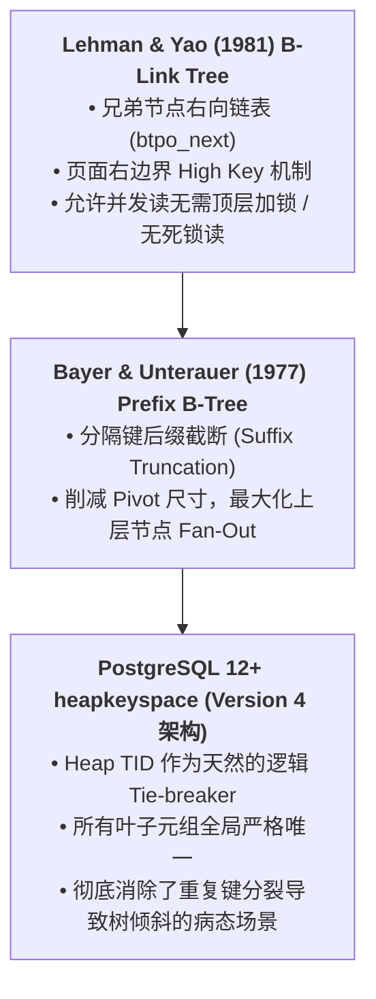
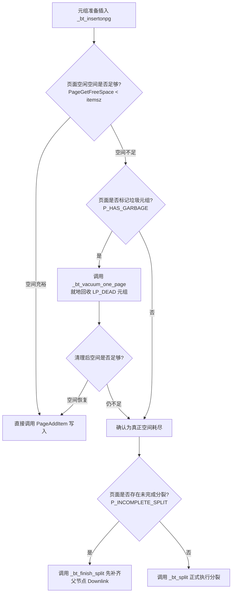
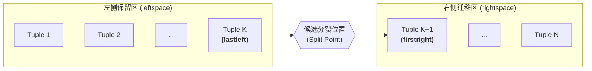
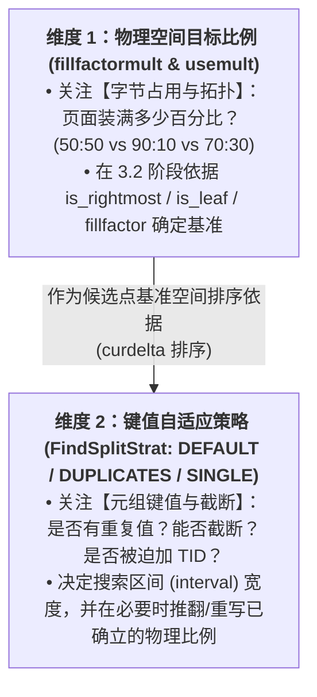
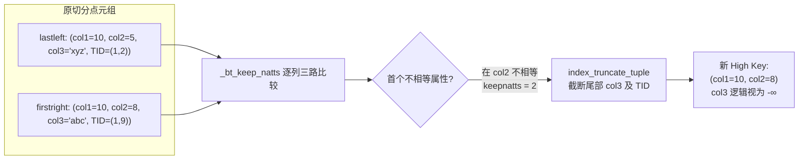
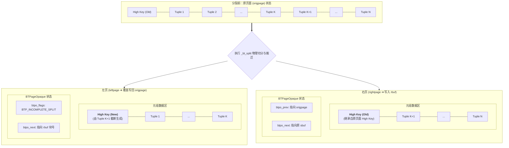
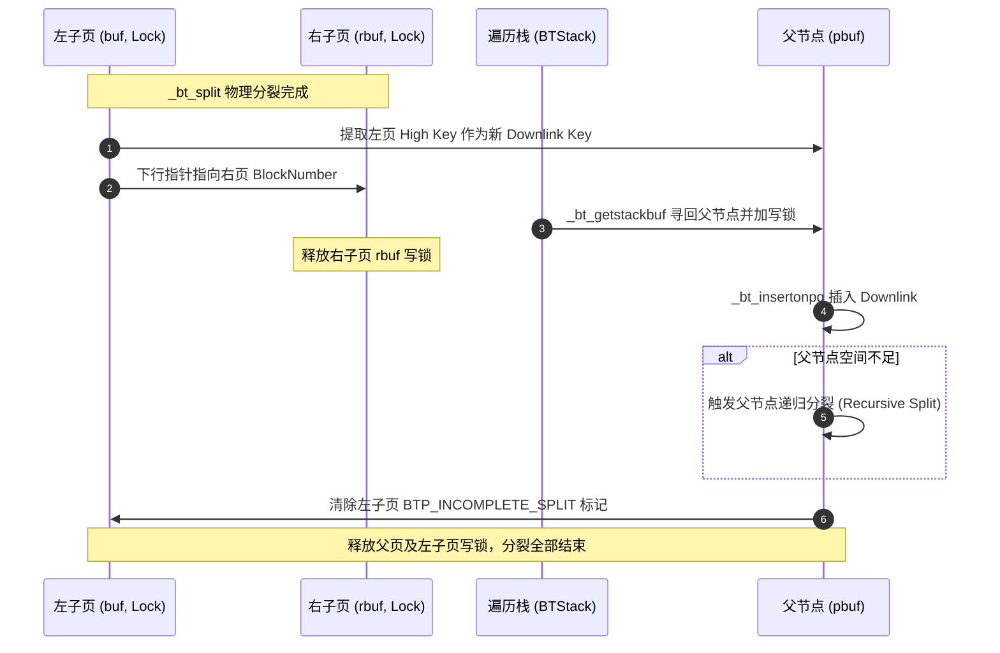

# PostgreSQL B-Tree 索引页面分裂（Page Split）机制深度调研报告

## 摘要

页面分裂（Page Split）是 B-Tree（在 PostgreSQL 中为 `nbtree`）维护结构平衡与动态扩展的核心机制。PostgreSQL 的 B-Tree 实现基于经典 **Lehman & Yao (L&Y) B-Link Tree** 算法，并在工程实践中融合了 Bayer & Unterauer 的 **Prefix B-Tree** 理论。在 PostgreSQL 12+ 版本引入全新的 **`heapkeyspace`（Version 4 索引）** 架构后，B-Tree 分裂逻辑进行了全方位的深度重构，引入了**后缀截断（Suffix Truncation）**、**自适应分裂策略（Default / Many Duplicates / Single Value）**、**单调递增插入启发式偏置**、以及**原子级双页分裂 WAL 记录**。

本报告对 PostgreSQL `nbtree` 分裂机制的全流程源码进行系统级拆解，覆盖触发前置防御、分裂点选取数学建模、后缀截断原理、物理执行与内存保护、并发控制与锁协议、父节点递归传播及崩溃恢复全貌。

---

## 目录

1. [架构基础与设计理论](#一架构基础与设计理论)
2. [分裂触发条件与前置自救机制](#二分裂触发条件与前置自救机制)
3. [分裂位置选取算法（`nbtsplitloc.c` 深度解析）](#三分裂位置选取算法nbtsplitlocc-深度解析)
   * 3.1 候选分裂点的穷举与空间核算 (`_bt_recsplitloc`)
   * 3.2 目标分裂比例的判定逻辑与空间排序 (`fillfactormult` & `usemult`)
   * 3.3 深度思辨：核心解耦——物理空间比例（Ratio）vs 数据搜索策略（Strategy）
   * 3.4 默认容忍区间 `split interval` 的精细设定机制（PG12 源码与理论推导）
   * 3.5 三大自适应搜索策略 (`FindSplitStrat`) 深度拆解
     * 3.5.4 物理比例与键值策略交叉决策矩阵（4大经典场景速查）
   * 3.6 Penalty 惩罚值评分与最优解决策 (`_bt_split_penalty`)
4. [后缀截断技术实现（Suffix Truncation）](#四后缀截断技术实现suffix-truncation)
   * 4.1 截断逻辑与 `_bt_truncate()`
   * 4.2 复合索引、INCLUDE 索引与 Posting List 的截断差异
   * 4.3 为什么内部节点（Internal Page）绝不使用后缀截断？
5. [物理分裂执行流程（`_bt_split()`）](#五物理分裂执行流程_bt_split)
   * 5.1 临时页缓冲与故障保护
   * 5.2 缓冲区加锁与死锁规避协议
   * 5.3 High Key 生成与元组迁移
   * 5.4 临界区（Critical Section）与原子替换
   * 5.5 WAL 日志结构与重放协议
6. [父节点插入与向上递归（`_bt_insert_parent()`）](#六父节点插入与向上递归_bt_insert_parent)
   * 6.1 Downlink 元组构建
   * 6.2 搜索栈回溯与父节点重定位 (`_bt_getstackbuf`)
   * 6.3 根节点分裂与树高增长 (`_bt_newroot`)
7. [并发控制、异常处理与崩溃自愈](#七并发控制异常处理与崩溃自愈)
   * 7.1 Lehman & Yao 非阻塞并发读与右向穿越 (`_bt_moveright`)
   * 7.2 谓词锁迁移 (`PredicateLockPageSplit`)
   * 7.3 未完成分裂的检测与自愈 (`_bt_finish_split`)
8. [核心函数与调用拓扑总结](#八核心函数与调用拓扑总结)

---

## 一、架构基础与设计理论

PostgreSQL 的 B-Tree 分裂实现由两个经典学术理论与一个工业级架构变革共同奠定：



1. **Lehman & Yao B-Link Tree 体系**：
   * 传统 B-Tree 节点分裂需要同时锁住父节点和子节点，容易造成顶层并发瓶颈。L&Y 算法为每个节点增加了指向右兄弟的指针 `btpo_next`，并在页面上引入了 **High Key（页面键值上界）**。
   * 允许**子节点先完成分裂，父节点的下行指针（Downlink）稍后异步/递归插入**。并发读事务若发现要找的键值大于当前页的 High Key，只需沿着 `btpo_next` 向右扫描（Step Right），绝不会漏读数据。
2. **Prefix B-Tree 与后缀截断**：
   * 内部节点的分隔键（Pivot Tuple）不需要保留完整的键值，只要能严格区分“左子树的最大值”与“右子树的最小值”即可。PostgreSQL 将此技术落地为**属性级后缀截断（Whole-attribute Suffix Truncation）**。
3. **`heapkeyspace`（Version 4 索引）**：
   * 在 PG 12 之前，相同索引键的元组在 B-Tree 内部被视为无序，重复键插入容易导致分裂点选在大量重复键中间，造成极端空间浪费。
   * PG 12 确立了 `heapkeyspace`：当用户定义的所有 Key 属性相同时，元组物理存储的 `Heap TID`（BlockNumber + OffsetNumber）作为最末位区分属性（Tie-breaker）。至此，叶子节点中每一个元组都具备全局严格唯一的位置。

---

## 二、分裂触发条件与前置自救机制

在元组插入入口函数 `_bt_insertonpg()` 中，分裂并非遇到空间不足就盲目执行，而是经过了严格的防御与自救。



### 1. 空间精确检查
`_bt_insertonpg()` 计算：
```c
itemsz = IndexTupleSize(itup);
itemsz = MAXALIGN(itemsz);

if (PageGetFreeSpace(page) < itemsz)
{
    // 需要分裂
}
```
*注：`PageGetFreeSpace()` 内部已经自动扣除了一个行指针 `sizeof(ItemIdData)` 的开销，因此判断完全精准。*

### 2. 单页内联清理（Single-Page Vacuum 自救）
在进入 `_bt_insertonpg` 之前（位于 `_bt_doinsert()`），如果目标页已满，但页面特殊区域包含 `P_HAS_GARBAGE` 标记，PostgreSQL 会立即调用 `_bt_vacuum_one_page()`。
* 此过程会就地扫描并清除所有被查询事务标记为 `LP_DEAD` 的死元组指针，并执行碎片整理（Defragmentation）。
* 只有当单页清理后空间依然无法容纳待插入元组时，才会无可挽回地触发分裂。这极大降低了高频 UPDATE/DELETE 负载下的“伪分裂（Unnecessary Splits）”。

---

## 三、分裂位置选取算法（`nbtsplitloc.c` 深度解析）

页面分裂点选取的质量直接决定了 B-Tree 索引的紧凑度、上层节点的扇出度以及未来的写入倾斜。该过程由核心函数 `_bt_findsplitloc()` 完成。

### 3.1 候选分裂点的穷举与空间核算 (`_bt_recsplitloc`)

由于待插入的 `newitem` 尚未物理写入页面，算法在逻辑上假想一个**包含 `newitem` 的虚拟页面**（长度为 `maxoff + 1`），并在任意两个相邻元组之间建立切割点（Split Point）：



每个候选分裂点由结构体 `SplitPoint` 记录：
```c
typedef struct {
    int16       curdelta;       /* 左右页面剩余空间的不平衡差值 */
    int16       leftfree;       /* 分裂后左页面剩余可用空间 */
    int16       rightfree;      /* 分裂后右页面剩余可用空间 */
    OffsetNumber firstrightoff; /* 右页面接收的原页面第一个元组偏移 */
    bool        newitemonleft;  /* newitem 属于左页还是右页 */
} SplitPoint;
```

#### 空间核算细节（`_bt_recsplitloc`）
1. **基础空间扣减**：
   * 原属于左侧的数据占用 `leftspace`，原属于右侧的数据占用 `rightspace`。
   * 若 `newitemonleft = true`，扣减左页可用空间；否则扣减右页。
2. **左页 High Key 预留（核心关键）**：
   * 右页的第一个元组（`firstright`）将成为左页的 High Key，因此它的空间**必须同时计入左页和右页**。
   * **悲观性假设**：在叶子层核算时，算法**保守地假设后缀截断无法避免在 High Key 附加 Heap TID**（即假设 High Key 尺寸为 `firstrightsz + MAXALIGN(sizeof(ItemPointerData))`）。宁可在预估时偏悲观，也绝不容许分裂后左页发生溢出。
3. **合法性剪枝**：
   * 只有当 `leftfree >= 0 && rightfree >= 0` 时，该切分点才被记录进候选数组 `state.splits[]`。

---

### 3.2 目标分裂比例的判定逻辑与空间排序 (`fillfactormult` & `usemult`)

在评估数据内容之前，内核必须首先确立本次分裂在**物理空间层面的基准目标（Baseline Target Ratio）**——即究竟是追求标准的五五均分（50:50），还是应用特定的填充因子偏置（如 90:10、70:30）。

#### 1. 判定的 4 类上下文依据
内核在 `_bt_findsplitloc()` 中提取以下 4 类信息：
1. **节点层级（`state.is_leaf`）**：叶子节点存数据元组，内部节点存下行 Pivot 元组。
2. **物理拓扑位置（`state.is_rightmost`）**：是否为当前树层级的最右页面（`P_RIGHTMOST`）。
3. **填充因子配置**：
   * 叶子页填充因子：`leaffillfactor = RelationGetFillFactor(rel, BTREE_DEFAULT_FILLFACTOR)`（默认 90%，或用户建索引时通过 `WITH (fillfactor = ...)` 指定）。
   * 内部页填充因子：`BTREE_NONLEAF_FILLFACTOR`（内核写死固定为 70%）。
4. **局部递增模式（`_bt_afternewitemoff()`）**：针对复合索引进行启发式探测：
   * 必须是多列索引（单列不走此分支）；
   * 元组尺寸等长且不超过阈值；
   * 新元组与左邻元组的前导列值完全相同；
   * **Heap TID 物理相邻性（`_bt_adjacenthtid`）**：左邻元组与待插入元组位于同一个堆块（或相邻连续块的首位），强力印证属于同一事务内的单向递增追加。

#### 2. 源码四大决策分支（`nbtsplitloc.c#L275-L331`）
```c
if (!state.is_leaf)
{
    /* 分支 1：内部节点（仅最右页启用 70% 偏置，普通内部页 50:50） */
    usemult = state.is_rightmost;
    fillfactormult = BTREE_NONLEAF_FILLFACTOR / 100.0; /* 0.70 */
}
else if (state.is_rightmost)
{
    /* 分支 2：最右叶子页（如自增主键、时间戳，强制启用 90% 偏置） */
    usemult = true;
    fillfactormult = leaffillfactor / 100.0;           /* 通常为 0.90 */
}
else if (_bt_afternewitemoff(&state, maxoff, leaffillfactor, &usemult))
{
    /* 分支 3：复合索引中的局部单调递增优化 */
    if (usemult)
        fillfactormult = leaffillfactor / 100.0;       /* 插入点靠右，应用 90% 偏置 */
    else
    {
        /* Fast-Path：新元组在中间偏右，直接精准切在 newitem 之后，提前 return！ */
        ...
        return newitemoff;
    }
}
else
{
    /* 分支 4：普通叶子页（随机插入，严格追求 50:50 均分） */
    usemult = false;
    fillfactormult = 0.50;
}
```

> [!IMPORTANT]
> **关键认知锚点**：请特别注意分支 2！当最右叶子页发生单调递增插入（例如自增主键 `SERIAL`、自增 ID、时间戳）导致分裂时，**在第一阶段就已经将物理基准比例定为了 90:10（`fillfactormult = 0.90, usemult = true`）**。

#### 3. 空间不平衡度（Delta）排序公式
确定了比例乘数 $f$（`fillfactormult`）和标志位 `usemult` 后，算法在 `_bt_deltasortsplits()` 中对全部候选点计算 `curdelta` 并升序排序：
* **标准均分模式（`usemult == false`）**：
  $$\text{curdelta} = |\text{leftfree} - \text{rightfree}|$$
  左右剩余空间越接近相等，`curdelta` 越接近 0，排在数组最前。
* **加权偏置模式（`usemult == true`，如 $f = 0.9$）**：
  $$\text{curdelta} = |f \times \text{leftfree} - (1.0 - f) \times \text{rightfree}|$$
  当左页空闲 $1-f = 10\%$、右页空闲 $f = 90\%$（即左页装满 90%）时，该式恰好为 0。该公式将**符合指定填充比例（如 90:10）的点定义为绝对空间最优解**排在最前方。

---

### 3.3 深度思辨：核心解耦——物理空间比例（Ratio）vs 数据搜索策略（Strategy）

很多开发者在阅读源码时极易产生一个**严重混淆**：
> “是不是 `SPLIT_DEFAULT` 策略就必然是 50:50 分裂？`SPLIT_SINGLE_VALUE` 策略才是 90:10 分裂？”

**答案是：绝对不是！这两个概念在架构设计上是彻底解耦、正交的两个独立维度。**



#### 为什么必须将两者解耦？
3.2 确立的比例只关注**页内字节占用**，对**元组存储的数据内容和键值重复度一无所知**。如果此时直接按 3.2 选出排名第一的切分点切下去，一旦页面包含大量**重复键（Duplicates）**，会导致整棵 B-Tree 严重退化：

1. **后缀截断彻底失效，被迫追加 Heap TID**：
   * 切分点左右两侧分别是 `lastleft = ('PAID', TID_A)` 和 `firstright = ('PAID', TID_B)`。
   * 用户键完全相同，后缀截断无法削减任何属性，**必须被迫向左页 High Key 追加 6 字节的 Heap TID** 作为唯一区分键。
   * 这直接使生成的 High Key 膨胀变大，插入父节点后会吃掉大量父节点空间，**导致上层节点扇出度（Fan-out）断崖式下跌，索引树层高提前被迫增加**。
2. **雪崩式半满裂变（Cascading Splits）**：
   * 业务写入重复值时，由于新元组的 Heap TID 是递增的，按 50:50 切开后，后续所有同值数据将**全部扎堆涌入右页**。
   * 这导致左页空留 50% 空间永远得不到填充（永久碎片），而右页很快被再次填满被迫又做 50:50 切分……最终造成整棵树空间利用率极低。

**结论**：
- **物理比例（Ratio）**是进入内容分析前的**空间基准愿望（Baseline Target）**；
- **分裂策略（Strategy）**是看到具体元组键值分布后的**自适应搜索与纠偏机制**——它的职责是**决定允许在多大搜索区间（interval）内寻找切分点，并在必要时推翻或重写物理比例**。

---

### 3.4 默认容忍区间 `split interval` 的精细设定机制（PG12 源码与理论推导）

在当前代码库（**PostgreSQL 12.22**）中，算法根据 3.2 排好序的候选点，首先计算一个初始容忍搜索区间 `state.interval`（`nbtsplitloc.c#L342-L344`）：

```c
/* limits on split interval (default strategy only) */
#define MAX_LEAF_INTERVAL           9
#define MAX_INTERNAL_INTERVAL       18
...
state.interval = Min(Max(1, state.nsplits * 0.05),
                     state.is_leaf ? MAX_LEAF_INTERVAL :
                     MAX_INTERNAL_INTERVAL);
```

#### 1. 三层参数的数学与工程推导
* **5% 比例（`state.nsplits * 0.05`）**：
  所有候选点已按空间不平衡度（Delta）升序排好。排在前 5% 的候选点与绝对空间最优点的剩余空间差距极微（通常仅相差几字节到几十字节）。PostgreSQL **愿意牺牲这微不足道的 5% 空间平衡度，换取在其中挑选一个能截断更多后缀属性的切分点**。
* **下限兜底（`Max(1, ...)`）**：保证即使全页候选点极少，区间内至少包含 1 个点，绝不为 0。
* **上限截断（`Min(..., 9 / 18)`）**：
  * **叶子节点封顶 9（`MAX_LEAF_INTERVAL`）**：叶子页在宽列较窄时可达 200~300 个元组，5% 相当于 10~15 个候选点。若窗口过宽，两端切分点的空间差异会扩大至数百字节，容易导致一侧过早满溢。因此硬卡在 9 个点（中心点左右各探索约 4 个元组），在截断机会与空间风险间划出安全红线。
  * **内部节点封顶 18（`MAX_INTERNAL_INTERVAL`，翻倍）**：内部节点的元组不截断，但内部节点需要尽量挑**物理字节尺寸最小**的元组作为下行键。内部节点的扇出度直接决定整棵树的高矮，因此算法给予内部节点**翻倍的容忍度（18）**，允许容忍更大的空间波动换取最小的下行键。
* **理论溯源**：该设计直接继承自 Bayer & Unterauer (1977) *Prefix B-Trees* 论文中的 $\sigma_l$（Leaf Split Interval）与 $\sigma_b$（Branch Split Interval）。

> [!NOTE]
> **版本演进提示**：在 PostgreSQL 13+ 中，社区将此处离散的 5% 数量截断逻辑重构为独立的静态函数 `_bt_defaultinterval()`，并改为基于页面总字节容忍度的动态核算（`tolerance = olddataitemstotal * LEAF_SPLIT_DISTANCE`）。而在当前 PG12 代码库中，正是上述基于宏 `9/18` 封顶的离散计算机制。

---

### 3.5 三大自适应搜索策略 (`FindSplitStrat`) 深度拆解

确立了初始 `state.interval` 后，算法在 `_bt_strategy()` 中通过比较区间边缘元组的键值（`_bt_interval_edges`），动态在三大策略中调度：

```c
typedef enum {
    SPLIT_DEFAULT,          /* 默认策略：沿用既定物理比例，在窄区间内寻找最优截断 */
    SPLIT_MANY_DUPLICATES,  /* 大量重复值策略：放宽搜索区间至全页，坚决避开追加 TID */
    SPLIT_SINGLE_VALUE      /* 单值重复策略：被迫追加 TID，强制重写物理比例为 90:10 */
} FindSplitStrat;
```

#### 策略 1：`SPLIT_DEFAULT`（默认策略 —— 维持原比例与窄搜索窗口）
* **触发判定**：初始窄区间（`interval` 1~9）内存在至少一个切分点，其左右元组的用户键不完全相等（`perfectpenalty <= indnkeyatts`），说明能够避开追加 Heap TID。
* **核心行为**：
  * **绝对不修改 3.2 确立的物理比例**：如果 3.2 是 50:50，就按 50:50 候选点排布；如果 3.2 是 90:10，就按 90:10 候选点排布。
  * **维持初始精细区间不变**（`interval` 依然维持在 1~9 或 1~18 个候选点）。
  * 在这个紧凑区间内挑选 Penalty 最小（保留属性最少）的切分点。
* **真相揭秘：为什么自增 ID 会在 `SPLIT_DEFAULT` 下执行 90:10 分裂？**
  * 在自增序列、时间戳持续追加场景下，插入始终发生在最右叶子页（`state.is_rightmost == true`）。
  * 3.2 阶段：内核确立 `usemult = true, fillfactormult = 0.90`，候选点按 **90:10 偏置**排好序，最优空间点自然落在靠近右侧 90% 处。
  * 3.5 阶段：由于自增值互不相同，`_bt_strategy()` 判定区间内无需追加 TID，策略直接定为 **`SPLIT_DEFAULT`**。
  * **结论**：**`SPLIT_DEFAULT` 不等于 50:50 分裂！对于最右叶子页，`SPLIT_DEFAULT` 执行的恰恰是 90:10 偏置分裂！**

#### 策略 2：`SPLIT_MANY_DUPLICATES`（大量重复值策略 —— 放宽区间，避免追加 TID）
* **触发判定**：初始区间内的所有切分点都被同一种重复键包围（若按原区间切，左页 High Key 必定被迫附加 Heap TID）；但**整页并不是 100% 全部重复**（整页首尾元组存在不同的键）。
* **核心行为**：
  * **推翻区间限制，全页大搜索**：算法直接将搜索区间拉大到整页（`state.interval = state.nsplits`，`nbtsplitloc.c#L410`）。
  * **维持原空间排序不变**，但允许算法一路向外探索，直到找到第一个**能区分用户键、无需追加 Heap TID 的切分点**。
  * 宁可接受切成 **30:70** 或 **70:30** 的极度不平衡空间分布，也**坚决不在大批重复项中间切开**，防止生成的 High Key 膨胀。
  * **单调递减防御（`nbtsplitloc.c#L812`）**：若检测到插入模式是往大批重复项左侧递减插入，为了防止不断在重复项边缘做极度不平衡的切分导致空间浪费，强制回退为 50:50 均分。

#### 策略 3：`SPLIT_SINGLE_VALUE`（单值重复策略 —— 彻底重写物理比例为 90:10）
* **触发判定**：整页从头到尾（包括待插入元组）所有键值完全相同，且当前页被判定为该重复值的**最右承载页**（`state.is_rightmost` 或者右侧页面存有更大键值）。此时无论怎么切，**追加 Heap TID 已经绝对无法避免**。
* **核心行为**：
  * 既然无法逃避追加 Heap TID，原先追求均分或寻找分界线的意义全部丧失。
  * 算法**强制推翻并重写 3.2 初始比例，将目标比例强制修改为 90:10**（`nbtsplitloc.c#L416-L421`）：
    ```c
    usemult = true;
    fillfactormult = BTREE_SINGLEVAL_FILLFACTOR / 100.0; /* 0.90 */
    _bt_deltasortsplits(&state, fillfactormult, usemult);
    state.interval = 1; /* 锁定为最贴近 90% 处的唯一最优解 */
    ```
  * 让左页填满 90% 永久封存，右页留出 90% 空白承接后续 Heap TID 递增插入，极大提升单值重复场景下的空间利用率。
* **特例回退**：若整页是相同值，但通过 High Key 比对发现右侧兄弟页依然是相同的值（即当前页只是相同重复值长链中的**中间页**），算法会**主动放弃 Single Value 策略，退回 `SPLIT_DEFAULT` 执行标准的 50:50 切分**（`nbtsplitloc.c#L940`），防止破坏中间链表的空间均摊。

---

#### 3.5.4 物理比例与键值策略交叉决策矩阵（4大经典场景速查）

为了彻底理清“物理比例”与“自适应策略”的组合关系，以下总结 4 种典型生产场景的实际执行逻辑：

| 生产业务场景 | 初始物理比例（3.2 确立） | 键值策略（`FindSplitStrat`） | 策略是否重写比例？ | 最终执行的切分形态 | 架构设计目的 |
| :--- | :--- | :--- | :--- | :--- | :--- |
| **场景 A：自增主键 / 时间戳顺序追加** | **90:10 偏置** (`usemult = true, fillfactormult = 0.90`) | **`SPLIT_DEFAULT`** | 否（沿用 90:10） | **90:10 偏置分裂** | 绝大多数数据留在左页，右页留 90% 迎接后续单调递增插入 |
| **场景 B：普通随机唯一值插入** | **50:50 均分** (`usemult = false, fillfactormult = 0.50`) | **`SPLIT_DEFAULT`** | 否（沿用 50:50） | **50:50 均等分裂** | 左右空间均匀平摊，并在窄区间内最大化后缀截断 |
| **场景 C：局部大段重复值（非全页重复）** | **50:50 均分** | **`SPLIT_MANY_DUPLICATES`** | 否（维持原排序，但区间放宽到整页） | **不规则比例分裂**（如 30:70 / 70:30） | 坚决避开在重复值内下刀，避免 High Key 附加 6 字节 TID |
| **场景 D：全页完全相同单值（最右重复页）**| 50:50 均分（原预设） | **`SPLIT_SINGLE_VALUE`** | **是！强制重写为 90:10** 并锁定 interval=1 | **90:10 偏置分裂** | 无法避免追加 TID，主动封存左页，留空右页承接递增 TID |

---

### 3.6 Penalty 惩罚值评分与最优解决策 (`_bt_split_penalty`)

在最终确立的策略与最终搜索区间（`state.interval`）下，`_bt_bestsplitloc()` 遍历区间内的每一个候选切分点，计算综合 Penalty 惩罚值并取最低分：

```c
static inline int
_bt_split_penalty(FindSplitData *state, SplitPoint *split)
{
    IndexTuple  lastleft = _bt_split_lastleft(state, split);
    IndexTuple  firstright = _bt_split_firstright(state, split);

    if (!state->is_leaf)
    {
        /* 内部节点：Penalty 直接等于 firstright 元组的物理尺寸 */
        return MAXALIGN(ItemIdGetLength(itemid)) + sizeof(ItemIdData);
    }

    /* 叶子节点：Penalty 等于区分 lastleft 和 firstright 所需保留的属性数 */
    return _bt_keep_natts_fast(state->rel, lastleft, firstright);
}
```

* **叶子节点决策导向**：Penalty 是所需保留的属性列数（1 到 $nkeyatts + 1$）。若候选点 A 只需第 1 列即可区分，而候选点 B 需要前 3 列区分，切分点 A 必定胜出，实现**后缀截断最大化**。
* **内部节点决策导向**：内部节点 Penalty 直接等于元组的物理字节数，优先选最小的元组作为父节点下行键。


---

## 四、后缀截断技术实现（Suffix Truncation）

当分裂点选定后，左页必须生成一个新的 High Key。该过程由 `_bt_truncate()` 闭环实现。



### 4.1 截断逻辑与 `_bt_truncate()`
1. 调用 `_bt_keep_natts()` 计算从第 1 列开始比较，直到遇到首个不相等的列：
   * 假设复合索引为 `(a, b, c)`。
   * `lastleft` 为 `(1, 100, 'foo')`，`firstright` 为 `(1, 200, 'bar')`。
   * 第一列 `a` 相同，第二列 `b` 区分出了大小（$100 < 200$），因此 `keepnatts = 2`。
2. 剥离无用后缀：
   * 第 3 列 `'bar'` 及行指针被物理剥除，生成的 High Key 仅保留 `(1, 200)`。
   * 对应在 B-Tree 搜索规则中，被截断的列隐式视作**负无穷大（$-\infty$）**。
3. Lehman & Yao 不变量保持：
   * L&Y 论文要求：新 High Key 必须大于等于左页所有键，严格小于右页所有键。
   * PostgreSQL 生成的 High Key 属性直接截取自 `firstright`，由于未保留列隐式为 $-\infty$，其严格小于真正的 `firstright`，且必定大于等于 `lastleft`：
   $$\text{lastleft} \le \text{lefthikey} < \text{firstright}$$

### 4.2 复合索引、INCLUDE 索引与 Posting List 的截断差异
* **`INCLUDE` 覆盖索引**：非键列（Non-key attributes）完全不参与树的导航比较，因此在叶子页分裂时，**无论如何非键列都会被 100% 截断丢弃**。
* **去重 Posting List（PG 13+ 演进，PG 12 预留支持）**：若 `firstright` 包含大量堆 TID 链表，后缀截断会剥离整个数组，大幅节约父节点空间。

### 4.3 为什么内部节点（Internal Page）绝不使用后缀截断？
在 `nbtinsert.c#L1685-L1700` 的核心注释中，PostgreSQL 开发者明确指出了原因：
```
"There must always be an unbroken 'seam' of identical separator keys 
that guide index scans at every level, starting from the grandparent. 
That's why suffix truncation is unsafe here."
```
1. **分隔缝隙一致性（Unbroken Seam）**：
   * B-Tree 内部节点的每一个 Pivot Key，最初都直接来源于最底层叶子节点分裂时的 High Key。
   * 自顶向下导航时，祖父节点的下行界限必须与父节点及叶子节点的 High Key 完全吻合。若在内部节点二次截断，将破坏这种跨层级的严格等价性，造成并发只读扫描定位错乱。
2. **内部节点元组本身已是 Pivot**：内部节点在构建之初就已经承载了截断后的形态，无需也不应再次截断。

---

## 五、物理分裂执行流程（`_bt_split()`）

物理分裂逻辑封装在 `_bt_split()`，这是整个引擎中对并发、内存与持久化要求最苛刻的代码之一。

### 5.1 临时页缓冲与故障保护
为了防止在分裂组装过程中由于内存分配失败、脏数据写入或约束检查抛错导致原有物理页面被破坏，PostgreSQL 采取了**写时复制（Copy-on-write）工作区保护**：
```c
/* 1. 分配与原页面大小相同的临时内存页作为左页工作区 */
leftpage = PageGetTempPage(origpage);
_bt_pageinit(leftpage, BufferGetPageSize(buf));

/* 2. 只有在 High Key 生成且左页全部构建合法后，才去获取右页 Buffer */
rbuf = _bt_getbuf(rel, P_NEW, BT_WRITE);
```
在获取新块 `rbuf` 之前发生的任何异常，原页面 `origpage` 毫发无损，也不会遗留任何未分配清理的孤儿页。

### 5.2 缓冲区加锁与死锁规避协议
分裂涉及 3 个（或 4 个）Buffer 的并发协同：
1. `buf`（原页，分裂后的左页）：进入函数前已持有 Exclusive 独占写锁。
2. `rbuf`（新分配的右页）：调用 `_bt_getbuf(..., P_NEW, BT_WRITE)` 加写锁。
3. `sbuf`（原页的右邻兄弟页）：
   * 原左页的 `btpo_next` 原本指向 `sbuf`。分裂后，`sbuf->btpo_prev` 必须前向修正指向 `rbuf`。
   * **死锁规避定理**：所有读写事务均遵循**从左向右（Left-to-Right）**加锁获取相邻兄弟，绝不允许逆向持锁移动。因此在持有着 `buf` 和 `rbuf` 情况下向前获取 `sbuf` 写锁是**严格无死锁（Deadlock-Free）**的。
4. `cbuf`（当分裂非叶子页时，插入下行指针对应的子节点）：用于在完成分裂时清除子节点的 `INCOMPLETE_SPLIT` 标记。

### 5.3 物理布局与元组迁移


*特例处理（内部节点首元组）*：若分裂的是内部节点，右页数据区的第一个元组会被直接剥除 Key 数据，转化为**负无穷虚拟元组（Minus-Infinity Item）**，仅保留 downlink 指针。

### 5.4 临界区（Critical Section）与原子替换
一切数据搬迁完毕后，进入无法中断的临界区：
```c
START_CRIT_SECTION();

/* 将内存工作区的数据瞬间还原回原磁盘 Buffer */
PageRestoreTempPage(leftpage, origpage);

MarkBufferDirty(buf);
MarkBufferDirty(rbuf);
if (!P_RIGHTMOST(ropaque))
{
    sopaque->btpo_prev = rightpagenumber;
    MarkBufferDirty(sbuf);
}
```

### 5.5 WAL 日志结构与重放协议
PostgreSQL 将两页分裂与兄弟指针修复合并为**单一原子 WAL 记录**：
* **日志标识**：`XLOG_BTREE_SPLIT_L`（新元组落在左页）或 `XLOG_BTREE_SPLIT_R`（新元组落在右页）。
* **记录载荷（Payload）**：
  * 注册 Buffer 0 (`buf`)：左页，增量写入左页新 High Key 和新插入的 `newitem`（若在左页）。
  * 注册 Buffer 1 (`rbuf`)：标记 `REGBUF_WILL_INIT`，记录右页所有元组二进制数据（整页重建）。
  * 注册 Buffer 2 (`sbuf`)：记录修改了 `btpo_prev` 指针的右邻页。
  * 注册 Buffer 3 (`cbuf`)：若有子页，记录清除 `INCOMPLETE_SPLIT`。
* **REDO 重放保障（`nbtxlog.c#L240`）**：重放时利用 `_bt_restore_page()` 严格按照元组编号物理复原右页与左页，确保崩溃恢复后物理镜像与分裂时保持 100% 字节一致。

---

## 六、父节点插入与向上递归（`_bt_insert_parent()`）

当 `_bt_split()` 退出后，左右子页已经持久化且建立了左右链表，但**父节点中依然没有指向右页的 Downlink**。完成下行指针插入的接力由 `_bt_insert_parent()` 负责。



### 6.1 Downlink 元组构建
新插入父节点的元组格式为：
* **数据内容**：左页的 High Key（经过后缀截断后的紧凑键）。
* **下行指针**：存储新右页的块号（`rbkno`）。
```c
ritem = (IndexTuple) PageGetItem(page, PageGetItemId(page, P_HIKEY));
new_item = CopyIndexTuple(ritem);
BTreeInnerTupleSetDownLink(new_item, rbkno);
```

### 6.2 搜索栈回溯与父节点重定位 (`_bt_getstackbuf`)
* **并发漂移问题**：在子页分裂期间，并发写事务可能已经分裂了父页面，或者父页面的 Downlink 发生了向右位移。
* **解决机制**：`_bt_getstackbuf()` 根据原始下降时记录在 `BTStack` 中的块号，重新锁定父节点。如果发现父节点被标记为已分裂或目标键已右移，它会沿着父层右链向前追溯，精确定位到正确的插入偏移。
* **锁释放时机**：**一旦父节点加写锁成功，立即释放右子页 `rbuf` 的写锁**；而左子页 `buf` 的写锁保持不放，直到作为 `cbuf` 传入父层在清除 `BTP_INCOMPLETE_SPLIT` 后一并释放。

### 6.3 根节点分裂与树高增长 (`_bt_newroot`)
若发生分裂的是根节点（Root Page）：
1. 此时 `stack == NULL`，表明无上层父节点。
2. 调用 `_bt_newroot()`：
   * 申请全新的磁盘块作为新 Root。
   * 新 Root 写入两个 Downlink：
     * 第一个元组：指向旧根（左页），Key 值为隐式负无穷。
     * 第二个元组：指向右页，Key 值为左页的 High Key。
   * 锁定索引元数据页（`BTREE_METAPAGE`），将 `btm_root` 指向新块，`btm_level` 树高自增 1。
   * 此操作同样具备严格的死锁避免特性（所有事务访问 Metapage 均遵循固定锁顺序）。

---

## 七、并发控制、异常处理与崩溃自愈

### 7.1 Lehman & Yao 非阻塞并发读与右向穿越
在分裂执行期间，**只读事务完全不被阻塞**：
* 假设读事务正打算查找键值 `15`，由于只读事务无需与写事务竞态锁树，读事务直接读取了尚未在父节点登记 Downlink 的左页。
* 读事务比对左页 High Key（例如发现 High Key 是 `12`）。
* 根据 L&Y 原理，`15 > 12` 意味着该元组必定已经落在了新分裂出的右子页上。只读事务调用 `_bt_moveright()`，沿着 `btpo_next` 步进到右页，直接读取数据。
* **结论**：读操作既不需要加父节点锁，也不需要等待分裂完全收尾，具有极高并发吞吐。

### 7.2 谓词锁迁移 (`PredicateLockPageSplit`)
在可串行化（Serializable Snapshot Isolation, SSI）隔离级别下，页面分裂可能破坏谓词锁（Predicate Lock）覆盖的键值范围。
* PostgreSQL 在物理分裂完成后立即调用 `PredicateLockPageSplit(rel, oldblk, newblk)`。
* 锁管理器将原左页上持有的所有细粒度谓词锁（SIREAD Locks）完整复制或分裂至新右页，杜绝了并发可串行化异常（如幻读）。

### 7.3 未完成分裂的检测与自愈 (`_bt_finish_split`)
若数据库在 `_bt_split()` 完成后、`_bt_insert_parent()` 写入父节点前由于断电发生 Crash：
1. **WAL 重放保障**：WAL 已经持久化了双页状态，数据库重启后左页打着 `BTP_INCOMPLETE_SPLIT` 标记。
2. **写自愈机制**：后续任意写事务访问到带有 `BTP_INCOMPLETE_SPLIT` 标记的页面时，不会抛错崩溃，而是立即调用 `_bt_finish_split()`。
3. 该函数主动提取左页 High Key，回溯父节点，补齐缺失的 Downlink，随后再执行当前事务的写入。系统实现了真正的“自愈（Self-healing）”。

---

## 八、核心函数与调用拓扑总结

以下是 PostgreSQL B-Tree 分裂涉及的核心函数与关键代码定位速查：

| 函数名 | 源码定位 | 核心职责 |
| :--- | :--- | :--- |
| `_bt_doinsert` | `nbtinsert.c` | 插入主逻辑，下行查找叶子页，触发单页 Vacuum 自救 |
| `_bt_insertonpg` | `nbtinsert.c` | 页面写入执行器，判断剩余空间，编排 `_bt_split` 与 `_bt_insert_parent` |
| `_bt_findsplitloc` | `nbtsplitloc.c` | 分裂算法决策中心，状态初始化，三大策略调度 |
| `_bt_recsplitloc` | `nbtsplitloc.c` | 候选分裂点穷举，悲观空间核算 |
| `_bt_afternewitemoff` | `nbtsplitloc.c` | 局部递增单调插入识别（Heap TID 邻接性分析） |
| `_bt_strategy` | `nbtsplitloc.c` | 评估候选区间，在 Default / Many Duplicates / Single Value 间切换 |
| `_bt_split_penalty` | `nbtsplitloc.c` | 分裂点打分计算（叶子页计保留列数，内部页计物理尺寸） |
| `_bt_truncate` | `nbtutils.c` | 后缀截断执行器，生成最小区分 High Key |
| `_bt_split` | `nbtinsert.c` | 物理分裂执行，加锁协议，数据搬迁，临界区写回与 WAL 写入 |
| `_bt_insert_parent` | `nbtinsert.c` | 向上层插入 Downlink，处理并发父页漂移与递归分裂 |
| `_bt_newroot` | `nbtinsert.c` | 根分裂处理，分配新根，原子更新元数据页 |
| `_bt_finish_split` | `nbtinsert.c` | 崩溃恢复或异常残留的未完成分裂自愈补全 |
| `btree_xlog_split` | `nbtxlog.c` | 分裂 WAL 日志 REDO 重放实现 |

---
*报告结束。本报告基于 PostgreSQL 12 内核代码编制。*
