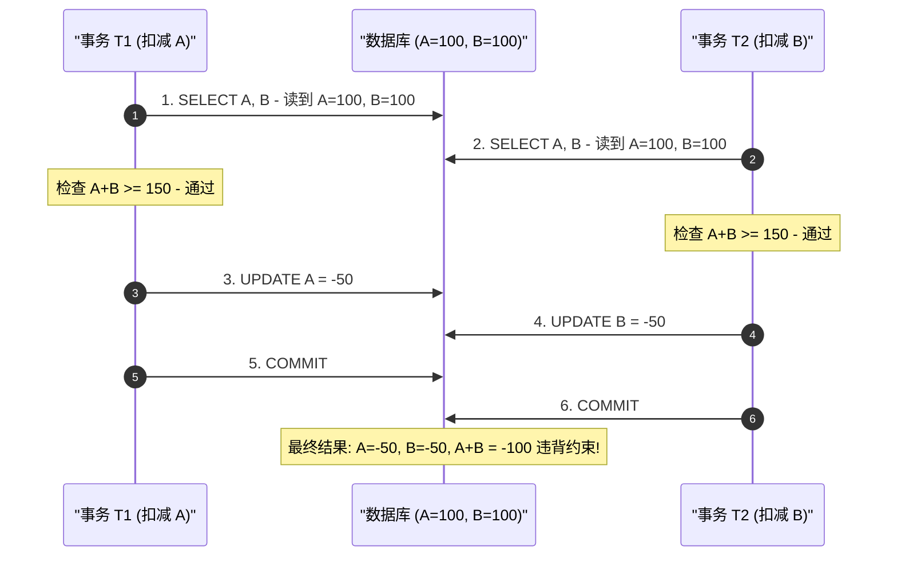
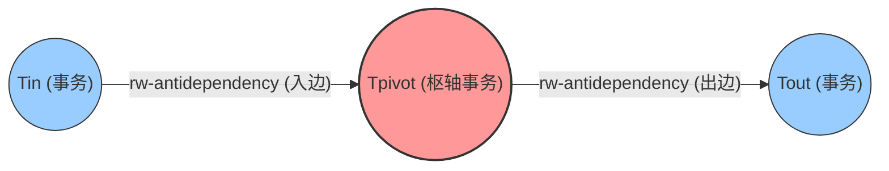
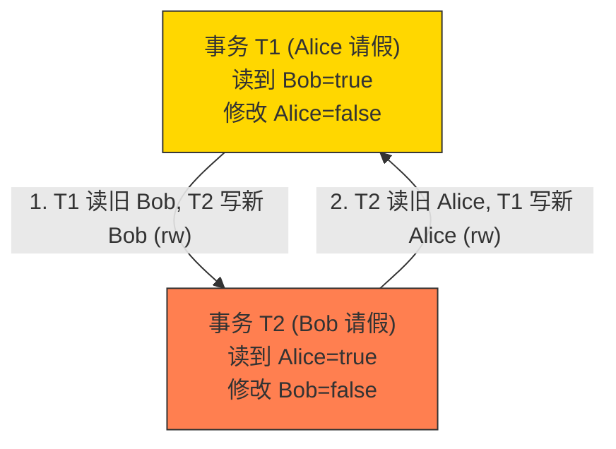
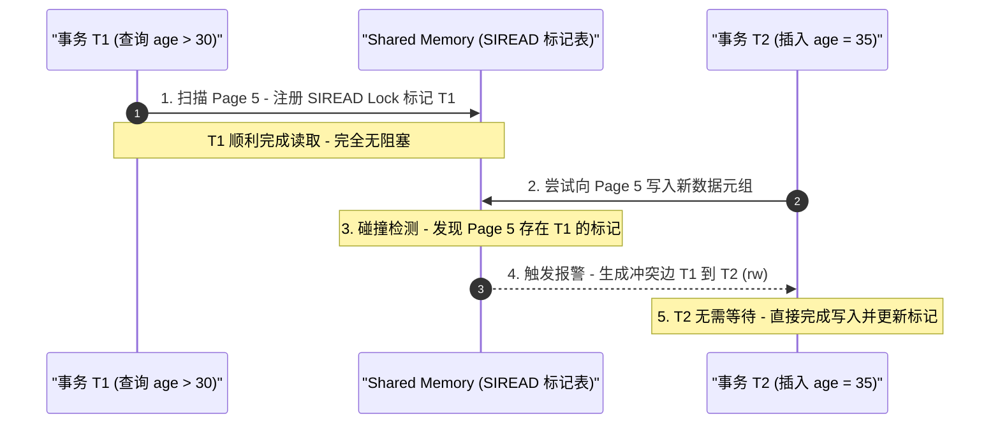
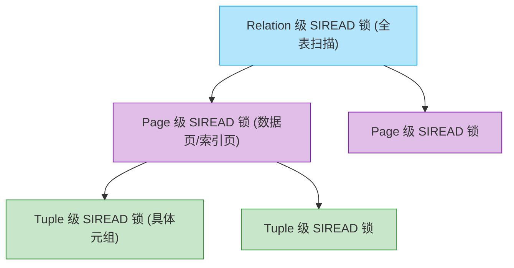
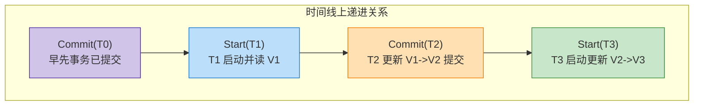

# PostgreSQL SSI 与谓词锁机制

在关系型数据库中，**可串行化（Serializable）** 隔离级别是 ACID 原则中隔离性（Isolation）的最高境界。它保证无论并发事务如何交错执行，其最终结果都与某种“一次仅执行一个事务”的顺序执行（Serial Execution）完全一致。

在 PostgreSQL 9.1 之前，系统提供的 `SERIALIZABLE` 隔离级别在底层本质上只是**快照隔离（Snapshot Isolation, SI）**。虽然 SI 提供了极高的并发性能（读不阻塞写、写不阻塞读），但它无法完全消除串行化异常（最典型的即 **写偏斜 Write Skew**）。

PostgreSQL 9.1 引入了基于学术界最新研究成果的 **可串行化快照隔离 (Serializable Snapshot Isolation, SSI)** 机制。本文基于 PostgreSQL 源码文档 `src/backend/storage/lmgr/README-SSI` 及其架构设计，深入探讨 SSI 的运行原理、谓词锁（Predicate Locking）的设计以及 PG 在工程实现上的独到创新。

---

## 1. 从快照隔离 (SI) 到 SSI 的演进

### 1.1 S2PL vs Snapshot Isolation

传统的完全串行化实现主要依赖**严格两阶段锁（Strict Two-Phase Locking, S2PL）**。S2PL 的核心规则是：
* 事务读取数据时加读锁，修改数据时加写锁，锁保持到事务提交或回滚。
* 写操作阻塞读和写，读操作阻塞写。

在并发极高的业务场景下，S2PL 会引发严重的锁等待与死锁，大幅降低系统的吞吐量与响应时间。

为了提升并发，快照隔离（SI）被广泛采用。SI 允许事务在一致性快照上读取数据，使得**读写互不阻塞**。然而，SI 只能解决脏读、不可重复读和传统幻读，却无法应对由于**隐式逻辑依赖**导致的串行化异常。

### 1.2 快照异常示例：写偏斜 (Write Skew)

假设表 `account` 中有两笔记录，要求两户余额之和 $A + B \ge 0$。
* 当前 $A = 100, B = 100$。
* **事务 T1**：尝试扣减 $A$ 150 元。T1 读取 $A=100, B=100$，检查 $A+B = 200 \ge 150$，通过，将 $A$ 改为 $-50$。
* **事务 T2**（与 T1 并发）：尝试扣减 $B$ 150 元。T2 读取 $A=100, B=100$，检查 $A+B = 200 \ge 150$，通过，将 $B$ 改为 $-50$。
* 两个事务相继提交后，$A = -50, B = -50$，总和为 $-100$，破坏了业务约束。

在 SI 下，由于 T1 只写了 $A$，T2 只写了 $B$，两者没有直接的行级写冲突（ww-conflict），因此 SI 会允许两者均成功提交，导致数据损坏。

---

## 2. SSI 算法核心原理

SSI 的基本思想是：**依然允许事务像在快照隔离 (SI) 下一样运行，但在后台监控事务之间的读写冲突（rw-conflict），识别事务依赖图中可能导致异常的危险结构（Dangerous Structure），一旦发现则主动回滚其中某个事务。**

### 2.1 依赖关系三要素

在事务并发执行依赖图中，存在三种边：
1. **wr-dependency**：T1 写入了一个版本，T2 读取了该版本（T2 逻辑上在 T1 之后）。
2. **ww-dependency**：T1 写入了一个版本，T2 更新/覆盖了该版本（T2 逻辑上在 T1 之后）。
3. **rw-conflict（读写冲突）**：T1 读取了一个版本，而并发事务 T2 后来写入了该数据的新版本（或者插入了落在 T1 读取范围内的新行）。由于 T1 没看到 T2 的修改，**T1 逻辑上必须在 T2 之前执行**。

### 2.2 危险结构 (Dangerous Structure) 剖析

Cahill 等人的研究证明：**在快照隔离（SI）下，每一个串行化异常（如 Write Skew），在事务依赖图中都必然存在且仅存在于包含“连续两条 `rw-antidependency`（读写反依赖）边”的结构中**。这一结构被统称为**危险结构（Dangerous Structure）**。

#### 1. 结构形态与枢轴事务 (Pivot Transaction)

在危险结构中，事务扮演着三个关键角色：
* **$T_{in}$**：产生 `rw` 冲突入边的事务（$T_{in} \xrightarrow{rw} T_{pivot}$）。
* **$T_{pivot}$（枢轴事务）**：位于两条连续 `rw` 冲突边的中心。**它既有 `rw` 入边，又有 `rw` 出边**。
* **$T_{out}$**：产生 `rw` 冲突出边的事务（$T_{pivot} \xrightarrow{rw} T_{out}$）。

当依赖图中结合其他边（如 `wr` 或 `ww` 依赖，甚至直接闭环）时，$T_{in} \xrightarrow{rw} T_{pivot} \xrightarrow{rw} T_{out} \dots \xrightarrow{} T_{in}$ 就会形成一个**依赖环（Dependency Cycle）**。在图论中，有向图存在环意味着无法进行拓扑排序，即无法找到任何合法的串行执行顺序。

#### 2. 直观案例：医生值班系统 (Doctor On-Call) 冲突拓扑

为了更清晰地理解这一结构，我们来看一个直观的业务案例：

* **业务约束**：医院要求任何时刻必须有**至少 1 名医生在值班**。
* **初始状态**：只有 Alice 和 Bob 两位医生，均在值班（`on_call = true`）。
* **并发事务**：
  * **$T_1$ (Alice 请假)**：读取到 Alice=true, Bob=true（共2人），检查 $2 > 1$ 通过，更新 Alice 为 `on_call = false`。
  * **$T_2$ (Bob 请假)**：在自身快照中读取到 Alice=true, Bob=true（共2人），检查 $2 > 1$ 通过，更新 Bob 为 `on_call = false`。

把两条 `rw` 边串联展开：
$$\dots \xrightarrow{rw} T_1 \xrightarrow{rw} T_2 \xrightarrow{rw} T_1 \dots$$

在 $T_1 \xrightarrow{rw} T_2 \xrightarrow{rw} T_1$ 的结构中：
* **$T_2$ 同时具备 `rw` 入边和 `rw` 出边**，成为了枢轴事务 **$T_{pivot}$**；
* 同理，$T_1$ 也是 **$T_{pivot}$**。
* 逻辑推导得出 “$T_1$ 必须在 $T_2$ 之前完成，且 $T_2$ 必须在 $T_1$ 之前完成”，构成了矛盾的依赖环！

#### 3. 工程检测的巨大优势

“危险结构”理论为 PostgreSQL 实现高吞吐 SSI 带来了巨大的工程优势：
* **无需维护全局昂贵事务图**：数据库不需要记录成本极高的 `wr` 和 `ww` 边，**只需专门追踪 `rw-conflict`**。
* **局部化标记**：PostgreSQL 只需要在 Shared Memory 中为活跃事务维护两个轻量标记：
  * `SIHEAP_HAVE_INCOMING_RW`（是否有 `rw` 入边）
  * `SIHEAP_HAVE_OUTGOING_RW`（是否有 `rw` 出边）
  一旦某个事务同时被打上这两个标记，它即被判定为处于危险结构中的 $T_{pivot}$ 状态，成为了重点监控与回滚的候选对象。

### 2.3 检测与回滚策略

SSI 只需追踪并发事务间的 `rw-conflict`，不需要记录成本更高的 `wr` 和 `ww` 依赖。

为了降低误杀率（False Positives），PostgreSQL 加入了进一步的判断优化：
1. **提交顺序条件**：只有当 $T_{out}$ 优先于 $T_{pivot}$ 和 $T_{in}$ 提交时，危险结构才会真正演化为异常。如果 $T_{out}$ 尚未提交，PG 会等待或延迟决断；如果满足条件，则对 $T_{pivot}$ 或 $T_{in}$ 抛出 `SQLSTATE 40001`（`serialization_failure`）进行回滚。
2. **只读事务 (Read-Only) 优化**：如果 $T_{in}$ 是只读事务，只有当 $T_{out}$ 在 $T_{in}$ 获取快照**之前**就已经提交，才可能构成异常环。

---

## 3. 谓词锁 (Predicate Locking) 系统设计

为了捕捉“读取某些范围后，并发事务插入或修改数据入该范围”（即范围读冲突），SSI 必须支持**谓词锁 (Predicate Locking)**。

### 3.1 谓词锁的名实之辨：是足迹而非阻塞

理解谓词锁最大的障碍在于其名称——**它虽然叫“锁”（Lock），但在 PostgreSQL（SIREAD 锁）中却完全不具备传统锁的“阻塞等待”特性**。

| 维度 | 传统锁 (如 2PL / FOR UPDATE) | 谓词锁 (PostgreSQL SIREAD Lock) |
| :--- | :--- | :--- |
| **核心机制** | **阻塞等待 (Blocking)**：冲突时挂起后台进程 | **足迹标记 (Footprint)**：在 Shared Memory 记下读取印记 |
| **并发影响** | 读写互相阻塞 | **完全不阻塞**（读不阻塞写，写不阻塞读） |
| **锁定目标** | 现有物理行（Row / Tuple） | 查询谓词涵盖的逻辑范围（Predicate Range） |
| **失效作用** | 事务提交前强行保护临界区 | 仅用于后续检测 `rw-conflict` 并防范幻读/写偏斜 |

在 SQL 中，`WHERE` 子句背后的逻辑条件被称为**“谓词（Predicate）”**（如 `WHERE age > 30`）。如果只对已存在的物理行加行锁，并发事务插入新符合条件的行（如新增 `age = 35`）时，行锁无法锁住不存在的行，从而引发幻读。谓词锁正是通过锁住**“谓词逻辑范围”**来解决这一难题。

### 3.2 SIREAD 锁的碰撞检测与冲突生成流程

当事务读取数据时，PG 不加任何行级读锁，而是在 Shared Memory 中记录 SIREAD 锁。当并发事务写入或插入数据时，触发 SIREAD 锁碰撞检测：

### 3.3 多粒度锁与锁升级 (Lock Escalation)

为了防止共享内存被海量细粒度锁耗尽，PostgreSQL 实现了多粒度的 SIREAD 锁架构：

* **粒度分为**：**Tuple $\rightarrow$ Page $\rightarrow$ Relation**。
* **锁升级**：当单个事务在某页面上持有的 Tuple 级 SIREAD 锁达到阈值时，自动合并升级为 Page 级锁；当 Page 级锁过多时升级为 Relation 级锁。
* **包含检查**：如果事务已经持有 Relation 级或 Page 级 SIREAD 锁，对更细粒度对象（如 Tuple）的加锁请求将被自动忽略。

### 3.4 堆表 (Heap) 与索引 (Index AM) 的加锁策略

* **堆表 (Heap)**：
  * 全表扫描加 Relation 级 SIREAD 锁。
  * 顺序读取 visible tuple 时加 Tuple 级 SIREAD 锁（如果事务已持有该 tuple 的写锁，则无需加读锁，因为写锁引发的 ww-dependency 约束更强）。
  * 插入新元组时，会与持有 Relation 级 SIREAD 锁的并发事务产生 `rw-conflict`。
* **索引 AM (B-Tree, GIN, GiST, Hash)**：
  * 索引锁的核心是锁定“间隙（Gaps）”。
  * **B-Tree**：索引扫描仅在访问到的**叶子页面（Leaf Pages）**上加 SIREAD 锁。如果索引根节点尚未创建（空表），则锁整个 Relation。
  * **GiST**：由于 GiST 搜索可能在任意层级确定无匹配，因此需要在搜索经过的**每一个索引层级**上加 SIREAD 锁。若发生 Page Split，锁必须复制到新页面。
  * **Hash / GIN**：针对 Bucket / Posting Tree / Pending List 等特殊结构实现了相应的页面锁复制与冲突检测逻辑。

---

## 4. PostgreSQL 的工程创新与优化

PostgreSQL 在将 SSI 落地到生产级引擎时，面对 MVCC 追加写、子事务、SLRU 管理等复杂现实，做出了一系列出色的工程创新。

### 4.1 MVCC 追加写下的“元组锁不扩展”证明

在 PostgreSQL 的 MVCC 实现中，更新元组并不是“原地修改”，而是失效旧 Tuple 并插入新 Tuple（非 HOT 更新还会涉及索引更新）。

一个关键问题是：**当 $T_1$ 读取了 Tuple $V_1$，随后 $T_2$ 将其更新为 $V_2$，如果之后 $T_3$ 又将 $V_2$ 更新为 $V_3$，$T_1$ 的 SIREAD 锁是否需要扩展传递到 $V_3$ 上？**

PostgreSQL README-SSI 中给出了优雅的数学证明，证实**完全不需要扩展**：

> **证明概要**：
> 假设我们需要 $T_1 \xrightarrow{rw} T_3$ 这条边产生作用。这要求 $T_3$ 存在一条冲突出边（rw-conflict out）指向 $T_1$ 之前的某个事务 $T_0$（即 $T_3 \xrightarrow{rw} T_0$）。
> 
> 根据依赖拓扑关系：
> 1. $T_0 \to T_1$ 必包含至少一条 wr 或 ww 依赖（因为 $T_1$ 入边无 rw 冲突），这意味着 **$T_0$ 在 $T_1$ 启动前就已经提交**。
> 2. $T_1 \xrightarrow{rw} T_2$ 意味着 **$T_1$ 启动早于 $T_2$ 提交**。
> 3. $T_2 \to T_3$ 的更新依赖意味着 **$T_2$ 提交早于 $T_3$ 启动**（否则 $T_3$ 会触发行级写冲突）。
> 
> 综合上述时间线：
> $$\text{Commit}(T_0) < \text{Start}(T_1) < \text{Commit}(T_2) < \text{Start}(T_3)$$
> 即 **$T_0$ 在 $T_3$ 启动前就已经完全提交**。因此，$T_3$ 绝不可能产生指向 $T_0$ 的 `rw-conflict` 出边（因为 $T_3$ 的快照必定能看到 $T_0$ 的修改）。
> 
> **结论**：$T_1 \to T_3$ 的边对于环检测是多余的，SIREAD 锁无需在元组更新链上传播！

这一结论极大避免了由于锁传播导致的假阳性回滚。

### 4.2 子事务 (Subtransactions) 溯源

PostgreSQL 支持 Savepoint 与子事务。如果子事务中的读取引发了 `rw-conflict`，即使子事务随后回滚，其读取的数据也可能已经影响了父事务后续的写决策。

因此，PostgreSQL 规定：**SSI 中的所有事务 ID（xid）追踪和 SIREAD 锁，一律映射到顶层事务 (Top-level XID)**。任何来自 Tuple 的 `xmin` / `xmax` 在参与 SSI 计算前，都会先调用 `SubTransGetTopmostTransaction()` 取得其顶层事务 ID。

### 4.3 只读事务安全退出 (Opt-Out) 与 DEFERRABLE

只读事务不会修改任何数据，因此它绝不可能成为危险结构中的 $T_{pivot}$ 或 $T_{out}$（不可能有 `rw-conflict` 出边）。

PostgreSQL 针对只读事务进行了大幅优化：
* **Opt-Out 机制**：如果系统中的并发事务无法构成针对该只读事务的环，该只读事务可以安全退出 SSI 监控，释放其持有的所有 SIREAD 锁。
* **`DEFERRABLE` 事务**：允许用户在启动 `SERIALIZABLE READ ONLY` 事务时指定 `DEFERRABLE`。事务会适当等待，直到获取到一个“绝对不可能参与任何串行化异常”的干净快照后再开始执行，此后该事务无需承担任何 SSI 检测开销，且绝不会被回滚。

### 4.4 SLRU 磁盘溢出管理

跟踪已提交事务的 SSI 摘要信息需要消耗内存。如果存在长事务或海量并发，共享内存可能不敷使用。

PostgreSQL 利用 **SLRU (Simple LRU)** 缓冲机制管理历史 SSI 事务元数据。当活跃事务摘要超出共享内存限制时，旧的已提交事务摘要会自动溢出保存到磁盘。虽然极端情况下磁盘 I/O 会导致性能轻微下降，但它**避免了强制回滚事务或拒绝新事务启动**，保障了系统的稳定性。

---

## 5. 局限性与未来展望 (R&D Issues)

尽管 PostgreSQL 的 SSI 实现非常优秀，但在 README-SSI 中也指出了当前的局限与潜在探索方向：

1. **WAL 重放与物理复制（Hot Standby / PITR）**：
   WAL 日志中记录的事务提交顺序无法保障物理备库在重放时维持完全相同的 SSI 串行化顺序。因此，在 Hot Standby 备库上执行的查询目前仅能保证快照隔离（SI）级别的一致性。
2. **硬件/架构演进**：
   在极高并发的场景下，共享内存中 SSI 全局锁结构的频繁碰撞仍是潜在瓶颈，如何进一步减少共享内存 touch 频率是持续优化的方向。

---

## 6. 总结

PostgreSQL 的 SSI 实现是学术理论与工程实践结合的典范：
* **理论上**：通过识别包含两个连续 `rw-conflict` 的危险结构，以极低的检测开销实现了完全的可串行化隔离。
* **工程上**：结合谓词锁多粒度升级、追加式 MVCC 锁不扩展证明、只读事务 DEFERRABLE 延迟启动以及 SLRU 磁盘溢出保护，使得 PostgreSQL 在提供最高数据一致性保障的同时，依然保持了媲美快照隔离的高吞吐性能。

对于追求数据绝对正确、业务逻辑复杂的企业级应用，PostgreSQL 的 SSI 无疑是一件无需显式加锁即可捍卫数据完整性的利器。

---

## 7. 参考资料与延伸阅读

1. **Cahill, M. J., Röhm, U., & Fekete, A. D. (2008).** *Serializable Isolation for Snapshot Databases*. In Proceedings of the 2008 ACM SIGMOD International Conference on Management of Data (pp. 729-738). [(SIGMOD '08 Paper)](https://dl.acm.org/doi/10.1145/1376616.1376690)
2. **Ports, D. R., & Grittner, K. (2012).** *Serializable Snapshot Isolation in PostgreSQL*. Proceedings of the VLDB Endowment (PVLDB), 5(12), 1850-1861. [(VLDB '12 Paper)](https://www.vldb.org/pvldb/vol5/p1850_danrkports_vldb2012.pdf)
3. **PostgreSQL Official Source Documentation.** `src/backend/storage/lmgr/README-SSI` (PostgreSQL 内核中 SSI 架构设计、Predicate Locking 及不扩展证明源码说明)
4. **PostgreSQL Official Manual.** *[Chapter 13. Concurrency Control - Serializable Isolation](https://www.postgresql.org/docs/current/applevel-consistency.html#SERIALIZABLE)*
5. **PostgreSQL Wiki.** *[Serializable Snapshot Isolation (SSI)](https://wiki.postgresql.org/wiki/SSI)*
6. **Fekete, A., Liarokapis, D., O'Neil, E., O'Neil, P., & Shasha, D. (2005).** *Making Snapshot Isolation Serializable*. ACM Transactions on Database Systems (TODS), 30(2), 492-528.
