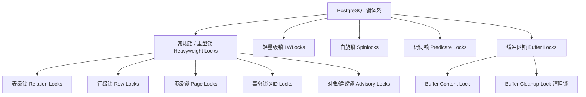

# PostgreSQL 锁机制深度调研报告

本报告对 PostgreSQL 中的锁机制进行了全面的梳理与调研，涵盖了从面向应用的高级锁（Heavyweight Locks）到面向系统内核的底层锁（LWLocks, Spinlocks），以及 SSI（可串行化快照隔离）所使用的谓词锁（Predicate Locks）。

---

## 一、 锁机制概览

PostgreSQL 的锁机制可以划分为以下几个层次：



各层次锁的核心指标对比：

| 锁类型 | 管理器 | 锁模式数量 | 死锁检测 | 自动释放 | 主要用途 |
| :--- | :--- | :--- | :--- | :--- | :--- |
| **常规锁 / 重型锁** | Lock Manager | 多种 (表锁 8 种, 行锁 4 种) | **支持** (Deadlock Detector) | 事务结束时自动释放（Advisory 锁除外） | 保护用户数据库对象，协调并发 SQL 操作 |
| **轻量级锁 (LWLock)**| LWLock Manager| 2 种 (Shared / Exclusive) | 不支持 | `elog()` 恢复时自动释放 | 保护共享内存数据结构（如 Buffer Pool、WAL Buffers） |
| **自旋锁 (Spinlock)** | 硬件原子指令 | 1 种 | 不支持 | 异常时不自动释放（超时会 panic/elog） | 保护极短的临界区（几个 CPU 指令，如 LWLock 的计数器） |
| **谓词锁 (SIReadLock)**| SSI Manager | 1 种 | 不支持（无阻塞） | 事务结束且老事务清理时释放 | 可串行化隔离级别（SSI），监测读写冲突不阻塞并发 |
| **缓冲区锁 (Buffer Lock)**| Buffer Manager | 3 种 (Share, Exclusive, Cleanup) | 不支持 | 释放 Buffer Pin 时或手动释放 | 保护单个 Buffer 内存页面的并发读写与物理清理 |

---

## 二、 常规锁 / 重型锁 (Heavyweight Locks)

常规锁由 Lock Manager 维护于共享内存中。支持完整的死锁检测机制，并由资源管理器（`ResourceOwner`）追踪，在事务提交（Commit）或回滚（Abort）时自动释放。

### 1. 表级锁 (Table-level Locks / Relation Locks)
虽然叫表级锁，但在 PG 内部其实是关系锁（Relation Locks），对所有关系（表、索引、视图等）都适用。PG 共有 **8 种**表级锁模式。

#### 表级锁模式及冲突矩阵
下表中，`X` 表示冲突（两个锁无法同时持有）：

| 锁模式 (Lock Mode) | 英文名称 | 1 | 2 | 3 | 4 | 5 | 6 | 7 | 8 | 常见触发 SQL / 操作 |
| :--- | :--- | :---: | :---: | :---: | :---: | :---: | :---: | :---: | :---: | :--- |
| **1. ACCESS SHARE** | 访问共享锁 | | | | | | | | X | `SELECT` |
| **2. ROW SHARE** | 行共享锁 | | | | | | | X | X | `SELECT FOR UPDATE`, `SELECT FOR SHARE` |
| **3. ROW EXCLUSIVE** | 行排他锁 | | | | | X | X | X | X | `INSERT`, `UPDATE`, `DELETE` |
| **4. SHARE UPDATE EXCLUSIVE** | 共享更新排他锁 | | | | X | X | X | X | X | `VACUUM` (非 FULL), `ANALYZE`, `CREATE INDEX CONCURRENTLY` |
| **5. SHARE** | 共享锁 | | | X | X | | X | X | X | `CREATE INDEX` (普通) |
| **6. SHARE ROW EXCLUSIVE** | 共享行排他锁 | | | X | X | X | X | X | X | `EXCLUDE` 约束，或显式 `LOCK TABLE ... SHARE ROW EXCLUSIVE` |
| **7. EXCLUSIVE** | 排他锁 | | X | X | X | X | X | X | X | `REFRESH MATERIALIZED VIEW CONCURRENTLY`（PG 内部特定阶段） |
| **8. ACCESS EXCLUSIVE** | 访问排他锁 | X | X | X | X | X | X | X | X | `DROP TABLE`, `TRUNCATE`, `VACUUM FULL`, `ALTER TABLE` (大多数) |

---

### 2. 行级锁 (Row-level Locks)
行级锁主要用于协调对单行数据的并发修改。PG 的行锁在数据未发生并发冲突时，**不占用共享内存**，而是直接标记在元组头部的 `t_infomask` 和 `t_xmax` 中。仅在发生行锁等待冲突时，才会创建真实的重型锁（如 `LOCKTAG_TUPLE`）放入共享内存中。

#### 行级锁模式及冲突矩阵
行级锁共有 **4 种**模式：

| 锁模式 (Row Lock Mode) | 1. KEY SHARE | 2. SHARE | 3. NO KEY UPDATE | 4. UPDATE | 常见触发 SQL |
| :--- | :---: | :---: | :---: | :---: | :--- |
| **1. FOR KEY SHARE** (键共享) | | | | X | 外键约束检查 |
| **2. FOR SHARE** (共享) | | | X | X | `SELECT FOR SHARE` |
| **3. FOR NO KEY UPDATE** (无键更新) | | X | X | X | 不修改主键/唯一键的 `UPDATE`（默认情况） |
| **4. FOR UPDATE** (更新) | X | X | X | X | `SELECT FOR UPDATE`, 修改主键/唯一键的 `UPDATE`, `DELETE` |

---

### 3. 页级锁 (Page-level Locks)
* **标签类型**：`LOCKTAG_PAGE`
* **功能**：页级锁主要用于控制对关系物理页面的并发读取与写入。目前最主要的使用场景是在各种索引访问方法（如 B-Tree、GIN、GiST 等）中，在进行页面分裂（Page Split）或页面删除（Page Deletion）时提供页面级别的同步保护。

### 4. 事务锁 (Transaction ID Locks)
* **标签类型**：`LOCKTAG_TRANSACTION` & `LOCKTAG_VIRTUALTRANSACTION`
* **功能**：
  * 每个事务在启动时，都会对自己的**虚拟事务 ID (VirtualXID)** 和 **真实事务 ID (XID)** 持有 `ExclusiveLock`（排他锁）。
  * 当事务 A 需要等待事务 B 提交或回滚时（例如等待行锁释放，或进行唯一性约束冲突检查时），事务 A 会尝试去申请事务 B 的 XID 上的 `ShareLock`（共享锁）。
  * 事务 A 会因此阻塞，直到事务 B 结束（提交或回滚），事务 B 释放了自身的排他锁，事务 A 成功获得共享锁后继续执行。这种设计巧妙地利用了锁管理器来实现事务的等待同步。

### 5. 对象锁 (Object Locks)
* **标签类型**：`LOCKTAG_OBJECT`
* **功能**：用于保护非关系型的数据库对象，例如 `DATABASE`、`SCHEMA`、`SEQUENCE`、`USER` 等。例如，当你在一个数据库中执行操作时，会对该 `DATABASE` 对象加共享锁，以防止其他会话同时执行 `DROP DATABASE`。

### 6. 建议锁 / 咨询锁 (Advisory Locks)
* **标签类型**：`LOCKTAG_ADVISORY`
* **功能**：PostgreSQL 提供的、由用户自行控制锁定语义的锁。数据库只负责存储和冲突校验，不关心其具体业务含义。
* **主要特性**：
  * **作用域分类**：
    * **会话级（Session-level）**：不随事务结束而释放，必须显式调用释放函数（如 `pg_advisory_unlock`），或者在连接断开时自动释放。
    * **事务级（Transaction-level）**：随当前事务的提交/回滚自动释放。
  * **模式选择**：支持共享锁（Share）和排他锁（Exclusive）。
  * **常用函数**：`pg_advisory_lock()`, `pg_try_advisory_lock()`, `pg_advisory_xact_lock()` 等。

---

## 三、 轻量级锁 (Lightweight Locks / LWLocks)

LWLocks 属于 PostgreSQL 内部使用的低级锁，用来保护共享内存中关键数据结构的并发读写。

### 1. 主要特点
* 仅有 **Shared** (共享/读) 和 **Exclusive** (排他/写) 两种模式。
* **没有死锁检测机制**。内核开发者必须通过严格规定 LWLocks 的获取顺序（Lock Ordering）来避免死锁。
* 实现非常轻量，在没有锁冲突时，只需几次 CPU 原子指令即可完成获取或释放；在有冲突时，会通过内核信号量（SysV Semaphore）或等待队列进入睡眠，避免消耗 CPU 资源。
* 允许在持有 LWLock 时发生错误（`elog(ERROR)`），LWLock Manager 会在事务清理时自动释放其持有的所有 LWLocks。

### 2. 常见 LWLocks 示例
* `BufMappingLock`：保护 Buffer 标签到 Buffer Pool 槽位映射的哈希表（采用多分区锁以减少冲突）。
* `ProcArrayLock`：保护活跃进程数组（`ProcArray`），在生成快照（Snapshot）和提交事务时需要频繁读写。
* `WALBufMappingLock` / `WALWriteLock`：保护 WAL 缓冲区分配与 WAL 刷盘操作。
* `LockMgrLock` / `LockHashPartitionLock`：保护重型锁管理器的哈希表分区。

---

## 四、 自旋锁 (Spinlocks)

自旋锁是 PostgreSQL 中最底层的锁，仅在互斥时间极短的场景下使用。

### 1. 主要特点
* 通过硬件级原子指令（如 `Test-and-Set`）实现。
* **忙等待（Busy Loop / Spin）**：如果锁不可用，获取锁 of 进程会不断循环尝试，短时间内占用 CPU，直到成功。
* **不可嵌套/不应长期持有**：自旋锁的持有时间通常只有几条或几十条机器指令。持有自旋锁期间，**绝对禁止**进行任何系统调用、I/O 操作或申请其他锁，否则极易导致严重的系统挂起。
* 即使在系统崩溃或发生错误时，自旋锁也不会自动释放。因此如果持有自旋锁时发生 Panic，通常会导致整个数据库实例崩溃。
* 主要用于为 LWLocks 的状态变量、Buffer 槽位头部状态（Buffer Header Spinlock）等提供微观互斥保护。

---

## 五、 谓词锁 (Predicate Locks / SIReadLocks)

谓词锁专为**可串行化隔离级别（Serializable Snapshot Isolation, SSI）**设计。

### 1. 工作原理
* **只记录，不阻塞**：谓词锁**不会阻塞**任何并发的读写操作。它的目的只是在内存中记录“哪个事务读取了哪些数据”（数据可以是元组级、页面级、甚至表级）。
* **冲突检测 (SIRead冲突)**：
  * 当一个读事务 A 读取了某数据，随后写事务 B 修改了该数据并提交，系统会记录一条 `rw-antidependency`（读写反向依赖）线。
  * 如果在依赖图中检测到环（例如多个读写依赖构成死循环，产生串行化异常的可能性），SSI 管理器会在相关事务提交时抛出 `40001` 串行化失败错误（Serialization Failure），将其中一个事务回滚。
* **锁合并与升级**：为了防止大量行级谓词锁撑爆内存，系统会在单页持有的谓词锁过多时自动将其**合并升级**为页级谓词锁，或者在单表页级锁过多时升级为表级谓词锁。

---

## 六、 缓冲区锁 (Buffer Locks)

缓冲区锁是在读写数据页时，在 Buffer Pool 层面加的锁。

### 1. 缓冲区内容锁 (Buffer Content Lock)
* **共享模式 (BUFFER_LOCK_SHARE)**：读取数据页时使用，允许多个会话同时读取同一个 Buffer 中的数据。
* **排他模式 (BUFFER_LOCK_EXCLUSIVE)**：修改数据页（如写入/更新元组）时使用。

### 2. 缓冲区清理锁 (Buffer Cleanup Lock)
* **定义**：排他模式 + Pin Count 等于 1。
* **作用**：确保没有其他事务正在通过旧的元组指针读取这个 Buffer 页面。
* **用途**：这是物理删除元组、重构页面空闲空间（Page Defragmentation）、HOT 链剪枝（HOT Pruning）的前提条件。
* 如果 VACUUM 在执行剪枝时无法立即获取清理锁（例如有长查询正 Pin 住该页），通常会选择跳过或挂起等待，以保证数据安全性。

---

## 七、 总结：如何观察与分析锁

在 PostgreSQL 的日常运维和调试中，可以通过系统视图来观测这些锁的状态：

1. **观察重型锁**：
   ```sql
   SELECT pid, locktype, relation::regclass, mode, granted, fastpath 
   FROM pg_locks 
   WHERE pid <> pg_backend_pid();
   ```
2. **观察被阻塞的查询**：
   ```sql
   SELECT blocked_locks.pid     AS blocked_pid,
          blocked_activity.usename  AS blocked_user,
          blocking_locks.pid    AS blocking_pid,
          blocking_activity.usename AS blocking_user,
          blocked_activity.query    AS blocked_statement,
          blocking_activity.query   AS blocking_statement
   FROM  pg_catalog.pg_locks         blocked_locks
    JOIN pg_catalog.pg_stat_activity blocked_activity ON blocked_activity.pid = blocked_locks.pid
    JOIN pg_catalog.pg_locks         blocking_locks 
        ON blocking_locks.locktype = blocked_locks.locktype
        AND blocking_locks.database IS NOT DISTINCT FROM blocked_locks.database
        AND blocking_locks.relation IS NOT DISTINCT FROM blocked_locks.relation
        AND blocking_locks.page IS NOT DISTINCT FROM blocked_locks.page
        AND blocking_locks.tuple IS NOT DISTINCT FROM blocked_locks.tuple
        AND blocking_locks.virtualxid IS NOT DISTINCT FROM blocked_locks.virtualxid
        AND blocking_locks.transactionid IS NOT DISTINCT FROM blocked_locks.transactionid
        AND blocking_locks.classid IS NOT DISTINCT FROM blocked_locks.classid
        AND blocking_locks.objid IS NOT DISTINCT FROM blocked_locks.objid
        AND blocking_locks.objsubid IS NOT DISTINCT FROM blocked_locks.objsubid
        AND blocking_locks.pid != blocked_locks.pid
    JOIN pg_catalog.pg_stat_activity blocking_activity ON blocking_activity.pid = blocking_locks.pid
   WHERE NOT blocked_locks.granted;
   ```
3. **观察 LWLocks 与自旋锁等待**：
   通过 `pg_stat_activity` 中的 `wait_event_type` and `wait_event` 字段，若看到类型为 `LWLock`，则说明系统共享内存资源正面临并发瓶颈（例如 `wal_insert` 或 `buffer_content` 锁竞争严重）。
