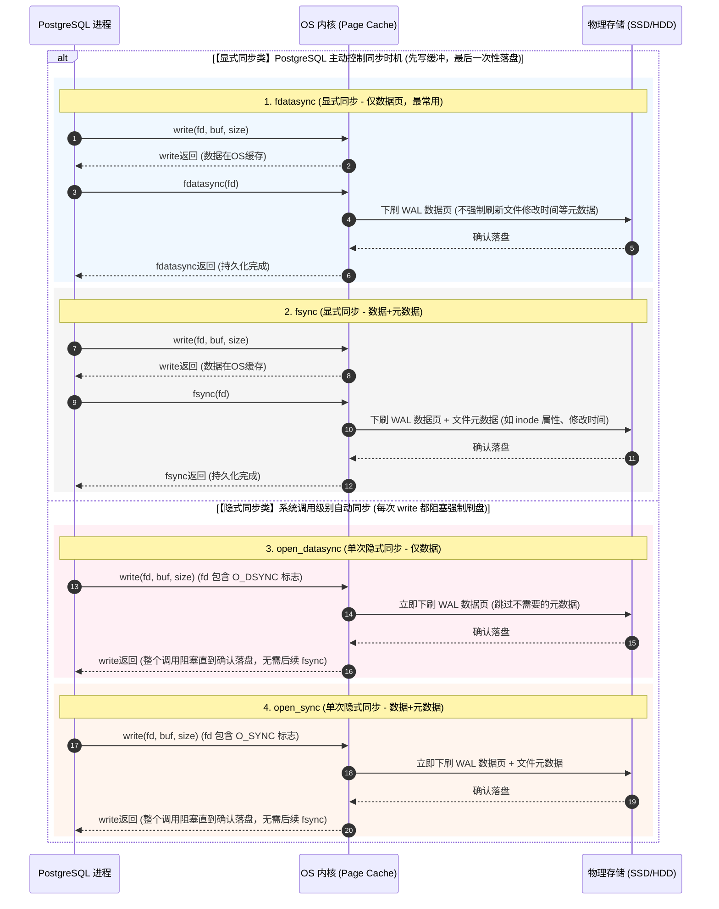
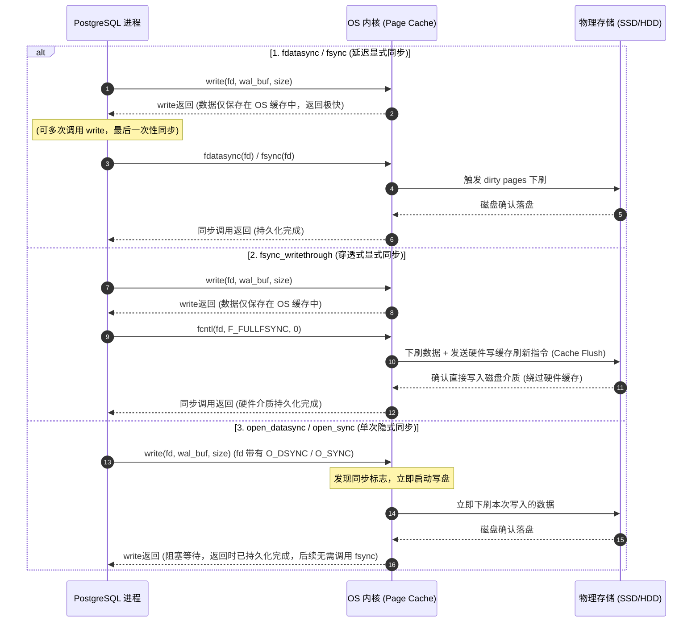

在关系型数据库中，为了保证事务的 ACID 特性中的 **持久性（Durability）**，数据库通常采用 **Write-Ahead Logging（WAL，写前日志）** 技术。这意味着在事务提交并向客户端确认成功之前，对应的 WAL 日志必须安全地写入到物理存储介质（如 SSD 或 HDD）中。

PostgreSQL 通过参数 `wal_sync_method` 来控制将 WAL 从内存刷写（Flush）到磁盘的物理机制。这个机制不仅关乎数据的安全，也极大地影响了高并发写入时的数据库性能。

本文将结合两张详细的 **Mermaid 时序图**，为您层层剥茧 PostgreSQL 在系统调用层面的 WAL 刷盘机制。

---

## 一、 系统调用的核心舞台：内核缓存与物理盘

在深入之前，我们需要明确数据落盘的典型路径：
$$\text{PostgreSQL 进程缓冲区} \xrightarrow{\text{write()}} \text{OS 内核缓存 (Page Cache)} \xrightarrow{\text{fsync()/fdatasync()}} \text{磁盘物理介质}$$

默认情况下，使用标准的 `write` 系统调用时，数据只是被拷贝到了操作系统内核的 Page Cache 中，并没有真正写入物理硬盘。如果此时系统发生断电或蓝屏崩溃， Page Cache 中的数据将会丢失。因此，必须使用特定的同步手段将数据下刷到磁盘。

---

## 二、 机制拆解：显式同步与隐式同步

根据数据库控制同步时机的方式不同，可以将 WAL 刷盘方法分为两大类：**显式同步** 和 **隐式同步**。

### 1. 显式同步类（延迟显式同步）
这类方法的特点是：**读写分离、集中落盘**。PostgreSQL 先通过多次轻量级的 `write` 调用将数据写入 OS Page Cache，然后再在关键节点（例如事务提交时）发起一个显式的同步系统调用，强制操作系统将 Page Cache 中的脏页（Dirty Pages）刷入磁盘。

#### fdatasync (仅刷数据，最常用)
* **原理**：调用 `write` 后，再显式调用 `fdatasync(fd)`。
* **特点**：**仅**强制把文件的数据部分同步到磁盘。如果文件的元数据（例如修改时间、访问权限等 inode 属性）发生了改变，但这些改变不影响后续读取已写入的数据，那么 `fdatasync` 会跳过元数据同步，从而减少磁盘 I/O 次数。
* **适用场景**：这是 Linux 环境下 PostgreSQL 的**默认且最推荐**的刷盘方式，性能极佳。

#### fsync (数据 + 元数据全面同步)
* **原理**：调用 `write` 后，显式调用 `fsync(fd)`。
* **特点**：不仅把文件数据部分同步到磁盘，还会强制将文件元数据（如 inode 属性、最后修改时间等）一同下刷。
* **对比**：相比 `fdatasync`，它多了一次元数据的写盘开销，因此在一些小文件频繁修改的场景下性能略慢。

---

### 2. 隐式同步类（单次隐式同步）
这类方法的特点是：**每写必同步、一次到位**。PostgreSQL 在打开 WAL 文件时，就会在文件描述符（fd）上设置同步标志（如 `O_DSYNC` 或 `O_SYNC`）。后续的每一次 `write` 调用，内核都会自动将数据落盘，整个 `write` 调用会阻塞，直到磁盘确认完成。

#### open_datasync (单次隐式同步 - 仅数据)
* **原理**：使用 `O_DSYNC` 标志打开文件。
* **特点**：每次调用 `write(fd, buf, size)` 时，操作系统会保证把本次写入的 WAL 数据页下刷到磁盘物理介质后才返回。它类似于 `write` + `fdatasync` 的合体，不需要后续再单独调用显式同步函数。

#### open_sync (单次隐式同步 - 数据 + 元数据)
* **原理**：使用 `O_SYNC` 标志打开文件。
* **特点**：每次调用 `write` 时，立即下刷数据页和文件元数据，直到完全写入后才返回。由于每次都强制写入元数据，开销较大。

---

### 3. 穿透式同步（特殊显式同步）
在某些操作系统（如 macOS / Darwin）上，由于操作系统的实现机制，即使调用了标准的 `fsync`，也只能确保数据被写到了磁盘设备的**硬件写缓存（Disk Write Cache）**中，而无法保证其真正写入物理介质。如果磁盘此时遭遇突然断电，硬件缓存中的数据依然会丢失。

#### fsync_writethrough (穿透式显式同步)
* **原理**：在调用 `write` 写入 OS Page Cache 后，调用 `fcntl(fd, F_FULLFSYNC, 0)`。
* **特点**：该系统调用不仅会将脏页下刷到磁盘，还会向磁盘控制器发送一个物理刷新指令（Cache Flush），强迫磁盘设备将自身内部高速缓存中的数据完全写入物理介质。
* **适用场景**：主要用于 macOS 系统，提供极致的数据安全防线。

---

## 三、 图解工作流

为了更直观地对比这些方法，我们用两张时序图来说明其底层消息传递与阻塞过程。

### 1. 显式同步与隐式同步的时序对比

下图展示了从 PostgreSQL 进程开始，经过 OS Page Cache，最终到达物理存储的详细机制分类：

### 2. 延迟同步、穿透式同步与隐式同步的时序对比

下图展示了在考虑硬件写缓存时，三种典型策略（延迟同步、带缓存刷新的穿透式同步、带有同步打开标记的隐式同步）的流程对比：

---

## 四、 核心对比与性能考量

为了方便您在实际调优中进行选择，我们对上述几种刷盘方式做了综合对比：

| 刷盘方法 (`wal_sync_method`) | 对应内核标志/系统调用 | 刷盘粒度 | 刷盘时机控制 | 性能表现 | 安全等级 | 适用系统 |
| :--- | :--- | :--- | :--- | :--- | :--- | :--- |
| **`fdatasync`** | `write()` + `fdatasync()` | 仅 WAL 数据 | 延迟显式同步（通常由 PostgreSQL 控制） | **极高** (减少元数据写入) | **高** (Linux 默认推荐) | 绝大多数类 Unix |
| **`fsync`** | `write()` + `fsync()` | 数据 + 元数据 | 延迟显式同步 | **中高** | **高** | 绝大多数类 Unix |
| **`fsync_writethrough`** | `write()` + `fcntl(F_FULLFSYNC)` | 数据 + 硬件缓存 | 延迟显式穿透同步 | **较低** (需穿透硬件缓存) | **极高** | 主要为 macOS |
| **`open_datasync`** | `write()` + `O_DSYNC` | 仅 WAL 数据 | 每次写入时隐式阻塞同步 | **一般** (每次写均阻塞) | **高** | 某些特定 Unix 变体 |
| **`open_sync`** | `write()` + `O_SYNC` | 数据 + 元数据 | 每次写入时隐式阻塞同步 | **低** | **高** | 某些特定 Unix 变体 |

### 为什么选择延迟显式同步 (`fdatasync`)？
在大多数高并发 OLTP 场景下，PostgreSQL 会在内存中多次写入 WAL 缓冲（WAL buffers）。如果使用隐式同步（如 `open_datasync`），每次 `write` 都会面临高额的磁盘寻道与落盘等待开销，性能将严重受限。

相比之下，`fdatasync` 允许 PostgreSQL 在事务进行时只管快速写入 OS 缓存（飞快的内存拷贝速度），最后只需调用一次 `fdatasync` 即可将这段时间积攒的所有脏页一次性同步到物理磁盘上。这种合并写入极大地提升了系统的吞吐量。

---

## 五、 总结与调优建议

1. **Linux 生产环境**：绝大多数情况下，保持默认的 `fdatasync` 是最优解。它能够在确保事务持久化的前提下提供极高的吞吐率。
2. **macOS 开发环境**：如果您在 Mac 笔记本上做开发测试，PostgreSQL 默认可能会使用 `fsync_writethrough` 以保证防断电丢失。但这可能会导致大量的物理磁盘写入延迟。如果您不在乎本地开发环境下的极端掉电数据完整性，可以将 `wal_sync_method` 临时修改为 `fsync` 甚至关闭 `fsync`（开发测试专用！）来大幅提升编译和运行测试的性能。
3. **硬件支撑**：无论选择何种同步参数，在要求极致持久性的生产环境，都应该为磁盘控制器配备带有电池备份（BBU/SuperCap）的非易失性写入缓存（NVRAM/NVDIMM），这样可以在硬件层面保障数据安全，同时将底层落盘性能推向极致。
